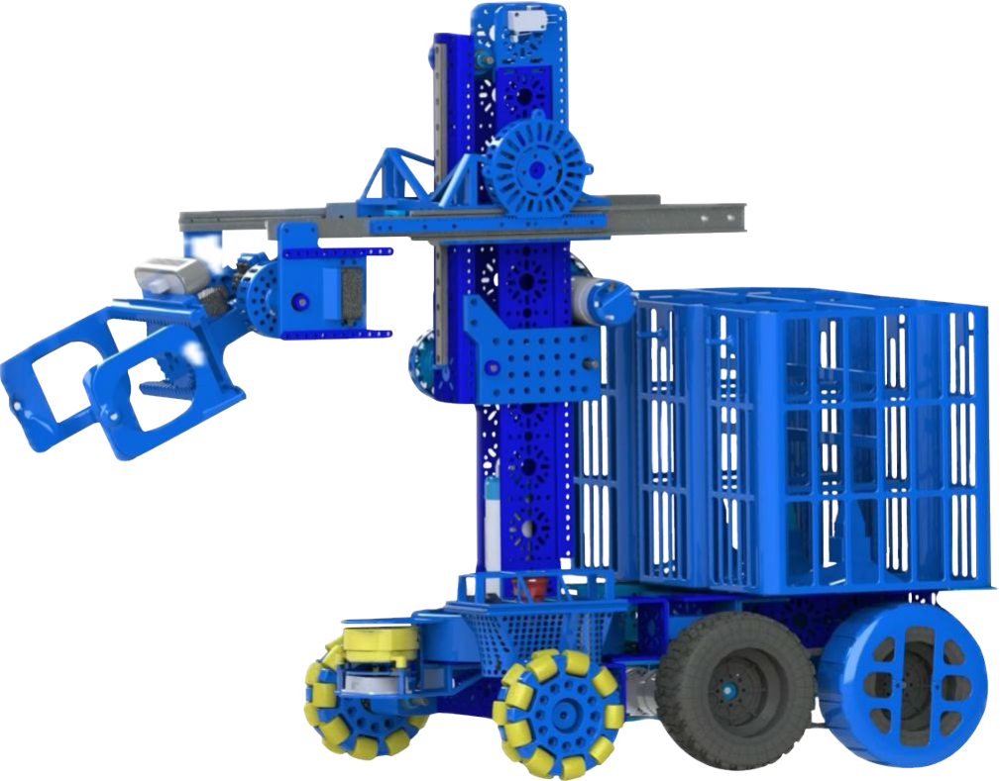

# 设备检查与启动

欢迎来到 ROS 2 机器人开发教程系列！本章是您拿到机器人后的第一课。为了确保后续开发与调试的顺利进行，我们需要在首次开机前对设备进行全面检查，并熟悉正确的启动与关机流程。

完成本章后，您将能够：

- ✅ 独立完成机器人开箱后的硬件清单核对与线缆检查。
- ✅ 正确为机器人供电并执行开机与关机操作。
- ✅ 通过面板指示灯状态判断机器人当前运行情况。

---

## 一、开箱与设备清单检查 📦

在您收到机器人后，请第一时间核对包装内的物品是否齐全。小心取出机器人主体及配件，并放置于平稳、开阔的台面或地面上。

### 1.1 标准配件清单

通常情况下，标准包装内包含以下物品（具体请以您购买的型号清单为准）：

| 类别 | 物品名称 | 数量 | 备注 |
| :--- | :--- | :---: | :--- |
| **主体** | 机器人底盘本体 | 1 | 含主控、电机、传感器等 |
| **电源** | 锂电池组及适配器 | 1 | 用于机器人供电 |
| **网络** | 以太网网线 | 1 | 用于有线调试连接(自备) |
| **工具** | L型内六角扳手 | 1套 | 用于维护与拆卸(自备) |
| **文档** | 快速入门指南 | 1 | 纸质或电子版 |

> [!WARNING]
> 请仔细检查设备外观是否有明显因运输造成的挤压、破损。如有异常，请立即停止操作并联系售后支持。🚨

---

## 二、硬件连接与检查 🔌

在通电之前，请务必检查机器人底盘内部及外部的各项线缆连接状态。运输过程中的震动可能导致接口松动。

### 2.1 内部线缆检查
1. **主控板连接**：检查主控板上的各根排线（如雷达线、电机驱动线、IMU线缆）是否插紧。
2. **电源线**：确认电池电源线与主板电源接口连接牢固，无裸露铜丝。

### 2.2 外部路由安装
如果您的机器人配备了外部路由，请在此阶段将其使用网线连接至主控板对应的以太网接口上。
> [!TIP]
> 💡 天线的朝向建议垂直向上，以获得最佳的无线信号覆盖范围。

---

## 三、供电与开机启动 🚀

确认硬件无误后，我们可以为机器人接入电源并执行启动操作。

### 3.1 电池安装与通电
1. 将充满电的电池组平稳推入机器人底盘的电池仓内。
2. 确认底盘侧面的**总电源开关**处于 `I`（开启）状态。

### 3.2 开机流程
1. **释放急停**：检查机器人面板上的红色急停按钮，顺时针旋转使其弹起。⚠️ 急停按钮按下时，电机驱动电源将被切断，机器人无法运动。
2. **观察指示灯**：此时面板上的电源指示灯应常亮，主控制器运行状态指示灯开始闪烁，表示系统正在启动。

> [!NOTE]
> 🤖 机器人的内部主控计算平台（如树莓派、NVIDIA Jetson等）启动 Linux 操作系统与 ROS 2 环境大约需要 **30-60秒** 的时间，请耐心等待。

## 四、硬件断电
1. 确认系统已完全关闭。
2. 按下红色急停按钮，切断底盘动力电源。
3. 将底盘侧面的**总电源开关**拨至 `O`（关闭）状态。
4. 断开两组电池连接插头。
4. 如需搬运，可拔出电池仓卡扣，取出电池组。

---

## 五、常见问题及处理 🛠️

| 现象 | 可能原因 | 解决方法 |
|------|----------|----------|
| 按下启动键无反应 | 急停未释放 / 电池未接通 | 检查急停是否弹起，确认总电源开关已打开，电池有电 |
| 开机后指示灯全灭 | 电池触点接触不良 / 低压保护 | 重新插拔电池，或给电池充电后重试 |
| 启动很久后绿色灯不闪 | 系统启动卡死 / SD卡损坏 | 尝试重新插拔存储卡，若无效需重新烧录系统镜像 |
| 机器发出异响或焦味 | 硬件短路 | **立即断开总电源**，停止使用并联系技术支持 🚨 |

> ✅ 确认设备检查无误并成功启动后，您就可以进入下一章，学习如何与机器人建立网络通信连接了！

---
## 👥 贡献者
本项目离不开每一位提交 PR、提 Issue、优化文档的开发者，由衷致谢！

    

        
        

            <a href="https://github.com/yxzhc" style="text-decoration: none;">YXZHC</a>
        

    

    

        
        

            <a href="https://github.com/hbrobot" style="text-decoration: none;">HBRobot</a>
        

    

---
🤝 **欢迎参与共建：**

[:fontawesome-brands-github: 提交 Issue](https://github.com/hbrobot/hbrobot.github.io/issues/new/choose){: .md-button }
[:octicons-git-pull-request-24: 提交 PR](https://github.com/hbrobot/hbrobot.github.io/compare){: .md-button .md-button--primary }