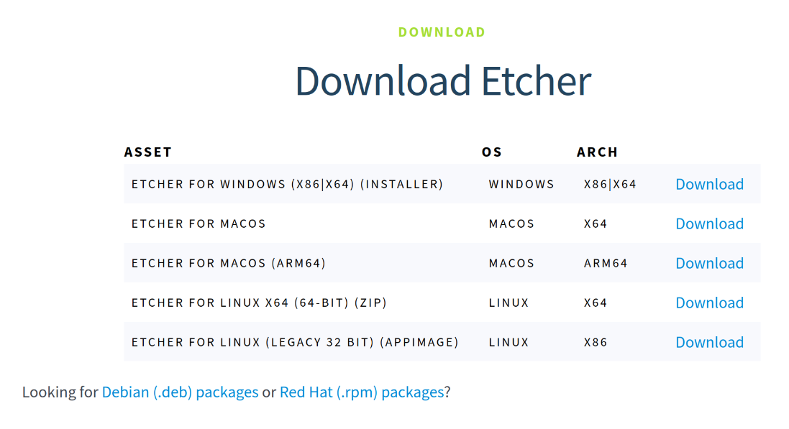
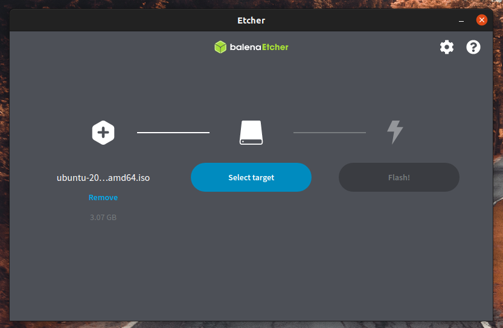

# Ubuntu 22.04 桌面版安装 
---
本教程适用于在已有 Windows 11 的电脑上安装 **Ubuntu 22.04 LTS（Jammy Jellyfish）桌面版**，用于 ROS 2 教学与实验环境。

> [!NOTE]
> 如果您是第一次安装操作系统，无需担心：Ubuntu 提供图形化安装向导，大多数情况下直接选择默认选项即可完成安装。

---

## 一、硬件与兼容性检查

### 1️⃣ 最低硬件要求
| 项目 | 建议配置 |
|---|---|
| CPU | 64 位处理器（Intel i5 十代或同等及以上） |
| 内存 | ≥ 8 GB（YOLO / ROS 2 推荐 16 GB） |
| 硬盘 | ≥ 64 GB 可用空间（建议 ≥ 256 GB） |
| 显卡 | 支持 OpenGL 3.0 的显卡（NVIDIA 显卡需支持 CUDA） |
| U 盘 | ≥ 12 GB（制作安装盘用） |

### 2️⃣ 兼容性确认
- 推荐优先使用 **[Ubuntu 认证硬件](https://ubuntu.com/certified?q=&category=Laptop&category=Desktop&limit=20)** 列表中的设备  
- 若不在列表中，可先 **[试用 Ubuntu 桌面](https://documentation.ubuntu.com/desktop/en/latest/tutorial/try-ubuntu-desktop/#try-ubuntu-desktop)** 验证硬件兼容性

---

## 二、备份与风险提示

> [!WARNING]
> 安装过程会**清空目标磁盘或分区数据**，请务必提前备份。

### 需备份的内容
- 个人文件 → 移动硬盘 / U 盘
- 浏览器数据 → 登录 Firefox / Google 账号同步

---

## 三、下载 Ubuntu 镜像

1. 前往 [Ubuntu 22.04.5 LTS 官方下载页](https://releases.ubuntu.com/jammy/)
2. 选择 **Desktop 映像**
3. 下载得到文件，例如：
   
   [ ubuntu-22.04.5-desktop-amd64.iso ]

> [!TIP]
> 若官网下载较慢，可使用
>
> [中国科学技术大学开源软件镜像](https://mirrors.ustc.edu.cn/ubuntu-releases/22.04.5/)
>
> [清华大学开源镜像站](https://mirror.tuna.tsinghua.edu.cn/ubuntu-releases/22.04.5/)

---

## 四、制作 Ubuntu 启动盘（推荐 Rufus，可选balenaEtcher）
> [!WARNING]
> 此操作会清空 U 盘，请提前备份 U 盘内文件。
##### 方案A：使用 **Rufus**（Windows）。

1. 下载 [Rufus](https://rufus.ie/zh/)（Windows）	[ 官方网站: [https://rufus.ie/zh/](https://rufus.ie/zh/) ]
2. 插入 ≥ 8 GB U 盘
3. 打开 Rufus：
    - 设备：选择你的 U 盘
    - 引导类型：选择 Ubuntu ISO
    - 分区类型：**GPT**
    - 目标系统类型：**UEFI（非 CSM）**
4. 点击 **开始** → 选择 **ISO 镜像模式写入**
5. 等待完成 ✅

##### 方案B：使用 **balenaEtcher**（跨平台、操作简单）。

1. 访问 [balenaEtcher 官网](https://etcher.balena.io/) 下载对应系统版本	[ 官方网站: [https://etcher.balena.io/](https://etcher.balena.io/) ]

    

2. 插入 U 盘（≥12 GB）

3. 打开 balenaEtcher

    

4. 选择：
    - **镜像文件**：刚下载的 Ubuntu ISO
    - **目标磁盘**：插入的 U 盘

5. 点击 **Flash!** 等待写入完成

---

## 五、从 U 盘启动

1. 将 U 盘插入目标电脑
2. 重启电脑
3. 进入 **启动菜单**（常见按键：F12 / Esc / F2 / F10）
4. 选择 U 盘启动项
5. 出现 Ubuntu 启动菜单后，选择 **Try or Install Ubuntu**

---

## 六、安装 Ubuntu（双系统）

> [!IMPORTANT]
> 以下流程适用于 **Windows 10/11 + Ubuntu 22.04 LTS（UEFI + GPT）**  
> 采用**简易安装**，无需手动分区，适合教学与实验环境。

---

### 1️⃣ BIOS / UEFI 设置（必须）

开机进入 BIOS（常见按键：F2 / F10 / F12 / Del / Esc）：

| 设置项 | 操作 | 原因 |
|---|---|---|
| Secure Boot | **关闭** | 防止 Ubuntu 引导被拦截 |
| Intel RST / RAID | 改为 **AHCI** | Ubuntu 不支持 Intel RST |
| 启动顺序 | U 盘设为第一启动项 | 确保从安装盘启动 |
| BitLocker | **关闭**（Windows 设置中） | 防止进入恢复模式 |
| 快速启动 | **关闭**（Windows 电源选项） | 防止文件系统状态异常 |

✅ 修改完成后务必 **保存并退出**。

---

### 2️⃣ 在 Windows 中准备磁盘空间

1. `Win + X` → **磁盘管理**
2. 右键 Windows 所在磁盘（如 C 盘）→ **压缩卷**
3. 输入压缩空间（建议 ≥ 128 GB，ROS 2 + YOLO 推荐 ≥ 256 GB）
4. 得到一个 **“未分配”** 区域即可  
   👉 **不要再新建分区**

> [!TIP]
> 若可压缩空间远小于剩余空间，可使用 DiskGenius 调整分区。

---

### 3️⃣ 启动并进入 Ubuntu 安装程序

1. 插入 U 盘，重启电脑
2. 出现主板 LOGO 时反复按下启动菜单键（F12 / F10 / Esc）
3. 选择你的 U 盘启动项
4. 出现 GRUB 菜单后，选择 **Try or Install Ubuntu**
5. 进入 Ubuntu 桌面后，双击 **Install Ubuntu**

---

### 4️⃣ 简易安装流程

| 安装步骤 | 推荐选择 |
|---|---|
| 语言 | 中文(简体) |
| 键盘布局 | English (US) |
| 安装模式 | **Normal installation**  /  正常安装 |
| 安装类型 | ✅ **Install Ubuntu alongside Windows Boot Manager**  /  与Windows共存 |
| 时区 | Shanghai |
| 用户信息 | 用户名与主机名使用英文 |

✅ 安装器会自动：
- 使用已有 EFI 分区
- 配置 GRUB 双系统引导

---

### 5️⃣ 安装完成与首次启动

1. 安装完成后点击 **Restart Now**  / 立即重新启动
2. 重启时拔出 U 盘
3. 出现 GRUB 菜单：
   - Ubuntu（默认）
   - Windows Boot Manager
4. 若仍直接进入 Windows：
   - 再次进入 BIOS
   - 将 **Ubuntu** 或 **UEFI Hard Drive BBS Priority** 中的 Ubuntu 置顶
   - 保存并退出

---

## 七、三方参考教程（详细图文）

• [win10/11 下Ubuntu 22.04（桌面版） 双系统安装教程](https://www.cnblogs.com/luzhanshi/articles/19118891)

• [Windows11 + Linux (Ubuntu22.04) 双系统最简安装](https://blog.csdn.net/2401_84064328/article/details/137232169)

---
## 👥 贡献者
本项目离不开每一位提交 PR、提 Issue、优化文档的开发者，由衷致谢！

    

        
        

            <a href="https://github.com/yxzhc" style="text-decoration: none;">YXZHC</a>
        

    

    

        
        

            <a href="https://github.com/其他用户" style="text-decoration: none;">HBRobot</a>
        

    

---
🤝 **欢迎参与共建：**

[:fontawesome-brands-github: 提交 Issue](https://github.com/hbrobot/hbrobot.github.io/issues/new/choose){: .md-button }
[:octicons-git-pull-request-24: 提交 PR](https://github.com/hbrobot/hbrobot.github.io/compare){: .md-button .md-button--primary }