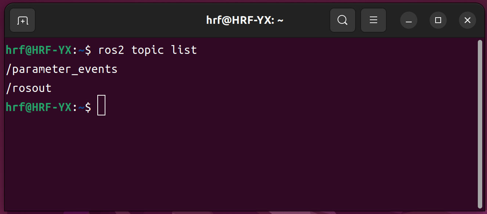

# ROS 2 Humble 安装 
---
> [!NOTE]
> 如果您是初学者，**强烈推荐使用一键安装脚本**。  
> 一键安装与手动安装在最终运行环境上完全一致，但可以有效规避依赖和系统源配置问题。

---

## 一、一键自动安装（推荐 ✅）

### 1️⃣ 打开终端
- 快捷键：`Ctrl + Alt + T`
- 稍等片刻，新终端窗口将出现

### 2️⃣ 执行一键安装脚本
```bash
wget http://fishros.com/install -O fishros && . fishros
```


### 3️⃣ 根据提示选择选项（一般推荐顺序）

| 步骤 | 选择项 |
|---|---|
| 安装方式 | `[1] 一键安装（推荐）：ROS / ROS2` |
| 系统源 | `[1] 更换系统源再继续安装` |
| 第三方源 | `[2] 更换系统源并清理第三方源` |
| 测速方式 | `[1] 自动测速选择最快的源` |
| 镜像源 | `[1] 中科大镜像源` |
| ROS 版本 | `[1] humble（ROS2）桌面版` |

> [!TIP]
> 安装过程中请确保网络畅通，预计耗时约 20 分钟。

---

## 二、手动安装（不推荐 ⚠️）

> [!WARNING]
> 仅建议在您具备 Linux / ROS 排错能力时使用手动安装方式。

- 官方安装文档（Ubuntu Deb 包方式）： 

  [https://docs.ros.org/en/humble/Installation/Ubuntu-Install-Debs.html](https://docs.ros.org/en/humble/Installation/Ubuntu-Install-Debs.html#)

---

## 三、安装验证

1. 打开一个新的终端  
2. 执行以下命令：
   
   ```bash
   ros2 topic list
   ```
   
3. 若终端输出类似下图的话题列表，说明 ROS 2 已成功安装：



---

## 四、常见问题

- **未找到 ros2 命令**
  
  - 确认安装完成后已重新打开终端
  - 手动 source 环境：
    
    ```bash
    source /opt/ros/humble/setup.bash
    ```
    
    

- **安装中途网络异常**
  - 重新执行一键安装脚本
  - 优先选择中科大或清华镜像源


---
## 👥 贡献者
本项目离不开每一位提交 PR、提 Issue、优化文档的开发者，由衷致谢！
<div style="display: flex; flex-wrap: wrap; gap: 30px; margin-top: 20px; margin-bottom: 20px;">
    <div style="text-align: center;">
        <a href="https://github.com/yxzhc">
            
        </a>
        <div style="margin-top: 8px; font-weight: 600;">
            <a href="https://github.com/yxzhc" style="text-decoration: none;">YXZHC</a>
        </div>
    </div>
    <div style="text-align: center;">
        <a href="https://github.com/hbrobot">
            
        </a>
        <div style="margin-top: 8px; font-weight: 600;">
            <a href="https://github.com/hbrobot" style="text-decoration: none;">HBRobot</a>
        </div>
    </div>
</div>
---
🤝 **欢迎参与共建：**

[:fontawesome-brands-github: 提交 Issue](https://github.com/hbrobot/hbrobot.github.io/issues/new/choose){: .md-button }
[:octicons-git-pull-request-24: 提交 PR](https://github.com/hbrobot/hbrobot.github.io/compare){: .md-button .md-button--primary }