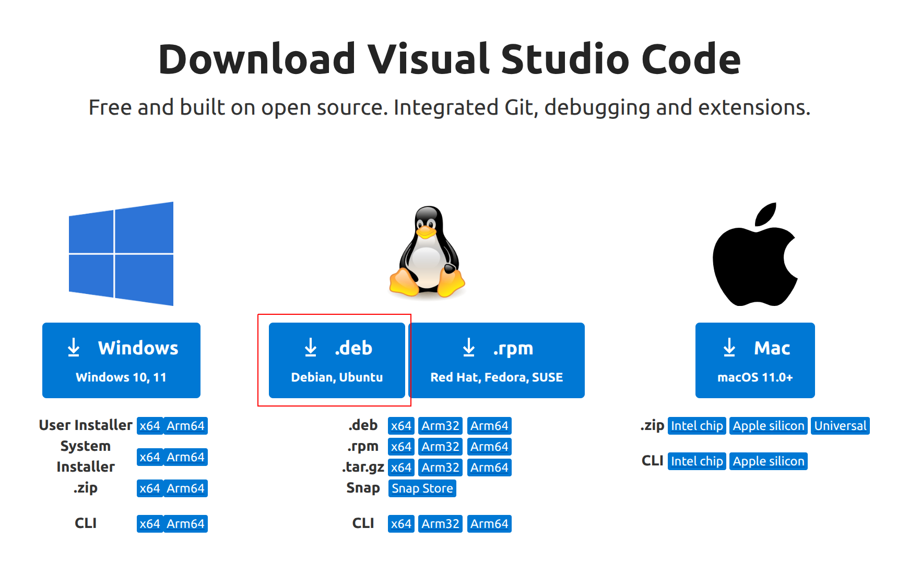
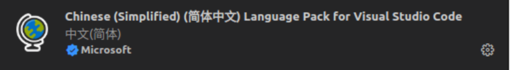
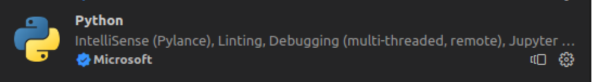

# Visual Studio Code 安装
---
### 下载 Visual Studio Code

我们需要安装Visual Studio Code软件，因为他能够提高我们的开发效率。

- [ ] [Visual Studio Code](http://code.visualstudio.com/Download)	： [https://code.visualstudio.com/Download](https://code.visualstudio.com/Download)

您需要在 Visual Studio Code 的官方网站中选择您所使用平台的对应版本。



> [!NOTE]
>
> 本节和所有Linux示例均使用Ubuntu Desktop 22.04 LTS 完成并测试。	

- [ ] 下载完成后您将得到如下文件 （其中1.95.2-1730981514为版本号，可能会有所变更）	

```shell
code_1.95.2-1730981514_amd64.deb
```

---


### 安装 Visual Studio Code

在Linux中安装软件一般情况下需要用到dpkg指令，没有接触过也不要担心，我们会提供具体的安装指令。

- [ ] 1. 首先需要找到刚刚下载的 VS Code 安装文件，您需要选中这个文件并且右击鼠标复制文件。

> [!NOTE]
>
> 在linux中复制文件后会得到文件路径！所以不必担心。

- [ ] 2. 接着打开一个新的Shell终端，输入下面的安装指令，并将您刚刚复制的文件路径粘贴在后方。

就像这样，其中 sudo dpkg -i 为安装指令，后面内容为安装文件的路径

```shell
sudo dpkg -i /home/xxx/下载/code_1.95.2-1730981514_amd64.deb
```

> [!NOTE]
>
> 卸载Visual Studio Code使用 ： sudo dpkg --purge  code

---


### 配置 Visual Studio Code

我们需要对编辑器进行简单的配置，使其能够更高效的运行。

首先点击侧边栏的Extensions(插件)选项或者使用快捷键`Ctrl+Shift+X`打开插件窗口

- [ ] 1. 安装简体中文语言支持。



- [ ] 2. 安装Python插件。



- [ ] 3. 开启编辑器自动保存功能。

> [!TIP]
>
> 开启自动保存功能可以避免因忘记保存而导致代码未生效的情况，极大地提升开发体验。您可以通过以下两种方式之一开启：
>
> 1. **菜单栏快捷开启**：点击顶部菜单栏的 `文件` -> 勾选 `自动保存`。
> 2. **设置项开启**：按下快捷键 `Ctrl + ,` 打开设置，在搜索框中输入 `auto save`，将 `Files: Auto Save` 选项从下拉菜单中选择为 `afterDelay`（延迟保存）或 `onWindowChange`（窗口失去焦点时保存）。

---
## 👥 贡献者
本项目离不开每一位提交 PR、提 Issue、优化文档的开发者，由衷致谢！
<div style="display: flex; flex-wrap: wrap; gap: 30px; margin-top: 20px; margin-bottom: 20px;">
    <div style="text-align: center;">
        <a href="https://github.com/yxzhc">
            
        </a>
        <div style="margin-top: 8px; font-weight: 600;">
            <a href="https://github.com/yxzhc" style="text-decoration: none;">YXZHC</a>
        </div>
    </div>
    <div style="text-align: center;">
        <a href="https://github.com/hbrobot">
            
        </a>
        <div style="margin-top: 8px; font-weight: 600;">
            <a href="https://github.com/hbrobot" style="text-decoration: none;">HBRobot</a>
        </div>
    </div>
</div>
---
🤝 **欢迎参与共建：**

[:fontawesome-brands-github: 提交 Issue](https://github.com/hbrobot/hbrobot.github.io/issues/new/choose){: .md-button }
[:octicons-git-pull-request-24: 提交 PR](https://github.com/hbrobot/hbrobot.github.io/compare){: .md-button .md-button--primary }