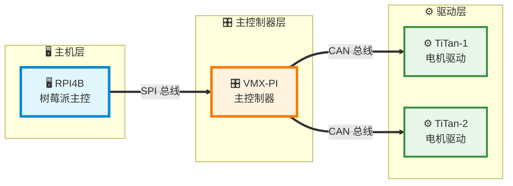
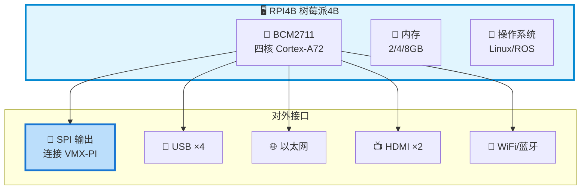
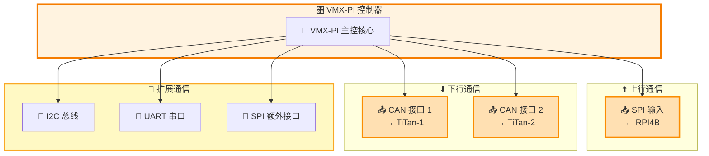
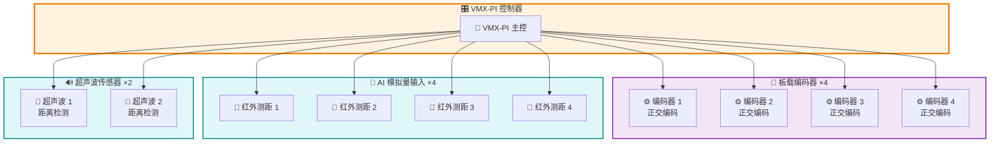
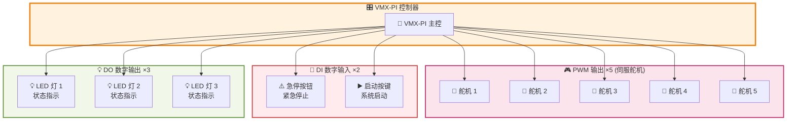
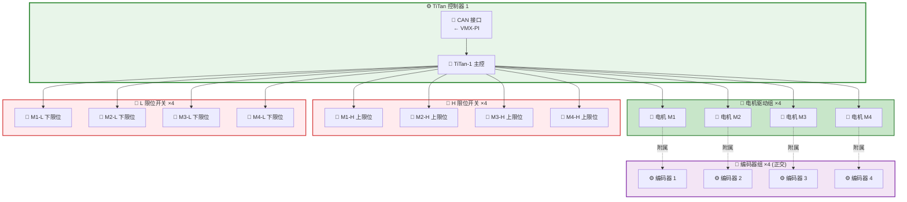
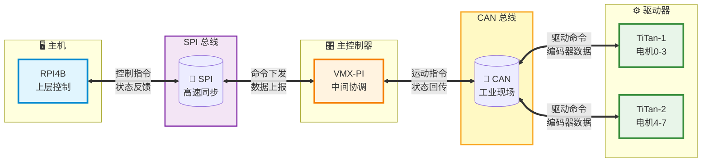

## 📊 图表 1：系统总览拓扑图

展示三大控制器之间的通信架构。

---

## 📊 图表 2：RPI4B 接口详图

---

## 📊 图表 3：VMX-PI 通信接口详图

---

## 📊 图表 4：VMX-PI 传感器接口详图

---

## 📊 图表 5：VMX-PI 控制输出与人机接口详图

---

## 📊 图表 6：TiTan-1 完整接口详图

---

## 📊 图表 7：TiTan-2 完整接口详图

---

## 📊 图表 8：通信数据流向图

---

## 📋 完整接口汇总表

| 控制器 | 接口类型 | 数量 | 用途 |
|--------|----------|------|------|
| **RPI4B** | SPI 输出 | 1 | 连接 VMX-PI |
| **VMX-PI** | SPI 输入 | 1 | 连接 RPI4B |
| | CAN 输出 | 2 | 连接 TiTan-1/2 |
| | I2C / UART / SPI | 各1 | 扩展通信 |
| | 板载编码器 | 4 | 正交编码 |
| | AI 红外测距 | 4 | 模拟量输入 |
| | 超声波传感器 | 2 | 距离检测 |
| | PWM 舵机 | 5 | 伺服控制 |
| | DI (急停+启动) | 2 | 数字输入 |
| | DO (LED) | 3 | 数字输出 |
| **TiTan×2** | CAN 接口 | 各1 | 连接 VMX-PI |
| | 电机驱动 | 各4 | 伺服电机 |
| | 编码器 | 各4 | 正交(附属电机) |
| | 限位开关 | 各8 | H限位+L限位 |

---

