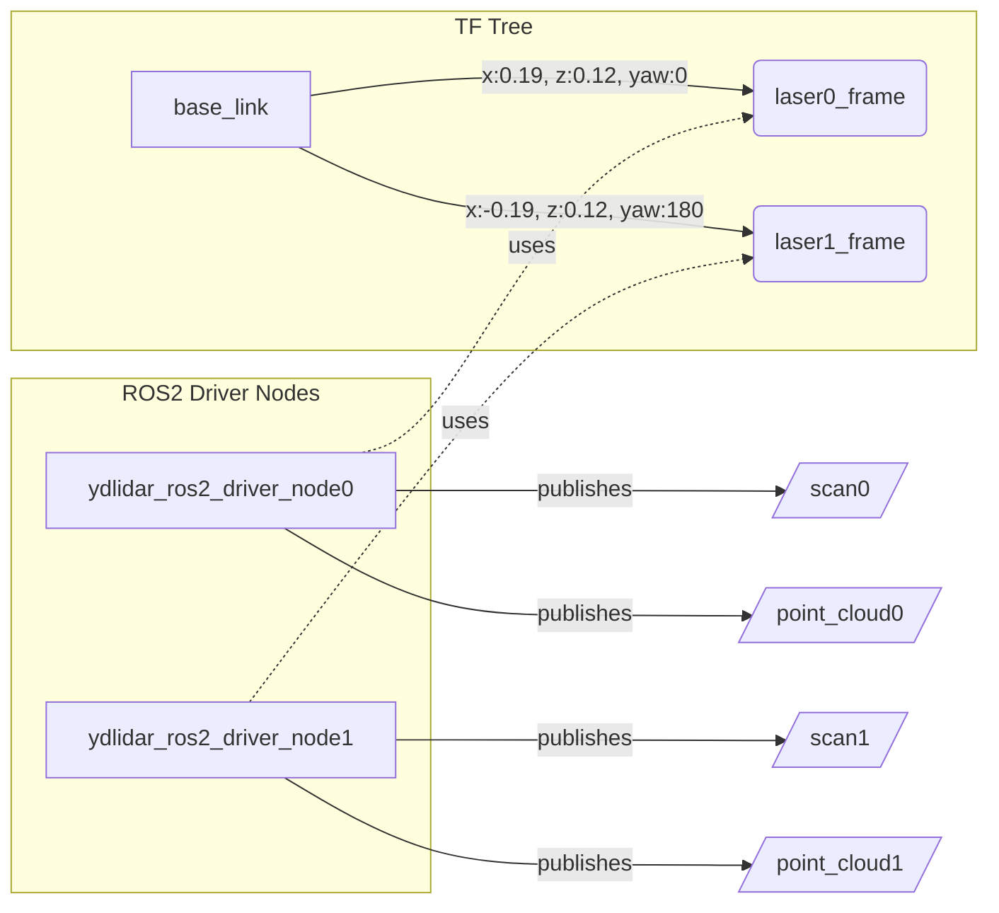

# 激光雷达驱动参数与启动配置 (ydlidar_ros2_driver)

本教程详细介绍了 `ydlidar_ros2_driver` 驱动节点的核心参数配置及多雷达协同工作的启动文件编写方法。通过合理的参数配置与话题重映射，可以轻松实现单雷达或多雷达系统的部署。

**📁 配置文件位置：**

```bash
/home/vmx/WSR_HB_Robot/install/ydlidar_ros2_driver/share/ydlidar_ros2_driver/params
```
**📁 启动文件位置：**

```bash
/home/vmx/WSR_HB_Robot/install/ydlidar_ros2_driver/share/ydlidar_ros2_driver/launch
```

## 1. 雷达核心参数详解

`ydlidar_ros2_driver` 节点通过 YAML 文件加载参数。以下是对各项参数的详细说明：

> [!CAUTION]
> 修改串口波特率 (`baudrate`) 和雷达类型 (`lidar_type`) 前请务必查阅对应型号雷达的硬件手册，错误的配置可能导致无法获取数据或设备异常。

| 参数名 | 类型 | 说明 | 常见取值示例 |
| :--- | :--- | :--- | :--- |
| `port` | string | 雷达连接的串口设备路径 | `/dev/lidar0`, `/dev/ttyUSB0` |
| `frame_id` | string | 雷达发布的激光数据所在的坐标系名称 | `laser0_frame` |
| `ignore_array` | string | 需要忽略的角度区间数组，为空表示不忽略 | `""` |
| `baudrate` | int | 串口通信波特率，需与雷达硬件设置一致 | `230400`, `115200` |
| `lidar_type` | int | 雷达型号类型索引 | `1` |
| `device_type` | int | 设备类型索引 | `0` |
| `intensity` | bool | 是否启用雷达强度数据采集 | `true`, `false` |
| `intensity_bit` | int | 强度数据位宽 | `8`, `0` |
| `isSingleChannel` | bool | 是否为单通道雷达。单通道雷达通常无需等待电机稳定 | `true`, `false` |
| `frequency` | float | 雷达扫描频率 | `10.0` |
| `sample_rate` | int | 采样率 | `4`, `3` |
| `abnormal_check_count` | int | 异常状态检查计数。连续多次未收到数据则触发重连 | `4` |
| `fixed_resolution` | bool | 是否使用固定角分辨率 | `true` |
| `reversion` | bool | 是否反转扫描方向（顺时针/逆时针） | `true`, `false` |
| `inverted` | bool | 雷达是否倒置安装 | `true`, `false` |
| `auto_reconnect` | bool | 异常断开时是否自动重新连接 | `true` |
| `support_motor_dtr` | bool | 是否支持通过 DTR 信号控制电机启停 | `true`, `false` |
| `angle_max` | float | 最大有效扫描角度 (单位：度) | `180.0` |
| `angle_min` | float | 最小有效扫描角度 (单位：度) | `-180.0` |
| `range_max` | float | 最大有效测距范围 (单位：米) | `12.0`, `64.0` |
| `range_min` | float | 最小有效测距范围 (单位：米) | `0.03`, `0.1` |
| `invalid_range_is_inf` | bool | 无效测距值是否用 `inf` 表示 (否则用 `nan` 或 `0`) | `false` |
| `debug` | bool | 是否开启底层调试日志打印 | `false` |

???+ warning "关于多雷达配置的注意事项"
    当在同一台计算机上运行多个雷达时，请务必确保每个雷达的 `port` 和 `frame_id` 参数**唯一**，并在 `launch` 文件中进行相应的话题重映射 (`remappings`)，否则将导致话题数据相互覆盖或 TF 树冲突。

## 2. 参数配置文件示例

根据不同的雷达型号（如 Tmini 或 X3 系列），你需要配置对应的参数文件。以下位置预留给您填充相应的配置内容。

??? example "示例：Tmini_0.yaml 配置文件"
    ```yaml

    ydlidar_ros2_driver_node0:
    ros__parameters:
        # port: /dev/ttyUSB0
        port: /dev/lidar0
        frame_id: laser0_frame
        ignore_array: ""
        baudrate: 230400
        lidar_type: 1
        device_type: 0
        intensity: true
        intensity_bit: 8
        isSingleChannel: false
        frequency: 10.0
        sample_rate: 4
        abnormal_check_count: 4
        fixed_resolution: true
        reversion: true
        inverted: true
        auto_reconnect: true
        support_motor_dtr: false
        angle_max: 180.0
        angle_min: -180.0
        range_max: 12.0
        range_min: 0.03
        invalid_range_is_inf: false
        debug: false
    ```

??? example "示例：Tmini_1.yaml 配置文件"
    ```yaml
    ydlidar_ros2_driver_node1:
    ros__parameters:
        # port: /dev/ttyUSB1
        port: /dev/lidar1
        frame_id: laser1_frame
        ignore_array: ""
        baudrate: 230400
        lidar_type: 1
        device_type: 0
        intensity: true
        intensity_bit: 8
        isSingleChannel: false
        frequency: 10.0
        sample_rate: 4
        abnormal_check_count: 4
        fixed_resolution: true
        reversion: true
        inverted: true
        auto_reconnect: true
        support_motor_dtr: false
        angle_max: 180.0
        angle_min: -180.0
        range_max: 12.0
        range_min: 0.03
        invalid_range_is_inf: false
        debug: false
    ```

??? example "示例：X3_lidar0.yaml 配置文件"
    ```yaml
    ydlidar_ros2_driver_node0:
    ros__parameters:
        # port: /dev/ttyUSB0
        port: /dev/lidar0
        frame_id: laser0_frame
        ignore_array: ""
        baudrate: 115200 #230400
        lidar_type: 1
        device_type: 0
        sample_rate: 3 # 9
        intensity_bit: 0
        abnormal_check_count: 4
        fixed_resolution: true
        reversion: false #true
        inverted: true
        auto_reconnect: true
        isSingleChannel: true #false
        intensity: false
        support_motor_dtr: true #false
        angle_max: 180.0 #180.0
        angle_min: -180.0 #-180.0
        range_max: 12.0 #64.0
        range_min: 0.1 #0.01
        frequency: 10.0
        invalid_range_is_inf: false
    ```

??? example "示例：X3_lidar1.yaml 配置文件"
    ```yaml
    ydlidar_ros2_driver_node1:
    ros__parameters:
        # port: /dev/ttyUSB0
        port: /dev/lidar1
        frame_id: laser1_frame
        ignore_array: ""
        baudrate: 115200 #230400
        lidar_type: 1
        device_type: 0
        sample_rate: 3 # 9
        intensity_bit: 0
        abnormal_check_count: 4
        fixed_resolution: true
        reversion: false #true
        inverted: true
        auto_reconnect: true
        isSingleChannel: true #false
        intensity: false
        support_motor_dtr: true #false
        angle_max: 180.0 #180.0
        angle_min: -180.0 #-180.0
        range_max: 12.0 #64.0
        range_min: 0.1 #0.01
        frequency: 10.0
        invalid_range_is_inf: false
    ```

## 3. 双雷达启动文件 配置详解

在多雷达应用场景中，我们需要在一个 Launch 文件中启动多个驱动节点，并配置静态 TF 坐标变换。

???+ tip "启动文件核心逻辑解析"
    1. **节点重映射 (`remappings`)**：将节点默认发布的 `/scan` 和 `/point_cloud` 话题重映射为 `/scan0`, `/scan1` 等，防止多节点话题冲突。
    2. **生命周期节点 (`LifecycleNode`)**：使用生命周期节点便于统一管理节点的启动与激活状态。
    3. **静态 TF (`static_transform_publisher`)**：发布 `base_link` 到各个雷达坐标系 (`laser0_frame`, `laser1_frame`) 的空间变换关系。


### 3.1 启动文件结构
在实际项目中，经常需要同时使用两台激光雷达（如前后安装）。以下基于 `dual_lidar.launch.py` 进行说明。

```python
# 为每个雷达创建独立的 LifecycleNode
driver_node_0 = LifecycleNode(
    package='ydlidar_ros2_driver',
    executable='ydlidar_ros2_driver_node',
    name='ydlidar_ros2_driver_node0',      # 节点名与 YAML 中的键对应
    parameters=[parameter_file_0],
    remappings=[('scan', '/scan0'), ('point_cloud', '/point_cloud0')],
)

driver_node_1 = LifecycleNode(
    package='ydlidar_ros2_driver',
    executable='ydlidar_ros2_driver_node',
    name='ydlidar_ros2_driver_node1',
    parameters=[parameter_file_1],
    remappings=[('scan', '/scan1'), ('point_cloud', '/point_cloud1')],
)
```

### 3.2 关键配置要点

1. **节点名称必须匹配**：YAML 文件中的顶层键（如 `ydlidar_ros2_driver_node0`）必须与 `LifecycleNode` 的 `name` 参数完全一致。

2. **独立坐标帧**：每个雷达应使用不同的 `frame_id`，如 `laser0_frame` 和 `laser1_frame`。

3. **话题重映射**：通过 `remappings` 将默认的 `/scan` 和 `/point_cloud` 话题重映射到独立的命名空间，避免数据冲突。

4. **静态 TF 变换**：使用 `static_transform_publisher` 发布雷达相对于 `base_link` 的坐标变换。

```python
# 雷达0：安装在车体前方
tf2_node_0 = Node(
    package='tf2_ros',
    executable='static_transform_publisher',
    arguments=['0.191965', '0.0', '0.12829', '0.0', '0.0', '0.0', 
               'base_link', 'laser0_frame']
)

# 雷达1：安装在车体后方（旋转 180°）
tf2_node_1 = Node(
    package='tf2_ros',
    executable='static_transform_publisher',
    arguments=['-0.191965', '0.0', '0.12829', '3.14159265', '0.0', '0.0', 
               'base_link', 'laser1_frame']
)
```

??? example "示例：dual_lidar.launch.py 启动文件"
    ```python
    #!/usr/bin/python3
    # Copyright 2020, EAIBOT
    # Licensed under the Apache License, Version 2.0 (the "License");
    # you may not use this file except in compliance with the License.
    # You may obtain a copy of the License at
    #
    #     http://www.apache.org/licenses/LICENSE-2.0
    #
    # Unless required by applicable law or agreed to in writing, software
    # distributed under the License is distributed on an "AS IS" BASIS,
    # WITHOUT WARRANTIES OR CONDITIONS OF ANY KIND, either express or implied.
    # See the License for the specific language governing permissions and
    # limitations under the License.

    from ament_index_python.packages import get_package_share_directory

    from launch import LaunchDescription
    from launch_ros.actions import LifecycleNode
    from launch_ros.actions import Node
    from launch.actions import DeclareLaunchArgument
    from launch.substitutions import LaunchConfiguration
    from launch.actions import LogInfo

    from launch.actions import ExecuteProcess, DeclareLaunchArgument, LogInfo

    import lifecycle_msgs.msg
    import os


    def generate_launch_description():
        share_dir = get_package_share_directory('ydlidar_ros2_driver')
        rviz_config_file = os.path.join(share_dir, 'config','ydlidar.rviz')
        parameter_file_0 = LaunchConfiguration('params_file_0')
        parameter_file_1 = LaunchConfiguration('params_file_1')
        node_name = 'ydlidar_ros2_driver_node'

        params_declare_0 = DeclareLaunchArgument('params_file_0',
                                            default_value=os.path.join(
                                                share_dir, 'params', 'Tmini_0.yaml'),
                                            description='FPath to the ROS2 parameters file to use.')
        params_declare_1 = DeclareLaunchArgument('params_file_1',
                                            default_value=os.path.join(
                                                share_dir, 'params', 'Tmini_1.yaml'),
                                            description='FPath to the ROS2 parameters file to use.')

        driver_node_0 = LifecycleNode(package='ydlidar_ros2_driver',
                                    executable='ydlidar_ros2_driver_node',
                                    name='ydlidar_ros2_driver_node0',
                                    output='screen',
                                    emulate_tty=True,
                                    parameters=[parameter_file_0],
                                    remappings=[('scan', '/scan0'), ('point_cloud', '/point_cloud0')],
                                    namespace='/',
                                    )
        driver_node_1 = LifecycleNode(package='ydlidar_ros2_driver',
                                    executable='ydlidar_ros2_driver_node',
                                    name='ydlidar_ros2_driver_node1',
                                    output='screen',
                                    emulate_tty=True,
                                    parameters=[parameter_file_1],
                                    remappings=[('scan', '/scan1'), ('point_cloud', '/point_cloud1')],
                                    namespace='/',
        )
        tf2_node_0 = Node(package='tf2_ros',
                        executable='static_transform_publisher',
                        name='static_tf_pub_laser0',
                        # x、 y、 z、 roll、 pitch、 yaw、 parent_frame、 child_frame
                        arguments = ['0.191965', '0.0', '0.12829', '0.0', '0.0', '0.0', 'base_link', 'laser0_frame']
                        )
        tf2_node_1 = Node(package='tf2_ros',
                        executable='static_transform_publisher',
                        name='static_tf_pub_laser1',
                        # x、 y、 z、 roll、 pitch、 yaw、 parent_frame、 child_frame
                        arguments = ['-0.191965', '0.0', '0.12829', '3.14159265', '0.0', '0.0', 'base_link', 'laser1_frame']
                        )

        rviz2_node = Node(package='rviz2',
                        executable='rviz2',
                        name='rviz2',
                        arguments=['-d', rviz_config_file],
                        )

        return LaunchDescription([
            params_declare_0,
            params_declare_1,
            driver_node_0,
            driver_node_1,
            tf2_node_0,
            tf2_node_1,
            # rviz2_node,
            
        ])
    ```

## 4. 系统架构与数据流向

通过上述配置，双激光雷达系统的节点关系与数据流向可通过下图直观展示：



## 5. 运行与调试

部署并运行 Launch 文件前，请确保已正确配置串口权限。

> [!WARNING]
> 请确保当前 Linux 用户具有串口设备的读写权限（通常需要将用户加入 `dialout` 组），否则驱动节点将报错无法打开设备。

???+ tip "如何授予串口权限"
    执行以下命令将当前用户加入 `dialout` 组：
    ```bash
    sudo usermod -aG dialout $USER
    ```
    执行完毕后，请**注销并重新登录**或重启计算机以使权限生效。

运行 Launch 文件：

```bash
ros2 launch ydlidar_ros2_driver dual_lidar.launch.py
```

若需在运行时动态指定参数文件，可使用以下命令覆盖默认参数路径：

```bash
ros2 launch ydlidar_ros2_driver dual_lidar.launch.py params_file_0:=/path/to/your/X3_lidar0.yaml params_file_1:=/path/to/your/X3_lidar1.yaml
```


---
## 👥 贡献者
本项目离不开每一位提交 PR、提 Issue、优化文档的开发者，由衷致谢！
<div style="display: flex; flex-wrap: wrap; gap: 30px; margin-top: 20px; margin-bottom: 20px;">
    <div style="text-align: center;">
        <a href="https://github.com/yxzhc">
            
        </a>
        <div style="margin-top: 8px; font-weight: 600;">
            <a href="https://github.com/yxzhc" style="text-decoration: none;">YXZHC</a>
        </div>
    </div>
    <div style="text-align: center;">
        <a href="https://github.com/hbrobot">
            
        </a>
        <div style="margin-top: 8px; font-weight: 600;">
            <a href="https://github.com/hbrobot" style="text-decoration: none;">HBRobot</a>
        </div>
    </div>
</div>
---
🤝 **欢迎参与共建：**

[:fontawesome-brands-github: 提交 Issue](https://github.com/hbrobot/hbrobot.github.io/issues/new/choose){: .md-button }
[:octicons-git-pull-request-24: 提交 PR](https://github.com/hbrobot/hbrobot.github.io/compare){: .md-button .md-button--primary }