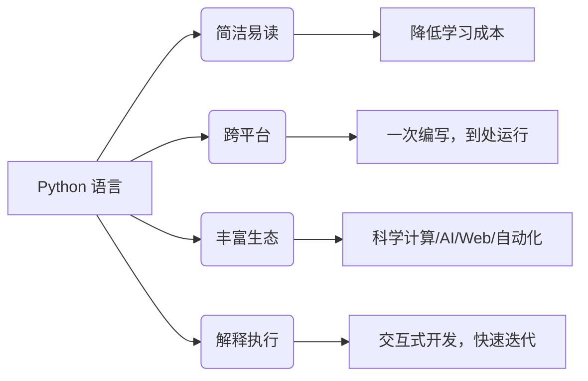
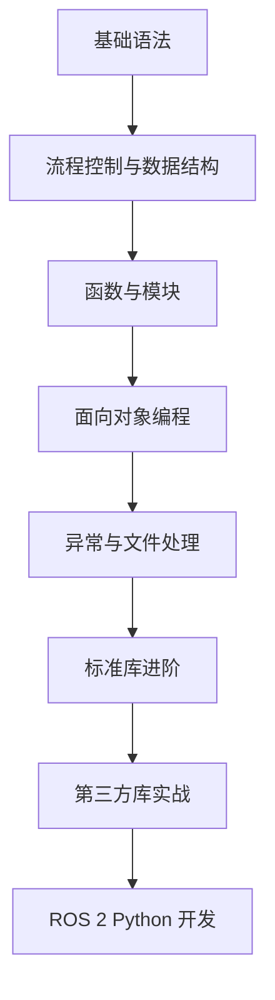

# Python 概述

## 关于本教程

本系列教程旨在帮助读者系统掌握 Python 编程语言，并能够顺利过渡到 ROS 2 开发。内容编排由浅入深，涵盖语法基础、数据结构、面向对象、异常处理、模块包管理，最后以 ROS 2 桥接实战收尾。

> [!NOTE]
> 每章均配有可运行的代码示例和常见问题解答。建议读者在阅读时同步动手实践，以加深理解。

---

## Python 是什么？

Python 是一种 **解释型、高级、通用型** 编程语言，由 Guido van Rossum 于 1991 年首次发布。它以其简洁清晰的语法和强大的扩展库而闻名，被誉为“可执行的伪代码”。



---

## Python 的主要特点

### 1. 语法简洁优雅
Python 使用缩进来组织代码块，强制可读性。例如，一个简单的 `Hello World` 仅需一行。

### 2. 动态类型系统
变量无需声明类型，解释器会在运行时自动推断。这极大提高了开发效率。

??? example "动态类型的直观感受"
    ```python
    x = 10          # 整型
    x = "Hello"     # 字符串，无需重新声明
    x = [1, 2, 3]   # 列表
    print(x)        # 输出 [1, 2, 3]
    ```

---

### 3. 丰富的标准库与第三方库
- **标准库**：提供文件 I/O、网络、正则、多线程、数据库等基础功能。
- **第三方库**：如 NumPy、Pandas、Matplotlib、TensorFlow、PyTorch、Django、Flask 等，覆盖几乎所有技术领域。

### 4. 跨平台性
Python 解释器支持 Windows、macOS、Linux 及各类 Unix 系统，代码可在不同平台间无缝迁移。

### 5. 可扩展与可嵌入
Python 可以调用 C/C++ 编写的扩展模块，也可以嵌入到 C/C++ 应用程序中作为脚本引擎。

## 安装与环境配置

### 推荐安装方式

| 操作系统 | 推荐方式 | 备注 |
|----------|----------|------|
| Windows  | 官方安装包 (python.org) 或 Anaconda | 建议勾选“Add Python to PATH” |
| macOS    | Homebrew (`brew install python`) 或官方包 | 系统自带 Python 2.7 已弃用，务必安装 Python 3 |
| Linux    | 系统包管理器 (apt/yum) 或源码编译 | Ubuntu 22.04+ 默认 Python 3.10+ |

> [!CAUTION]
> 请**务必**安装 Python 3.8 及以上版本，因为 Python 2 已于 2020 年停止维护，本系列教程所有代码均基于 Python 3。

### 验证安装
打开终端（命令提示符）输入：
```bash
python --version   # 或 python3 --version
```
若显示类似 `Python 3.10.x` 则安装成功。

### 虚拟环境（强烈推荐）
使用虚拟环境可以隔离项目依赖，避免包版本冲突。
```bash
# 创建虚拟环境
python -m venv myenv

# 激活（Windows）
myenv\Scripts\activate
# 激活（macOS/Linux）
source myenv/bin/activate

# 退出
deactivate
```

???+ tip "推荐使用 poetry 或 conda"
    对于大型项目，建议使用 `poetry` 或 `conda` 管理依赖，它们提供更完善的依赖解析和环境锁定功能。

---

## 运行 Python 代码的三种方式

### 1. 交互式解释器（REPL）
在终端输入 `python3` 进入交互模式，可以逐条执行命令，适合试验和调试。

```python
>>> print("Hello, Python!")
Hello, Python!
>>> 3 + 5
8
```

### 2. 运行脚本文件
将代码写入 `.py` 文件，然后通过解释器执行：
```bash
python3 myscript.py
```

### 3. 集成开发环境（IDE）
如 PyCharm、VS Code、Jupyter Notebook 等，提供代码补全、调试、运行一体化体验。

---

## 基本语法速览（预告）

本系列后续章节将深入讲解，这里仅列出关键概念供参考：

- **变量与数据类型**：数字、字符串、布尔、列表、元组、字典、集合
- **运算符**：算术、比较、逻辑、赋值、位运算
- **流程控制**：`if` / `elif` / `else`、`for`、`while`、`break` / `continue`
- **函数定义**：`def`、参数传递、返回值、匿名函数（`lambda`）
- **模块与包**：`import`、`from ... import ...`、自定义模块
- **面向对象**：类、对象、继承、多态、特殊方法
- **异常处理**：`try` / `except` / `finally`、自定义异常
- **文件操作**：读写文本/二进制文件、上下文管理器

---

## 开发工具推荐

| 工具 | 用途 | 特点 |
|------|------|------|
| Visual Studio Code | 轻量级编辑器 | 插件丰富，支持 Python 调试和远程开发 |
| PyCharm | 专业 IDE | 功能全面，适合大型项目，社区版免费 |
| Jupyter Notebook | 交互式文档 | 适合数据分析和教学，可混合代码与说明 |
| Thonny | 教育工具 | 极简，适合完全新手 |

???+ tip "VS Code 必装插件"
    - **Python** (ms-python.python)
    - **Pylance** (语言服务)
    - **Code Runner** (快速运行代码片段)

---

## 学习路径建议



??? warning "常见误区"
    - 混淆 `=`（赋值）与 `==`（相等比较）
    - 忘记缩进，导致 `IndentationError`
    - 在函数内部修改全局变量未使用 `global` 声明
    - 可变对象（如列表）作为默认参数导致的意外行为（将在函数章节详述）

---

## 参考资料与延伸阅读

- [Python 官方文档](https://docs.python.org/zh-cn/3/) （中文版）
- [PEP 8 – Python 代码风格指南](https://peps.python.org/pep-0008/)
- [Python 包索引 (PyPI)](https://pypi.org/)
- [Real Python 教程](https://realpython.com/)

---

> [!WARNING]
> 本系列文档仅供学习交流，所有示例代码均可在 Python 3.8+ 环境中运行。未经允许不得用于商业目的。

> [!CAUTION]
> 文档中的代码示例若涉及文件操作或网络请求，请在安全环境中执行，避免破坏系统数据。

---

---
## 👥 贡献者
本项目离不开每一位提交 PR、提 Issue、优化文档的开发者，由衷致谢！
<div style="display: flex; flex-wrap: wrap; gap: 30px; margin-top: 20px; margin-bottom: 20px;">
    <div style="text-align: center;">
        <a href="https://github.com/yxzhc">
            
        </a>
        <div style="margin-top: 8px; font-weight: 600;">
            <a href="https://github.com/yxzhc" style="text-decoration: none;">YXZHC</a>
        </div>
    </div>
    <div style="text-align: center;">
        <a href="https://github.com/hbrobot">
            
        </a>
        <div style="margin-top: 8px; font-weight: 600;">
            <a href="https://github.com/hbrobot" style="text-decoration: none;">HBRobot</a>
        </div>
    </div>
</div>
---
🤝 **欢迎参与共建：**

[:fontawesome-brands-github: 提交 Issue](https://github.com/hbrobot/hbrobot.github.io/issues/new/choose){: .md-button }
[:octicons-git-pull-request-24: 提交 PR](https://github.com/hbrobot/hbrobot.github.io/compare){: .md-button .md-button--primary }

---