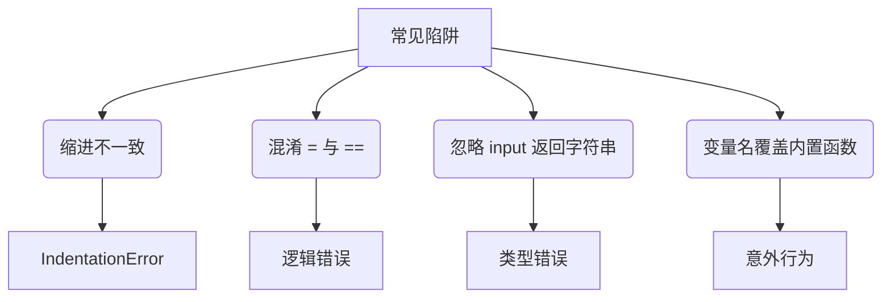

# 基本语法

<!-- 章节元信息 -->
上一章：[Python 概述](./00-python-overview.zh.md) | 下一章：[流程控制](./02-flow-control.zh.md)

---

本章正式进入 Python 语言的核心。我们将详细讲解 Python 的基本语法元素，包括注释、缩进规则、变量与数据类型、运算符、输入输出等。这些内容是后续所有编程的基础，请务必熟练掌握。

> [!NOTE]
> 本章所有示例代码均可在 Python 3.8+ 交互式环境或脚本中运行。强烈建议你打开终端，边学边练。

---

## 1. 注释

注释是代码中不会被解释器执行的文本，用于解释代码逻辑，提高可读性。Python 支持单行注释和多行注释。

### 单行注释
以 `#` 开头，直到行末。

```python
# 这是单行注释
print("Hello")  # 也可以放在代码后面
```

### 多行注释
使用三个引号（单引号或双引号）包裹，通常用于文档字符串（docstring），也可作为临时多行注释。

```python
"""
这是多行注释（文档字符串）
通常写在模块、类或函数开头
"""
print("World")

'''
也可以用三个单引号
'''
```

???+ tip "文档字符串的最佳实践"
    使用 `"""` 作为函数/类的文档字符串，遵循 PEP 257 规范，这样可以通过 `help()` 函数查看。例如：
    ```python
    def add(a, b):
        """返回 a 与 b 的和。"""
        return a + b
    ```

---

## 2. 缩进与代码块

Python 使用 **缩进** 表示代码块（如条件、循环、函数体），取代了其他语言中的大括号 `{}`。缩进的空格数可以任意（通常为 4 个空格），但**同一代码块内的缩进必须一致**。

```python
if True:
    print("这是缩进4个空格")   # 正确
    print("同属一个代码块")
else:
    print("另一个代码块")
```

> [!CAUTION]
> 混用 Tab 和空格会导致 `IndentationError`。建议编辑器统一将 Tab 转换为空格（VS Code / PyCharm 默认如此）。

??? example "错误示例"
    ```python
    if True:
    print("缺少缩进")   # IndentationError
    ```

---

## 3. 变量与赋值

变量是存储数据的容器。Python 是动态类型语言，变量无需显式声明类型，赋值即创建。

```python
name = "Alice"      # 字符串
age = 25            # 整数
height = 1.68       # 浮点数
is_student = True   # 布尔值
```

### 多变量赋值
```python
a, b, c = 1, 2, 3          # 同时赋值
x = y = z = 0             # 链式赋值
```

### 变量命名规则
- 由字母、数字、下划线组成，不能以数字开头。
- 区分大小写（`age` 和 `Age` 不同）。
- 避免使用 Python 关键字（如 `if`, `for`, `class` 等）。
- 推荐使用小写字母和下划线分隔（蛇形命名法），如 `my_variable`。

???+ warning "常见关键字列表"
    `False`, `None`, `True`, `and`, `as`, `assert`, `async`, `await`, `break`, `class`, `continue`, `def`, `del`, `elif`, `else`, `except`, `finally`, `for`, `from`, `global`, `if`, `import`, `in`, `is`, `lambda`, `nonlocal`, `not`, `or`, `pass`, `raise`, `return`, `try`, `while`, `with`, `yield`。

---

## 4. 基本数据类型

Python 内置了多种数据类型，这里介绍最常用的几种。

### 4.1 数值类型
- **整数 (int)**：任意大小，如 `10`, `-3`, `0`。
- **浮点数 (float)**：带小数点的数，如 `3.14`, `-0.001`, `2.0`（也可写成 `2.`）。
- **复数 (complex)**：形如 `a + bj`，如 `3+4j`。

```python
print(type(10))      # <class 'int'>
print(type(3.14))    # <class 'float'>
```

### 4.2 布尔类型 (bool)
只有两个值：`True` 和 `False`（注意首字母大写）。常用于条件判断。

```python
is_ok = True
is_finished = False
```

### 4.3 字符串 (str)
用单引号、双引号或三引号括起来的一系列字符。

```python
s1 = 'Hello'
s2 = "World"
s3 = '''多行
字符串'''
```

字符串支持多种操作，后续章节会详细展开。

### 4.4 类型转换
- `int(x)`：转换为整数
- `float(x)`：转换为浮点数
- `str(x)`：转换为字符串
- `bool(x)`：转换为布尔值

```python
print(int("123"))      # 123
print(str(456))        # "456"
print(bool(0))         # False，非零数值为 True
```

---

## 5. 运算符

### 5.1 算术运算符

| 运算符 | 描述 | 示例 |
|--------|------|------|
| `+`    | 加   | `3 + 2` → 5 |
| `-`    | 减   | `5 - 3` → 2 |
| `*`    | 乘   | `2 * 3` → 6 |
| `/`    | 除法（浮点） | `7 / 2` → 3.5 |
| `//`   | 整除（向下取整） | `7 // 2` → 3 |
| `%`    | 取余（模） | `7 % 2` → 1 |
| `**`   | 幂运算 | `2 ** 3` → 8 |

### 5.2 比较运算符
返回布尔值：`==`, `!=`, `>`, `<`, `>=`, `<=`。

```python
print(5 == 5)    # True
print(3 != 2)    # True
```

### 5.3 逻辑运算符
- `and`：与
- `or`：或
- `not`：非

```python
x = 5
print(x > 0 and x < 10)   # True
print(not (x > 10))       # True
```

### 5.4 赋值运算符
除了 `=`，还有复合赋值：`+=`, `-=`, `*=`, `/=` 等。

```python
a = 10
a += 5   # 相当于 a = a + 5 → 15
```

### 5.5 成员运算符
- `in`：在序列中（字符串、列表等）
- `not in`：不在序列中

```python
print('a' in 'apple')   # True
print(3 in [1, 2, 4])   # False
```

### 5.6 身份运算符
- `is`：判断两个对象是否相同（内存地址）
- `is not`：判断是否不同

```python
a = [1, 2]
b = [1, 2]
print(a is b)   # False (不同对象)
print(a == b)   # True (内容相等)
```

???+ warning "`==` 与 `is` 的区别"
    - `==` 比较值是否相等。
    - `is` 比较内存地址是否相同。对于小整数（-5~256）和短字符串，Python 会缓存，但不要依赖此行为。

---

## 6. 输入与输出

### 6.1 输出：`print()`
`print()` 将内容输出到控制台，可以同时输出多个值，用逗号分隔，默认空格分隔并换行。

```python
print("Hello", "World", 123)   # Hello World 123
print("A", end="")             # 不换行
print("B")                     # AB
```

### 6.2 输入：`input()`
`input()` 从键盘读取一行文本，返回字符串。可以传入提示字符串。

```python
name = input("请输入你的名字：")
print("你好，" + name)
```

> [!CAUTION]
> `input()` 返回的总是字符串，如果需要数值，必须显式转换：
> ```python
> age = int(input("请输入年龄："))
> ```

---

## 7. 字符串基础（预告）

字符串在 Python 中非常重要，这里先介绍几种常用操作，后续数据结构章节会进一步深入。

- **拼接**：使用 `+` 或 `*`（重复）。
  ```python
  s = "Hello" + " " + "World"   # "Hello World"
  t = "Ha" * 3                  # "HaHaHa"
  ```
- **索引**：从 0 开始，支持负数从末尾开始。
  ```python
  s = "Python"
  print(s[0])   # 'P'
  print(s[-1])  # 'n'
  ```
- **切片**：`[start:end:step]`，左闭右开。
  ```python
  print(s[0:4])   # "Pyth"
  print(s[::-1])  # "nohtyP"（反转）
  ```
- **常用方法**：`.upper()`, `.lower()`, `.strip()`, `.split()`, `.join()` 等。

??? example "字符串格式化示例"
    ```python
    name = "Alice"
    age = 25
    # f-string（Python 3.6+ 推荐）
    print(f"姓名：{name}，年龄：{age}")
    # format 方法
    print("姓名：{}，年龄：{}".format(name, age))
    # % 格式化（旧式）
    print("姓名：%s，年龄：%d" % (name, age))
    ```

---

## 8. 简单交互程序示例

综合以上知识，编写一个简单的问候程序：

```python
# 打招呼程序
name = input("请输入你的名字：")
age = input("请输入你的年龄：")
age = int(age) if age.isdigit() else 0

print(f"你好，{name}！")
if age > 0:
    print(f"你今年 {age} 岁，明年将 {age+1} 岁。")
else:
    print("年龄输入无效。")
```

---

## 9. 常见陷阱与避坑指南



??? warning "避坑小贴士"
    - 始终保持 4 个空格的缩进。
    - 条件判断使用 `==`，赋值使用 `=`。
    - 对 `input()` 的结果进行类型转换前先验证合法性。
    - 不要使用 `list`, `str`, `input` 等作为变量名，以免覆盖内置函数。

---

## 10. 小结

本章我们学习了：

- 注释和缩进规则
- 变量声明与命名规范
- 四种基本数据类型及转换
- 各类运算符的使用
- 输入输出函数
- 字符串的基本操作

掌握这些内容，你已经可以编写简单的 Python 程序了。下一章将进入流程控制，让你的程序具备逻辑判断和循环能力。

---

## 练习（建议动手）

1. 编写程序，输入圆的半径，计算并输出面积（π 取 3.14159）。
2. 交换两个变量的值（不使用临时变量）。
3. 编写程序，输入一个三位数，输出其个位、十位、百位数字。

---

> [!WARNING]
> 请确保练习时使用 Python 3，不要在 Python 2 环境下运行，否则可能出现意想不到的结果。

> [!CAUTION]
> 字符串切片时索引越界会引发 `IndexError`，请确保索引在有效范围内。
