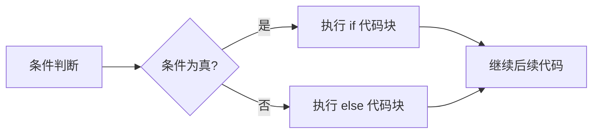
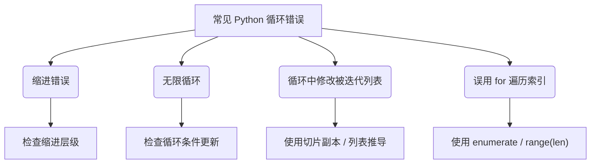

# 流程控制

上一章：[基本语法](./01-basic-syntax.zh.md) | 下一章：[数据结构](./03-data-structures.zh.md)

---

程序默认按顺序逐行执行，但实际业务逻辑需要根据条件选择执行路径，或重复执行某段代码。Python 提供了丰富的流程控制语句，本章将全面讲解条件分支和循环结构。

> [!NOTE]
> 本章示例均可在 Python 3 环境中运行。建议使用交互式解释器或新建 `.py` 文件进行练习。

---

## 1. 条件分支：`if` / `elif` / `else`

条件分支用于根据布尔表达式的结果决定执行哪段代码。

### 1.1 基本语法

```python
if 条件1:
    # 条件1为真时执行
    代码块1
elif 条件2:
    # 条件1为假且条件2为真时执行
    代码块2
else:
    # 所有条件都为假时执行
    代码块3
```

- `elif` 是 `else if` 的缩写，可以有零个或多个。
- `else` 是可选的。

```python
score = 85
if score >= 90:
    grade = 'A'
elif score >= 80:
    grade = 'B'
elif score >= 70:
    grade = 'C'
elif score >= 60:
    grade = 'D'
else:
    grade = 'F'
print(f"成绩等级：{grade}")   # B
```

### 1.2 嵌套条件

条件语句可以嵌套，但过深的嵌套会降低可读性，建议使用 `and` / `or` 简化。

```python
x = 10
y = 20
if x > 0:
    if y > 0:
        print("x和y均为正数")
    else:
        print("x为正，y为非正")
else:
    print("x为非正")
# 更好的写法：
if x > 0 and y > 0:
    print("x和y均为正数")
elif x > 0 and y <= 0:
    print("x为正，y为非正")
else:
    print("x为非正")
```

### 1.3 三元表达式（条件表达式）

简洁的单行条件赋值，格式为 `值1 if 条件 else 值2`。

```python
age = 18
status = "成年" if age >= 18 else "未成年"
print(status)   # 成年
```



??? example "多重条件判断示例"
    ```python
    # 判断闰年
    year = 2024
    if (year % 4 == 0 and year % 100 != 0) or (year % 400 == 0):
        print(f"{year} 是闰年")
    else:
        print(f"{year} 不是闰年")
    ```

---

## 2. 循环结构

循环用于重复执行某段代码，直到满足退出条件。

### 2.1 `while` 循环

只要条件为真，就不断执行循环体。

```python
count = 0
while count < 5:
    print(count)
    count += 1
# 输出 0,1,2,3,4
```

> [!CAUTION]
> 务必确保循环条件最终会变为假，否则产生无限循环。若不小心写出无限循环，可以按 `Ctrl+C` 中断。

### 2.2 `for` 循环

`for` 循环用于遍历可迭代对象（如字符串、列表、元组、字典、range 等）。

```python
# 遍历字符串
for ch in "Python":
    print(ch)

# 遍历列表
fruits = ["apple", "banana", "cherry"]
for fruit in fruits:
    print(fruit)

# 遍历字典（默认遍历键）
person = {"name": "Alice", "age": 25}
for key in person:
    print(key, person[key])   # 或使用 items()
```

### 2.3 `range()` 函数

`range()` 生成一个不可变的整数序列，常用于 `for` 循环中控制迭代次数。

```python
range(stop)          # 0 ~ stop-1
range(start, stop)   # start ~ stop-1
range(start, stop, step)  # 步长
```

```python
for i in range(5):        # 0,1,2,3,4
    print(i)

for i in range(2, 8, 2):  # 2,4,6
    print(i)

# 倒序
for i in range(10, 0, -1):  # 10,9,...,1
    print(i)
```

### 2.4 `enumerate()` 获取索引和值

`enumerate` 在遍历时可同时获得元素及其索引。

```python
colors = ["red", "green", "blue"]
for index, color in enumerate(colors):
    print(f"{index}: {color}")
# 输出：0: red, 1: green, 2: blue

# 可指定起始索引
for index, color in enumerate(colors, start=1):
    print(f"{index}: {color}")
```

### 2.5 循环中的 `break` 和 `continue`

- `break`：立即终止所在循环，跳出循环体。
- `continue`：跳过本次循环剩余的语句，立即进入下一次循环判断。

```python
# break 示例：查找第一个偶数
numbers = [1, 3, 5, 2, 4, 6]
for n in numbers:
    if n % 2 == 0:
        print(f"找到偶数: {n}")
        break
else:
    print("没有偶数")   # 若循环正常结束（没有 break）则执行

# continue 示例：打印奇数
for n in range(10):
    if n % 2 == 0:
        continue
    print(n)   # 输出 1,3,5,7,9
```

### 2.6 `for...else` 和 `while...else`

Python 支持循环的 `else` 子句：当循环**正常结束**（即没有执行 `break`）时，`else` 块会被执行。

```python
# 检查素数
num = 17
for i in range(2, int(num ** 0.5) + 1):
    if num % i == 0:
        print(f"{num} 不是素数")
        break
else:
    print(f"{num} 是素数")
```

???+ tip "`else` 在循环中的用途"
    常用于搜索任务：若在循环中找到了目标，用 `break` 退出，此时不执行 `else`；若遍历完仍未找到，则 `else` 执行，表示“未找到”。

---

## 3. 循环控制的高级技巧

### 3.1 嵌套循环

循环可以嵌套，内层循环在外层循环的每次迭代中都会完整执行。

```python
# 打印九九乘法表
for i in range(1, 10):
    for j in range(1, i+1):
        print(f"{j}×{i}={i*j}", end="\t")
    print()   # 换行
```

### 3.2 列表推导式（List Comprehension）

列表推导式是一种简洁的生成列表的方式，可视为 `for` 循环的表达式版本。

```python
# 生成平方数列表
squares = [x**2 for x in range(10)]          # [0,1,4,...,81]

# 带条件过滤
evens = [x for x in range(20) if x % 2 == 0]

# 嵌套循环展开
pairs = [(a, b) for a in range(3) for b in range(3)]  # (0,0),(0,1)...(2,2)
```

### 3.3 `zip()` 并行迭代

`zip` 将多个可迭代对象按位置打包成元组，用于并行遍历。

```python
names = ["Alice", "Bob", "Charlie"]
ages = [25, 30, 35]
for name, age in zip(names, ages):
    print(f"{name} is {age} years old")

# 若长度不同，zip 以最短的为准。
```

### 3.4 `itertools` 模块（拓展）

对于复杂的循环逻辑，Python 标准库的 `itertools` 提供了强大的迭代工具，如 `cycle`, `repeat`, `combinations`, `permutations` 等。

```python
import itertools
for item in itertools.cycle([1, 2, 3]):  # 无限循环
    print(item)
    break   # 仅演示
```

---

## 4. 流程控制实战案例

### 4.1 猜数字游戏

```python
import random
target = random.randint(1, 100)
guess = None
tries = 0

while guess != target:
    try:
        guess = int(input("猜一个1~100的数字："))
        tries += 1
        if guess < target:
            print("太小了")
        elif guess > target:
            print("太大了")
    except ValueError:
        print("请输入有效整数")

print(f"恭喜！你用了 {tries} 次猜中了 {target}")
```

### 4.2 遍历文件行（常见模式）

```python
with open("data.txt", "r", encoding="utf-8") as f:
    for line in f:
        line = line.strip()
        if not line:    # 跳过空行
            continue
        # 处理非空行
        print(line)
```

---

## 5. 常见错误与最佳实践



??? warning "修改列表时的陷阱"
    ```python
    # 错误：在遍历时删除元素会跳过元素
    lst = [1, 2, 3, 4]
    for i in lst:
        if i % 2 == 0:
            lst.remove(i)
    print(lst)   # 可能得到 [1, 3] 但不是预期 [1, 3]? 实际为 [1,3] 仍正确，但更复杂的情况会出错
    
    # 正确方式1：遍历副本
    for i in lst[:]:
        if i % 2 == 0:
            lst.remove(i)
    
    # 正确方式2：列表推导新建
    lst = [i for i in lst if i % 2 != 0]
    ```

???+ tip "使用 `for` 而非 `while` 更安全"
    如果迭代次数可预知或需要遍历序列，优先使用 `for`，因为 Python 内部处理索引和终止条件，降低无限循环风险。

---

## 6. 小结

本章学习了：

- `if` / `elif` / `else` 条件分支及三元表达式
- `while` 和 `for` 循环
- `range()`, `enumerate()`, `zip()` 等辅助工具
- `break`, `continue`, `else` 在循环中的用法
- 列表推导式及循环注意事项

流程控制是程序逻辑的核心，请务必通过大量练习来熟悉。下一章将深入 Python 的内置数据结构（列表、元组、字典、集合），它们将与循环密切配合。

---

## 练习建议

1. 打印所有水仙花数（三位数，各位数字立方和等于自身）。
2. 输入一个正整数，判断是否为素数。
3. 使用 `for` 循环打印等腰三角形（行数由用户输入）。
4. 给定列表 `[1, 2, 3, 4, 5, 6]`，生成新列表，包含原列表中每个元素的平方，但只保留平方后为偶数的元素（使用列表推导式）。

---

> [!WARNING]
> 当循环内修改可变对象时，务必确认不会产生意外的副作用。若不熟悉，建议先创建副本。

> [!CAUTION]
> 使用 `while True` 时一定要确保有 `break` 出口，否则程序将永远阻塞。

---
## 👥 贡献者
本项目离不开每一位提交 PR、提 Issue、优化文档的开发者，由衷致谢！
<div style="display: flex; flex-wrap: wrap; gap: 30px; margin-top: 20px; margin-bottom: 20px;">
    <div style="text-align: center;">
        <a href="https://github.com/yxzhc">
            
        </a>
        <div style="margin-top: 8px; font-weight: 600;">
            <a href="https://github.com/yxzhc" style="text-decoration: none;">YXZHC</a>
        </div>
    </div>
    <div style="text-align: center;">
        <a href="https://github.com/hbrobot">
            
        </a>
        <div style="margin-top: 8px; font-weight: 600;">
            <a href="https://github.com/hbrobot" style="text-decoration: none;">HBRobot</a>
        </div>
    </div>
</div>
---
🤝 **欢迎参与共建：**

[:fontawesome-brands-github: 提交 Issue](https://github.com/hbrobot/hbrobot.github.io/issues/new/choose){: .md-button }
[:octicons-git-pull-request-24: 提交 PR](https://github.com/hbrobot/hbrobot.github.io/compare){: .md-button .md-button--primary }