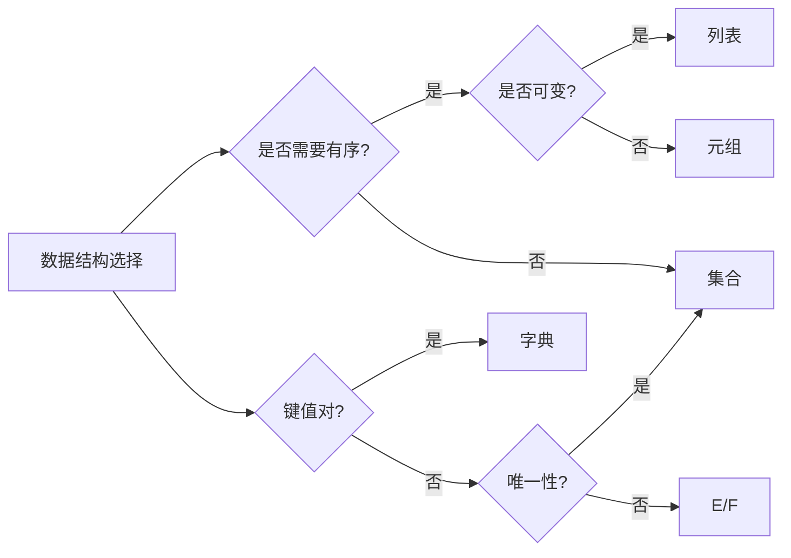

# 数据结构

上一章：[流程控制](./02-flow-control.zh.md) | 下一章：[函数](./04-function.zh.md)

---

数据结构是编程中组织和存储数据的方式。Python 提供了四种内置的高效数据结构：**列表（List）**、**元组（Tuple）**、**字典（Dict）** 和 **集合（Set）**。它们是 Python 语言的基石，几乎在所有程序中都会用到。本章将深入讲解每种结构的特性、操作方法和适用场景。

> [!NOTE]
> 本章示例均可在 Python 3 环境中运行。建议在交互式解释器中跟着操作，以加深印象。

---

## 1. 列表（List）

列表是有序、可变、元素可重复的序列，用方括号 `[]` 表示。它是 Python 中最常用的数据结构。

### 1.1 创建列表

```python
empty = []                      # 空列表
numbers = [1, 2, 3, 4, 5]
mixed = [1, "hello", 3.14, True]   # 元素类型可以不同
nested = [[1, 2], [3, 4]]       # 嵌套列表
```

### 1.2 访问与切片

索引从 0 开始，支持负数索引（-1 表示最后一个元素）。

```python
fruits = ["apple", "banana", "cherry", "date", "elderberry"]
print(fruits[0])      # apple
print(fruits[-1])     # elderberry
print(fruits[1:4])    # ['banana', 'cherry', 'date']  左闭右开
print(fruits[::2])    # ['apple', 'cherry', 'elderberry']  步长2
```

### 1.3 常用方法（增删改查）

| 方法 | 描述 | 示例 |
|------|------|------|
| `append(x)` | 末尾添加元素 | `lst.append(10)` |
| `extend(iterable)` | 末尾扩展多个元素 | `lst.extend([11,12])` |
| `insert(i, x)` | 在位置 i 插入元素 | `lst.insert(0, 99)` |
| `remove(x)` | 删除第一个值为 x 的元素 | `lst.remove(99)` |
| `pop([i])` | 删除并返回索引 i 处的元素（默认末尾） | `last = lst.pop()` |
| `clear()` | 清空所有元素 | `lst.clear()` |
| `index(x)` | 返回第一个 x 的索引 | `idx = lst.index("apple")` |
| `count(x)` | 统计 x 出现的次数 | `c = lst.count(5)` |
| `sort()` | 原地排序（可指定 key/reverse） | `lst.sort()` |
| `reverse()` | 原地反转 | `lst.reverse()` |
| `copy()` | 返回浅拷贝 | `new = lst.copy()` |

```python
lst = [3, 1, 4, 1, 5, 9, 2]
lst.append(6)             # [3,1,4,1,5,9,2,6]
lst.insert(0, 0)          # [0,3,1,4,1,5,9,2,6]
lst.remove(1)             # 删除第一个 1
popped = lst.pop(2)       # 删除索引2的元素 (4)
lst.sort()                # [0,1,2,3,5,6,9]
lst.reverse()             # [9,6,5,3,2,1,0]
print(lst.count(1))       # 1
```

### 1.4 列表推导式（重温）

列表推导式提供了一种简洁的构建列表方式。

```python
# 生成平方数
squares = [x**2 for x in range(10)]
# 带条件过滤
evens = [x for x in range(20) if x % 2 == 0]
# 嵌套循环扁平化
matrix = [[1,2,3], [4,5,6], [7,8,9]]
flat = [num for row in matrix for num in row]   # [1,2,3,4,5,6,7,8,9]
```

### 1.5 列表作为栈和队列

- **栈（LIFO）**：用 `append()` 入栈，`pop()` 出栈。
- **队列（FIFO）**：用 `append()` 入队，`pop(0)` 出队（但效率低，推荐 `collections.deque`）。

```python
# 栈
stack = []
stack.append(1)
stack.append(2)
print(stack.pop())   # 2

# 队列（简单实现）
queue = []
queue.append(10)
queue.append(20)
print(queue.pop(0))  # 10
```

---

## 2. 元组（Tuple）

元组是有序、不可变、元素可重复的序列，用小括号 `()` 表示。一旦创建，就不能修改其内容。

### 2.1 创建元组

```python
t1 = ()                     # 空元组
t2 = (1, 2, 3)              # 通常括号可省略：1,2,3
t3 = (1,)                   # 单元素元组，逗号不可省略
t4 = tuple([1, 2, 3])       # 从列表转换
```

### 2.2 访问与切片

与列表类似，支持索引和切片（但不能修改）。

```python
t = (10, 20, 30, 40, 50)
print(t[1])       # 20
print(t[-2:])     # (40, 50)
```

### 2.3 元组方法

由于不可变，方法很少：`count()` 和 `index()`。

```python
t = (1, 2, 2, 3)
print(t.count(2))   # 2
print(t.index(3))   # 3
```

### 2.4 元组解包

元组可以方便地将多个值赋给变量，这种操作称为解包（unpacking）。

```python
point = (3, 5)
x, y = point           # x=3, y=5

# 使用 * 收集剩余元素
a, *rest = (1, 2, 3, 4)   # a=1, rest=[2,3,4]
```

### 2.5 元组 vs 列表

| 特性 | 列表 | 元组 |
|------|------|------|
| 可变性 | 可变 | 不可变 |
| 速度 | 稍慢 | 稍快（因不可变） |
| 内存 | 更大 | 更小 |
| 使用场景 | 动态数据集 | 固定数据集（如坐标、配置） |
| 是否可哈希 | 否 | 是（可用作字典键） |

???+ tip "何时使用元组？"
    - 表示固定数据（如函数返回多个值）。
    - 作为字典的键（因为可哈希）。
    - 当不希望数据被意外修改时。

---

## 3. 字典（Dictionary）

字典是键值对（key-value）的无序集合（Python 3.7+ 保留插入顺序），键必须唯一且不可变（如字符串、数字、元组），值可以是任意类型。

### 3.1 创建字典

```python
empty = {}
person = {"name": "Alice", "age": 25, "city": "New York"}
# 使用 dict() 构造
person2 = dict(name="Bob", age=30)     # 注意这里的键不加引号
# 从键值对列表
items = [("a", 1), ("b", 2)]
d = dict(items)
```

### 3.2 访问与修改

```python
d = {"apple": 3, "banana": 5}
print(d["apple"])        # 3
# 安全访问（若键不存在返回 None 或指定默认值）
print(d.get("orange", 0))   # 0
# 修改/添加
d["banana"] = 10         # 更新
d["cherry"] = 7          # 添加新键
```

### 3.3 常用方法

| 方法 | 描述 |
|------|------|
| `keys()` | 返回所有键的视图 |
| `values()` | 返回所有值的视图 |
| `items()` | 返回所有键值对元组的视图 |
| `get(key[, default])` | 获取键对应的值，不存在返回默认值 |
| `pop(key[, default])` | 删除并返回键对应的值 |
| `popitem()` | 弹出并返回最后一个插入的键值对 |
| `update(dict2)` | 合并另一个字典 |
| `clear()` | 清空字典 |
| `copy()` | 返回浅拷贝 |

```python
d = {"x": 1, "y": 2}
for key in d.keys():
    print(key)
for value in d.values():
    print(value)
for k, v in d.items():
    print(k, v)

d.pop("x")           # 删除 x
d.update({"z": 3})   # 添加 z
```

### 3.4 字典推导式

类似列表推导式，用于生成字典。

```python
# 交换键值
original = {"a": 1, "b": 2, "c": 3}
inverted = {v: k for k, v in original.items()}   # {1:'a', 2:'b', 3:'c'}

# 带条件
squares = {x: x**2 for x in range(5) if x % 2 == 0}   # {0:0, 2:4, 4:16}
```

### 3.5 默认字典（`defaultdict`）和有序字典（`OrderedDict`）

- `collections.defaultdict`：当键不存在时自动生成默认值。
- `collections.OrderedDict`：保留插入顺序（Python 3.7+ 字典已原生保留，但仍有特殊方法）。

```python
from collections import defaultdict
dd = defaultdict(int)   # 默认值为 0
dd["count"] += 1         # 无需检查键是否存在
print(dd)                # {'count': 1}
```

---

## 4. 集合（Set）

集合是无序、唯一元素的集合，用花括号 `{}` 或 `set()` 创建。它支持数学上的集合运算（并、交、差等）。

### 4.1 创建集合

```python
s1 = {1, 2, 3, 3}          # {1,2,3}  自动去重
s2 = set([4, 5, 6])        # 从列表转换
empty_set = set()          # 注意 {} 是空字典，不是空集合
```

### 4.2 常用操作

- 添加：`add(x)`  
- 删除：`remove(x)`（不存在报错），`discard(x)`（不存在不报错）  
- 弹出：`pop()`（随机删除一个元素）  
- 清空：`clear()`

```python
s = {1, 2, 3}
s.add(4)               # {1,2,3,4}
s.remove(2)            # {1,3,4}
s.discard(10)          # 无影响
popped = s.pop()       # 随机弹出一个
```

### 4.3 集合运算

| 运算 | 操作符 | 方法 | 描述 |
|------|--------|------|------|
| 并集 | `\|` | `union()` | 两个集合的所有元素 |
| 交集 | `&` | `intersection()` | 共有元素 |
| 差集 | `-` | `difference()` | 在第一个不在第二个 |
| 对称差 | `^` | `symmetric_difference()` | 不同时属于两者的元素 |

```python
A = {1, 2, 3, 4}
B = {3, 4, 5, 6}
print(A | B)        # {1,2,3,4,5,6}
print(A & B)        # {3,4}
print(A - B)        # {1,2}
print(A ^ B)        # {1,2,5,6}

# 子集/超集判断
print(A.issubset(B))   # False
print(A.issuperset({1,2}))  # True
```

### 4.4 集合推导式

```python
squares = {x**2 for x in range(10)}   # {0,1,4,9,...81}
evens = {x for x in range(20) if x % 2 == 0}
```

### 4.5 集合的应用场景

- **去重**：`unique = set(list)`。
- **成员测试**：集合的 `in` 操作是 O(1)，比列表快。
- **数据关系运算**：求共同好友、差集等。

---

## 5. 深拷贝与浅拷贝

当数据结构包含可变对象（如列表嵌套列表）时，拷贝行为需注意。

- **浅拷贝**：只复制顶层对象，内部嵌套对象仍引用原对象。
- **深拷贝**：递归复制所有层级的对象，完全独立。

```python
import copy
original = [[1, 2], [3, 4]]
shallow = original.copy()           # 或 list(original)
shallow[0][0] = 99
print(original)   # [[99, 2], [3, 4]]   original 被影响

deep = copy.deepcopy(original)
deep[0][0] = 100
print(original)   # [[99, 2], [3, 4]]   不受影响
```

???+ warning "可变对象的默认参数陷阱"
    若函数默认参数使用可变对象（如列表），则多次调用会共享同一对象，导致意外。应使用 `None` 并在函数内部创建新对象。

---

## 6. 遍历数据结构的常用模式

```python
# 遍历列表（带索引）
for i, val in enumerate(lst):
    print(i, val)

# 遍历字典
for key, value in d.items():
    print(key, value)

# 同时遍历多个序列
names = ["Alice", "Bob"]
ages = [25, 30]
for name, age in zip(names, ages):
    print(f"{name} is {age}")

# 判断元素是否存在
if "apple" in fruits:   # 列表 O(n)
if "apple" in fruit_set: # 集合 O(1)
```



---

## 7. 性能对比

| 数据结构 | 索引访问 | 成员检查（in） | 插入/删除 |
|----------|----------|---------------|-----------|
| 列表 | O(1) | O(n) | O(n) 在开头/中间，O(1) 在末尾 |
| 元组 | O(1) | O(n) | 不可变 |
| 字典 | O(1) | O(1) | O(1) 平均 |
| 集合 | 不支持 | O(1) | O(1) 平均 |

???+ tip "根据场景选择合适的数据结构"
    - 需要频繁随机访问且动态变化 → 列表
    - 固定数据且需要哈希 → 元组
    - 需要快速查找（键值映射） → 字典
    - 需要去重或集合运算 → 集合

---

## 8. 实战案例：统计文本词频

```python
text = "apple banana apple orange banana apple"
words = text.split()
word_count = {}
for word in words:
    word_count[word] = word_count.get(word, 0) + 1

# 使用 collections.Counter 更简洁
from collections import Counter
counter = Counter(words)
print(counter.most_common(2))   # [('apple', 3), ('banana', 2)]
```

---

## 9. 小结

本章详细介绍了 Python 的四大数据结构：

- **列表**：灵活可变，适用于动态数据。
- **元组**：不可变，适用于固定数据。
- **字典**：键值映射，快速查找。
- **集合**：无重复元素，支持集合运算。

掌握它们的使用方法和性能特点是编写高效 Python 代码的关键。下一章将学习函数，如何组织代码逻辑。

---

## 练习

1. 给定列表 `[1, 2, 2, 3, 4, 4, 5]`，使用集合去重并保持原有顺序。
2. 合并两个字典，若有重复键，后者覆盖前者。
3. 使用字典推导式，将列表 `["a", "b", "c"]` 转换为 `{"a": 0, "b": 1, "c": 2}`。
4. 实现一个函数，接收任意数量参数，返回去重后的列表（保持原顺序）。

---

> [!WARNING]
> 字典的键必须是不可变类型，因此列表不能作为键，但元组可以（前提是元组内元素也可哈希）。

> [!CAUTION]
> 在遍历列表时删除元素会导致索引错乱，建议遍历副本或使用列表推导创建新列表。


---
## 👥 贡献者
本项目离不开每一位提交 PR、提 Issue、优化文档的开发者，由衷致谢！
<div style="display: flex; flex-wrap: wrap; gap: 30px; margin-top: 20px; margin-bottom: 20px;">
    <div style="text-align: center;">
        <a href="https://github.com/yxzhc">
            
        </a>
        <div style="margin-top: 8px; font-weight: 600;">
            <a href="https://github.com/yxzhc" style="text-decoration: none;">YXZHC</a>
        </div>
    </div>
    <div style="text-align: center;">
        <a href="https://github.com/hbrobot">
            
        </a>
        <div style="margin-top: 8px; font-weight: 600;">
            <a href="https://github.com/hbrobot" style="text-decoration: none;">HBRobot</a>
        </div>
    </div>
</div>
---
🤝 **欢迎参与共建：**

[:fontawesome-brands-github: 提交 Issue](https://github.com/hbrobot/hbrobot.github.io/issues/new/choose){: .md-button }
[:octicons-git-pull-request-24: 提交 PR](https://github.com/hbrobot/hbrobot.github.io/compare){: .md-button .md-button--primary }