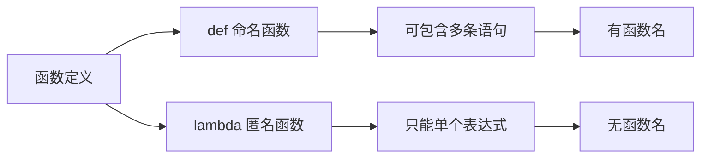

# 函数

上一章：[数据结构](./03-data-structures.zh.md) | 下一章：[模块与包](./05-module-package.zh.md)

---

函数是组织代码、实现复用和模块化的核心手段。通过函数，我们可以将一段逻辑封装起来，给它一个名字，并在需要时调用。Python 的函数非常灵活，支持多种参数传递方式和强大的高阶函数特性。

> [!NOTE]
> 本章所有示例均可在 Python 3 环境中运行。请务必动手实践，理解函数的定义、调用和参数传递机制。

---

## 1. 定义与调用函数

### 1.1 基本定义

使用 `def` 关键字定义函数，格式如下：

```python
def 函数名(参数列表):
    """文档字符串（可选）"""
    函数体
    return 返回值   # 可选
```

示例：

```python
def greet(name):
    """向指定的人打招呼"""
    return f"Hello, {name}!"

print(greet("Alice"))   # Hello, Alice!
```

- 函数名遵循变量命名规则（小写 + 下划线）。
- 参数列表可以为空。
- `return` 可选，若无则返回 `None`。

### 1.2 函数调用

直接使用函数名加括号，传入实参即可。

```python
result = greet("Bob")
```

### 1.3 文档字符串（docstring）

使用三引号编写，可以通过 `help()` 或 `.__doc__` 查看。

```python
def add(a, b):
    """计算两个数的和并返回。
    
    参数：
        a (int/float): 第一个加数
        b (int/float): 第二个加数
    返回：
        int/float: 两数之和
    """
    return a + b

print(add.__doc__)
help(add)
```

---

## 2. 参数传递

Python 的参数传递非常灵活，支持以下几种形式。

### 2.1 位置参数（Positional Arguments）

调用时按顺序传入，形参与实参一一对应。

```python
def power(base, exponent):
    return base ** exponent

print(power(2, 3))   # 8
```

### 2.2 默认参数（Default Arguments）

在定义时为参数指定默认值，调用时可省略。

```python
def greet(name, greeting="Hello"):
    return f"{greeting}, {name}!"

print(greet("Alice"))              # Hello, Alice!
print(greet("Bob", "Hi"))          # Hi, Bob!
```

> [!CAUTION]
> 默认参数的值在函数定义时计算，若默认值为可变对象（如列表），会跨调用共享，引发意外。推荐使用 `None` 并在函数内部重新创建。

```python
# 错误示例
def add_item(item, lst=[]):
    lst.append(item)
    return lst

print(add_item(1))   # [1]
print(add_item(2))   # [1, 2]  导致共享同一个列表

# 正确做法
def add_item(item, lst=None):
    if lst is None:
        lst = []
    lst.append(item)
    return lst
```

### 2.3 关键字参数（Keyword Arguments）

调用时通过 `形参名=值` 的方式指定，可以不按顺序。

```python
def introduce(name, age, city):
    return f"{name} is {age} years old, from {city}"

print(introduce(city="Beijing", age=25, name="Alice"))
```

### 2.4 可变参数

- **`*args`**：接收任意数量的位置参数，打包为元组。
- **`**kwargs`**：接收任意数量的关键字参数，打包为字典。

```python
def sum_all(*args):
    return sum(args)

print(sum_all(1, 2, 3, 4))   # 10

def print_info(**kwargs):
    for key, value in kwargs.items():
        print(f"{key}: {value}")

print_info(name="Alice", age=25, city="NYC")
```

### 2.5 关键字专用参数（Keyword-Only Arguments）

在 `*` 之后的参数只能通过关键字传递，不能使用位置参数。

```python
def config(host, port, *, debug=False, timeout=60):
    print(host, port, debug, timeout)

config("localhost", 8080, debug=True)   # 正确
# config("localhost", 8080, True)       # 错误，debug 必须关键字
```

### 2.6 参数组合顺序

在函数定义中，参数的顺序应为：
**位置参数 → `*args` → 默认参数 → 关键字专用参数 → `**kwargs`**

```python
def complex_func(a, b, *args, c=10, d=20, **kwargs):
    pass
```

---

## 3. 返回值

### 3.1 单个返回值

使用 `return` 返回一个值。

```python
def square(x):
    return x ** 2
```

### 3.2 多个返回值

实际上返回一个元组，可以通过解包接收。

```python
def divmod_custom(a, b):
    return a // b, a % b   # 返回元组 (商, 余数)

quotient, remainder = divmod_custom(10, 3)
print(quotient, remainder)   # 3 1
```

### 3.3 无返回值（返回 `None`）

若没有 `return` 或 `return` 不带值，函数返回 `None`。

```python
def no_return():
    print("nothing")

result = no_return()
print(result)   # None
```

---

## 4. 作用域

变量按作用域分为局部变量和全局变量。

- **局部变量**：在函数内部定义的变量，仅在函数内可见。
- **全局变量**：在模块顶层定义的变量，全局可用。

```python
x = 10   # 全局变量

def func():
    y = 5   # 局部变量
    print(x)   # 可以访问全局变量
    # x += 1   # 错误，不能在函数内直接修改全局变量（除非声明 global）

def modify_global():
    global x
    x += 1   # 修改全局变量

modify_global()
print(x)   # 11
```

- 若要修改全局变量，必须使用 `global` 关键字声明。
- 对于嵌套函数，可使用 `nonlocal` 修改外层（非全局）变量。

```python
def outer():
    z = 10
    def inner():
        nonlocal z
        z += 1
    inner()
    print(z)   # 11
```

---

## 5. 匿名函数（`lambda`）

`lambda` 表达式创建小型匿名函数，只能包含单个表达式，常用于需要函数对象的场景。

```python
square = lambda x: x ** 2
print(square(5))   # 25

# 常用在排序 key 中
pairs = [(1, 'one'), (2, 'two'), (3, 'three')]
pairs.sort(key=lambda pair: pair[1])   # 按字符串排序
```



---

## 6. 高阶函数

函数可以接受其他函数作为参数，或返回函数，这样的函数称为高阶函数。

### 6.1 内置高阶函数

- `map(func, iterable)`：对可迭代对象每个元素应用函数，返回迭代器。
- `filter(func, iterable)`：过滤满足条件的元素。
- `reduce(func, iterable)`：从 `functools` 导入，累积计算。

```python
# map
nums = [1, 2, 3, 4]
squared = list(map(lambda x: x**2, nums))   # [1,4,9,16]

# filter
evens = list(filter(lambda x: x % 2 == 0, nums))   # [2,4]

# reduce（需导入）
from functools import reduce
product = reduce(lambda a, b: a * b, nums)   # 24
```

### 6.2 自定义高阶函数

```python
def apply_twice(func, arg):
    return func(func(arg))

def add_five(x):
    return x + 5

print(apply_twice(add_five, 10))   # 20
```

---

## 7. 装饰器（Decorator）入门

装饰器是 Python 的高级特性，本质是一个高阶函数，用于在不修改原函数代码的前提下，为其增加额外功能（如日志、计时、权限校验等）。

### 7.1 简单装饰器

```python
def logger(func):
    def wrapper(*args, **kwargs):
        print(f"调用函数：{func.__name__}，参数：{args}, {kwargs}")
        result = func(*args, **kwargs)
        print(f"返回值：{result}")
        return result
    return wrapper

@logger   # 语法糖，等价于 add = logger(add)
def add(a, b):
    return a + b

add(3, 5)
# 输出：
# 调用函数：add，参数：(3, 5), {}
# 返回值：8
```

### 7.2 带参数的装饰器

```python
def repeat(times):
    def decorator(func):
        def wrapper(*args, **kwargs):
            for _ in range(times):
                result = func(*args, **kwargs)
            return result
        return wrapper
    return decorator

@repeat(3)
def say_hello():
    print("Hello")

say_hello()   # 打印三次 Hello
```

### 7.3 保留原函数元信息

使用 `functools.wraps` 保留被装饰函数的 `__name__` 和 `__doc__`。

```python
from functools import wraps

def logger(func):
    @wraps(func)
    def wrapper(*args, **kwargs):
        print(f"Calling {func.__name__}")
        return func(*args, **kwargs)
    return wrapper
```

???+ tip "装饰器应用场景"
    - 日志记录
    - 性能计时
    - 权限校验
    - 缓存（如 `@lru_cache`）
    - 事务管理

---

## 8. 递归函数

函数调用自身称为递归。递归必须有终止条件，否则无限递归导致栈溢出。

```python
def factorial(n):
    if n == 0:      # 终止条件
        return 1
    return n * factorial(n - 1)

print(factorial(5))   # 120
```

> [!CAUTION]
> Python 默认递归深度限制为 1000，深度过大会抛出 `RecursionError`。可以使用 `sys.setrecursionlimit()` 修改，但谨慎使用。

---

## 9. 类型注解（Type Hints）

Python 3.5+ 支持类型注解，提高代码可读性，且可被静态检查工具（如 mypy）利用。

```python
def greet(name: str, age: int = 18) -> str:
    return f"{name} is {age} years old"

# 注解不会强制类型，仅作提示
```

---

## 10. 实战案例：计算器

```python
def calculator():
    """简单计算器，支持 + - * /"""
    def add(a, b): return a + b
    def sub(a, b): return a - b
    def mul(a, b): return a * b
    def div(a, b):
        if b == 0:
            raise ValueError("除数不能为零")
        return a / b

    ops = {'+': add, '-': sub, '*': mul, '/': div}
    while True:
        expr = input("输入表达式 (如 3 + 4) 或 'quit' 退出: ")
        if expr.lower() == 'quit':
            break
        parts = expr.split()
        if len(parts) != 3:
            print("格式错误，请重新输入")
            continue
        a, op, b = parts
        try:
            a = float(a)
            b = float(b)
            if op not in ops:
                print("不支持的操作符")
                continue
            result = ops[op](a, b)
            print(f"结果: {result}")
        except ValueError:
            print("请输入有效数字")
        except Exception as e:
            print(f"错误: {e}")

if __name__ == "__main__":
    calculator()
```

---

## 11. 小结

本章涵盖了：

- 函数定义与调用
- 多种参数形式：位置、默认、关键字、`*args`/`**kwargs`
- 作用域规则（`global` / `nonlocal`）
- `lambda` 匿名函数
- 高阶函数与装饰器入门
- 递归与类型注解

函数是 Python 编程的基石，灵活运用函数能让代码清晰、可复用。下一章将学习模块与包，实现代码的组织和跨文件复用。

---

## 练习

1. 编写一个函数 `is_palindrome(s)`，判断字符串是否为回文（忽略大小写和空格）。
2. 实现一个装饰器 `@timing`，打印函数的执行时间（使用 `time.time`）。
3. 编写一个函数 `apply_to_evens(func, lst)`，对列表中的偶数应用 `func`，返回新列表。
4. 实现一个递归函数计算斐波那契数列第 n 项，并比较循环实现的效率。

---

> [!WARNING]
> 递归深度过大时可能引发 `RecursionError`，对于复杂计算应优先考虑迭代。

> [!CAUTION]
> 装饰器会改变原函数的元信息，记得使用 `@wraps` 修复，否则影响调试。


---
## 👥 贡献者
本项目离不开每一位提交 PR、提 Issue、优化文档的开发者，由衷致谢！
<div style="display: flex; flex-wrap: wrap; gap: 30px; margin-top: 20px; margin-bottom: 20px;">
    <div style="text-align: center;">
        <a href="https://github.com/yxzhc">
            
        </a>
        <div style="margin-top: 8px; font-weight: 600;">
            <a href="https://github.com/yxzhc" style="text-decoration: none;">YXZHC</a>
        </div>
    </div>
    <div style="text-align: center;">
        <a href="https://github.com/hbrobot">
            
        </a>
        <div style="margin-top: 8px; font-weight: 600;">
            <a href="https://github.com/hbrobot" style="text-decoration: none;">HBRobot</a>
        </div>
    </div>
</div>
---
🤝 **欢迎参与共建：**

[:fontawesome-brands-github: 提交 Issue](https://github.com/hbrobot/hbrobot.github.io/issues/new/choose){: .md-button }
[:octicons-git-pull-request-24: 提交 PR](https://github.com/hbrobot/hbrobot.github.io/compare){: .md-button .md-button--primary }