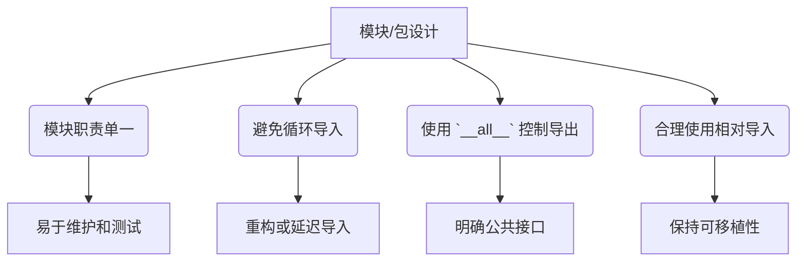

# 模块与包

上一章：[函数](./04-function.zh.md) | 下一章：[面向对象基础](./06-oop-basics.zh.md)

---

随着程序规模的增长，将所有代码放在一个文件中会变得难以维护。Python 通过 **模块（Module）** 和 **包（Package）** 机制，支持将代码组织到独立的文件中，实现逻辑分离、复用和命名空间管理。本章将详细讲解如何创建、导入和使用模块与包，以及相关的路径管理和最佳实践。

> [!NOTE]
> 本章内容基于 Python 3 标准规范。所有示例均可运行，建议读者在自己的环境中创建文件并实践。

---

## 1. 模块的概念

**模块** 是一个包含 Python 定义和语句的 `.py` 文件。模块名即文件名（不含 `.py` 后缀）。模块可以定义函数、类和变量，也可以包含可执行代码。

### 1.1 创建模块

创建一个 `mymodule.py` 文件：

```python
# mymodule.py
"""这是一个示例模块"""

PI = 3.14159

def add(a, b):
    return a + b

class Circle:
    def __init__(self, radius):
        self.radius = radius
    def area(self):
        return PI * self.radius ** 2

print("模块 mymodule 已加载")
```

### 1.2 导入模块

使用 `import` 语句导入模块：

```python
import mymodule

print(mymodule.PI)                     # 3.14159
print(mymodule.add(10, 20))            # 30
c = mymodule.Circle(5)
print(c.area())                        # 78.53975
```

### 1.3 导入特定对象

使用 `from ... import ...` 可以直接导入模块中的特定对象，无需前缀。

```python
from mymodule import PI, add, Circle

print(PI)
print(add(3, 4))
c = Circle(2)
```

> [!CAUTION]
> 使用 `from module import *` 会导入所有不以下划线开头的名称，但通常不推荐，因为它污染命名空间且难以追踪来源。

---

## 2. 模块的搜索路径

当导入模块时，Python 解释器会在以下位置按顺序搜索：

1. 当前脚本所在目录（或当前工作目录）
2. `PYTHONPATH` 环境变量指定的目录
3. Python 安装的标准库路径
4. 第三方库安装路径（如 `site-packages`）

可以通过 `sys.path` 查看所有搜索路径：

```python
import sys
print(sys.path)
```

也可以在运行时动态添加路径：

```python
import sys
sys.path.append("/path/to/my/modules")
import mymodule
```

---

## 3. 模块的缓存与重新加载

模块在第一次导入后会被缓存到 `sys.modules` 中，后续导入直接使用缓存，不会重新执行模块代码。

```python
import mymodule   # 第一次会打印 "模块 mymodule 已加载"
import mymodule   # 不会再次打印
```

若要在开发过程中强制重新加载模块，可以使用 `importlib.reload()`：

```python
import importlib
import mymodule
importlib.reload(mymodule)   # 重新执行模块代码
```

> [!WARNING]
> `reload()` 不推荐在生产环境使用，主要用于调试。

---

## 4. 包（Package）

**包** 是一种通过“点号模块名”来组织模块的层次结构。包本质上是一个包含 `__init__.py` 文件的目录（Python 3.3+ 中 `__init__.py` 非强制，但建议保留以标识包）。包可以包含子包和模块。

### 4.1 包的结构示例

假设我们有如下目录结构：

```
myproject/
├── __init__.py          # 空文件，标识为包
├── utils/
│   ├── __init__.py
│   ├── string_helpers.py
│   └── math_helpers.py
└── data/
    ├── __init__.py
    └── database.py
```

`__init__.py` 可以为空，也可以包含包的初始化代码或定义 `__all__` 列表控制 `from package import *` 的行为。

### 4.2 导入包中的模块

```python
# 导入整个模块
import myproject.utils.string_helpers
myproject.utils.string_helpers.capitalize("hello")

# 导入模块并起别名
import myproject.utils.string_helpers as sh
sh.capitalize("hello")

# 从包中导入特定子模块
from myproject.utils import string_helpers
string_helpers.capitalize("hello")

# 从子模块导入特定函数
from myproject.utils.string_helpers import capitalize
capitalize("hello")
```

### 4.3 `__init__.py` 的作用

- 标识一个目录为 Python 包。
- 可以执行包的初始化代码。
- 可以定义 `__all__` 列表，指定 `from package import *` 时导入的子模块。

```python
# myproject/__init__.py
__all__ = ['utils', 'data']   # 可选

# myproject/utils/__init__.py
from .string_helpers import capitalize
from .math_helpers import sqrt

__all__ = ['capitalize', 'sqrt']
```

这样，用户可以：

```python
from myproject.utils import capitalize, sqrt
```

---

## 5. 相对导入

在包内部，模块之间可以使用相对导入，使用 `.` 表示当前包，`..` 表示父包。

```
myproject/
├── __init__.py
├── utils/
│   ├── __init__.py
│   └── string_helpers.py
└── data/
    ├── __init__.py
    └── database.py   # 需要导入 utils/string_helpers
```

在 `database.py` 中：

```python
# database.py
from ..utils.string_helpers import capitalize   # 相对导入
```

> [!CAUTION]
> 相对导入只能在包内使用，并且要求运行脚本的顶级包名称已知（即不能直接作为顶层脚本运行）。通常推荐在包内使用绝对导入（从顶级包名开始）以提高可读性。

---

## 6. 将模块作为脚本执行

每个模块都有一个内置属性 `__name__`。当模块被直接运行时，`__name__` 值为 `"__main__"`；当被导入时，值为模块名。利用这一特性，可以让模块既可作为库导入，也可作为独立脚本运行。

```python
# mymodule.py
def main():
    print("运行主程序")

if __name__ == "__main__":
    main()
```

运行 `python mymodule.py` 时，执行 `main()`；在其他文件中导入时，不会自动执行 `main()`。

---

## 7. 标准库模块介绍

Python 标准库提供了大量实用模块。以下列举常用模块：

| 模块 | 用途 |
|------|------|
| `sys` | 系统相关功能（参数、路径、退出等） |
| `os` | 操作系统接口（文件、目录、环境变量） |
| `math` | 数学函数（三角函数、对数等） |
| `random` | 随机数生成 |
| `datetime` | 日期和时间处理 |
| `json` | JSON 编解码 |
| `re` | 正则表达式 |
| `collections` | 额外数据结构（`defaultdict`, `Counter`, `deque`） |
| `itertools` | 迭代器工具 |
| `functools` | 高阶函数工具（`partial`, `reduce`） |
| `pathlib` | 面向对象的文件路径操作 |

```python
import math, random, datetime
print(math.sqrt(25))           # 5.0
print(random.randint(1, 10))   # 随机整数
print(datetime.datetime.now()) # 当前时间
```

---

## 8. 第三方库管理（`pip`）

第三方库通过 `pip` 安装：

```bash
pip install numpy
pip install requests==2.28.0   # 指定版本
pip install --upgrade pip
```

### 8.1 列出已安装包

```bash
pip list
pip freeze   # 输出格式用于 requirements.txt
```

### 8.2 生成 `requirements.txt`

```bash
pip freeze > requirements.txt
```

### 8.3 从 `requirements.txt` 安装

```bash
pip install -r requirements.txt
```

### 8.4 虚拟环境（回顾）

强烈建议为每个项目创建虚拟环境，隔离依赖。使用 `venv` 或 `conda`。

```bash
python -m venv myenv
source myenv/bin/activate   # Windows: myenv\Scripts\activate
```

---

## 9. 发布自己的包（PyPI）

若想将自己写的模块/包分享给他人，可以上传到 Python 包索引（PyPI）。基本步骤如下：

1. 准备 `setup.py` 或 `pyproject.toml`。
2. 构建分发包（`python -m build`）。
3. 使用 `twine` 上传至 PyPI（`twine upload dist/*`）。

简单示例 `setup.py`：

```python
from setuptools import setup, find_packages

setup(
    name="mypackage",
    version="0.1.0",
    packages=find_packages(),
    description="A short description",
    author="Your Name",
    install_requires=[
        "requests>=2.0",
    ],
)
```

---

## 10. 模块与包的最佳实践



???+ tip "良好习惯"
    - 模块文件名应简短、小写，可使用下划线。
    - 包名也应小写，避免使用特殊字符。
    - 每个模块开头包含文档字符串说明用途。
    - 使用 `__all__` 明确对外公开的接口，隐藏内部实现。
    - 避免循环依赖（若出现，可考虑将公共部分提取到新模块）。

??? warning "常见陷阱"
    - **循环导入**：A 导入 B，B 又导入 A，会导致部分模块未完全初始化。解决方法：重构代码、将导入放到函数内部、或合并模块。
    - **相对导入在顶层脚本失效**：若直接运行包内的模块，相对导入会失败，应使用 `python -m package.module` 方式运行。
    - **修改 `sys.path` 造成混乱**：尽量通过包结构管理路径，而非动态修改搜索路径。

---

## 11. 实战案例：实现一个简易工具包

创建包结构如下：

```
toolkit/
├── __init__.py
├── strings.py
├── numbers.py
└── files.py
```

`toolkit/strings.py`:

```python
def reverse(s):
    return s[::-1]

def count_vowels(s):
    return sum(1 for ch in s.lower() if ch in "aeiou")
```

`toolkit/numbers.py`:

```python
def is_prime(n):
    if n < 2:
        return False
    for i in range(2, int(n**0.5)+1):
        if n % i == 0:
            return False
    return True
```

`toolkit/files.py`:

```python
def read_file(path):
    with open(path, 'r', encoding='utf-8') as f:
        return f.read()
```

`toolkit/__init__.py`:

```python
from .strings import reverse, count_vowels
from .numbers import is_prime
from .files import read_file

__all__ = ['reverse', 'count_vowels', 'is_prime', 'read_file']
```

现在在其他脚本中使用：

```python
from toolkit import reverse, is_prime
print(reverse("hello"))          # "olleh"
print(is_prime(17))              # True
```

---

## 12. 小结

本章学习了：

- 模块的创建与导入方式
- 模块搜索路径与缓存机制
- 包的层次结构与 `__init__.py` 的作用
- 相对导入与绝对导入
- `__name__ == "__main__"` 的使用
- 标准库与第三方库管理
- 包的发布流程简介

掌握模块与包，就可以高效地组织大型项目，复用代码，并利用丰富的第三方生态。下一章将进入面向对象编程（OOP），学习类和对象的概念。

---

## 练习

1. 创建一个包 `shapes`，包含 `circle.py`、`rectangle.py`、`triangle.py`，每个模块实现相应的面积计算函数。在 `__init__.py` 中暴露这些函数。
2. 编写一个模块，包含一个函数 `list_files(dir_path)`，返回指定目录下所有文件的列表（递归）。使用 `os` 或 `pathlib` 实现。
3. 在练习 1 的基础上，编写一个脚本 `main.py`，导入 `shapes` 包并使用其中的函数。
4. 练习使用 `pip` 安装 `requests` 库，并用它发送一个 GET 请求获取网页内容。

---

> [!WARNING]
> 绝对导入（从顶级包开始）比相对导入更清晰，在大型项目中应优先使用。

> [!CAUTION]
> 不要将模块命名为 Python 标准库或内置模块的名称（如 `sys.py`、`json.py`），否则会覆盖标准库，导致难以排查的错误。

---
## 👥 贡献者
本项目离不开每一位提交 PR、提 Issue、优化文档的开发者，由衷致谢！
<div style="display: flex; flex-wrap: wrap; gap: 30px; margin-top: 20px; margin-bottom: 20px;">
    <div style="text-align: center;">
        <a href="https://github.com/yxzhc">
            
        </a>
        <div style="margin-top: 8px; font-weight: 600;">
            <a href="https://github.com/yxzhc" style="text-decoration: none;">YXZHC</a>
        </div>
    </div>
    <div style="text-align: center;">
        <a href="https://github.com/hbrobot">
            
        </a>
        <div style="margin-top: 8px; font-weight: 600;">
            <a href="https://github.com/hbrobot" style="text-decoration: none;">HBRobot</a>
        </div>
    </div>
</div>
---
🤝 **欢迎参与共建：**

[:fontawesome-brands-github: 提交 Issue](https://github.com/hbrobot/hbrobot.github.io/issues/new/choose){: .md-button }
[:octicons-git-pull-request-24: 提交 PR](https://github.com/hbrobot/hbrobot.github.io/compare){: .md-button .md-button--primary }