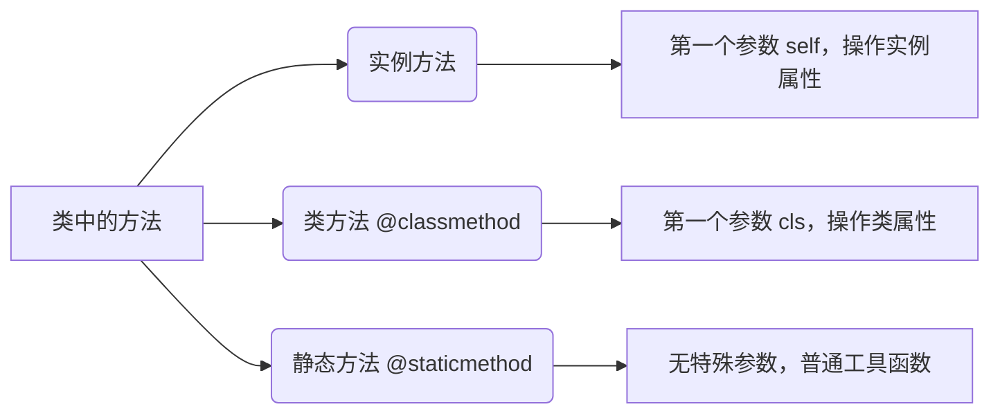

# 面向对象基础

上一章：[模块与包](./05-module-package.zh.md) | 下一章：[异常与文件处理](./07-exception-file.zh.md)

---

面向对象编程（Object-Oriented Programming，OOP）是一种编程范式，它将数据（属性）和操作（方法）封装在对象中，通过类（Class）来创建对象。Python 从设计之初就是面向对象的语言，支持类、继承、多态等核心特性。本章将系统讲解 Python 中的类与对象，帮助你掌握 OOP 的基本思想和实践。

> [!NOTE]
> 本章示例均基于 Python 3。建议读者新建 `.py` 文件跟随编码，直观感受面向对象与面向过程的差异。

---

## 1. 类与对象的基本概念

- **类（Class）**：是创建对象的蓝图或模板，描述了对象应有的属性和方法。
- **对象（Object）**：是类的具体实例，拥有自己的属性值和行为。

例如，“狗”是一个类，“我家的小黄”则是这个类的一个具体对象。

### 1.1 定义类

使用 `class` 关键字定义类，类名通常采用驼峰命名法（如 `MyClass`）。

```python
class Dog:
    """一个简单的狗类"""
    pass   # 占位，表示空类
```

### 1.2 创建对象（实例化）

通过类名加括号即可创建对象。

```python
my_dog = Dog()
print(type(my_dog))   # <class '__main__.Dog'>
```

### 1.3 构造函数 `__init__`

`__init__` 是类的特殊方法，在对象创建时自动调用，用于初始化对象的属性。

```python
class Dog:
    def __init__(self, name, age):
        self.name = name   # 实例属性
        self.age = age

my_dog = Dog("小黄", 3)
print(my_dog.name)   # 小黄
print(my_dog.age)    # 3
```

- `self` 指向当前实例，必须为第一个参数（名称可自定义，但习惯用 `self`）。
- 在 `__init__` 中定义的属性称为实例属性，每个对象独立。

---

## 2. 实例方法与属性

### 2.1 实例方法

实例方法的第一个参数为 `self`，通过实例调用时自动传入。

```python
class Dog:
    def __init__(self, name, age):
        self.name = name
        self.age = age
    
    def bark(self):
        print(f"{self.name} 在汪汪叫！")
    
    def get_age(self):
        return self.age

dog = Dog("旺财", 5)
dog.bark()          # 旺财 在汪汪叫！
print(dog.get_age()) # 5
```

### 2.2 属性的动态修改与删除

Python 的属性是动态的，可以随时添加、修改或删除（不推荐随意增删，破坏封装）。

```python
dog.color = "黄色"   # 添加新属性
print(dog.color)
del dog.color        # 删除属性
```

### 2.3 类属性与实例属性的区别

- **类属性**：定义在类中、所有实例共享的属性。
- **实例属性**：通过 `self` 或实例动态添加，每个实例独立。

```python
class Student:
    school = "北京大学"   # 类属性

    def __init__(self, name):
        self.name = name   # 实例属性

s1 = Student("张三")
s2 = Student("李四")
print(s1.school)   # 北京大学
print(s2.school)   # 北京大学
Student.school = "清华大学"   # 修改类属性，影响所有实例
print(s1.school)   # 清华大学
s1.school = "复旦大学"        # 为 s1 添加同名实例属性，覆盖类属性
print(s1.school)   # 复旦大学
print(s2.school)   # 清华大学
```

---

## 3. 类方法与静态方法

### 3.1 类方法（`@classmethod`）

类方法使用 `@classmethod` 装饰，第一个参数是 `cls`（类本身），可以通过类或实例调用。通常用于工厂方法或修改类状态。

```python
class Person:
    species = "智人"

    @classmethod
    def get_species(cls):
        return cls.species

    @classmethod
    def create_anonymous(cls):
        return cls("匿名")

    def __init__(self, name):
        self.name = name

print(Person.get_species())    # 智人
anon = Person.create_anonymous()
print(anon.name)               # 匿名
```

### 3.2 静态方法（`@staticmethod`）

静态方法使用 `@staticmethod` 装饰，不需要 `self` 或 `cls` 参数，与普通函数类似，但属于类的命名空间。通常用于工具函数。

```python
class MathUtils:
    @staticmethod
    def add(a, b):
        return a + b

    @staticmethod
    def multiply(a, b):
        return a * b

print(MathUtils.add(3, 5))      # 8
print(MathUtils.multiply(2, 4)) # 8
```



---

## 4. 封装与访问控制

封装是 OOP 的核心特性之一，将数据（属性）和操作隐藏内部，对外提供公共接口。Python 通过命名约定来实现访问控制：

- 以单下划线 `_` 开头的属性/方法：表示“受保护的”，仅供内部使用，但外部仍可访问（只是约定）。
- 以双下划线 `__` 开头的属性/方法：Python 会进行名称修饰（name mangling），使其难以从外部直接访问（但不能完全阻止）。

```python
class BankAccount:
    def __init__(self, owner, balance):
        self.owner = owner
        self.__balance = balance   # 私有属性

    def deposit(self, amount):
        if amount > 0:
            self.__balance += amount

    def withdraw(self, amount):
        if 0 < amount <= self.__balance:
            self.__balance -= amount
            return True
        return False

    def get_balance(self):
        return self.__balance

acc = BankAccount("Alice", 1000)
print(acc.get_balance())        # 1000
# print(acc.__balance)          # AttributeError
print(acc._BankAccount__balance) # 1000  名称修饰后仍可访问，但不建议
```

> [!CAUTION]
> Python 的“私有”并非强制，而是基于约定。开发人员应尊重封装性，不要强行访问私有属性。

---

## 5. 属性装饰器（`@property`）

`@property` 可以将方法伪装成属性，实现类似 getter/setter 的机制，同时保持调用方式的简洁。

```python
class Temperature:
    def __init__(self, celsius):
        self._celsius = celsius

    @property
    def celsius(self):
        return self._celsius

    @celsius.setter
    def celsius(self, value):
        if value < -273.15:
            raise ValueError("温度不能低于绝对零度")
        self._celsius = value

    @property
    def fahrenheit(self):
        return self._celsius * 9/5 + 32

t = Temperature(25)
print(t.celsius)      # 25
print(t.fahrenheit)   # 77.0
t.celsius = 30        # 调用 setter
# t.celsius = -300    # 抛出 ValueError
```

- `@property` 定义 getter，`@属性名.setter` 定义 setter。
- 只读属性只需 `@property`，不定义 setter。

---

## 6. 继承

继承允许我们创建一个新类（子类）来继承现有类（父类）的属性和方法，实现代码复用和层次化设计。

### 6.1 基本语法

```python
class Animal:
    def __init__(self, name):
        self.name = name

    def speak(self):
        print(f"{self.name} 发出声音")

class Cat(Animal):          # 继承 Animal
    def speak(self):        # 重写父类方法
        print(f"{self.name} 喵喵叫")

class Dog(Animal):
    def speak(self):
        print(f"{self.name} 汪汪叫")

cat = Cat("咪咪")
dog = Dog("小黑")
cat.speak()   # 咪咪 喵喵叫
dog.speak()   # 小黑 汪汪叫
```

### 6.2 `super()` 调用父类方法

在子类中可以使用 `super()` 调用父类的方法，特别是在 `__init__` 中初始化父类属性。

```python
class Animal:
    def __init__(self, name, age):
        self.name = name
        self.age = age

class Cat(Animal):
    def __init__(self, name, age, color):
        super().__init__(name, age)   # 调用父类构造
        self.color = color

    def info(self):
        return f"{self.name}, {self.age}岁, {self.color}色"

cat = Cat("咪咪", 3, "白")
print(cat.info())   # 咪咪, 3岁, 白色
```

### 6.3 多重继承

Python 支持多重继承，一个类可以继承多个父类。当多个父类有同名方法时，遵循 **MRO（Method Resolution Order）** 顺序（C3 线性化），可通过 `类.__mro__` 查看。

```python
class Flyable:
    def move(self):
        print("飞行")

class Swimable:
    def move(self):
        print("游泳")

class Duck(Flyable, Swimable):
    pass

duck = Duck()
duck.move()   # 飞行（因为 Flyable 在前）
print(Duck.__mro__)   # (<class 'Duck'>, <class 'Flyable'>, <class 'Swimable'>, <class 'object'>)
```

> [!WARNING]
> 多重继承可能带来复杂的依赖关系，使用时需谨慎，尽量保持设计简单。

---

## 7. 多态

多态指不同类的对象对同一方法调用，表现出不同的行为。在 Python 中，多态通过继承和方法重写自然实现。

```python
def make_speak(animal):
    animal.speak()   # 只要对象有 speak 方法即可

animals = [Cat("小白"), Dog("大黄")]
for a in animals:
    make_speak(a)   # 分别输出 喵喵叫 和 汪汪叫
```

Python 的“鸭子类型”更加强调对象的行为而非类型：**“如果它走起来像鸭子，叫起来像鸭子，那么它就是鸭子”**。

---

## 8. 特殊方法（魔术方法）

Python 类中以下划线开头和结尾的方法称为特殊方法，用于实现运算符重载、对象表示、上下文管理等。

| 方法 | 作用 |
|------|------|
| `__init__(self, ...)` | 构造方法 |
| `__str__(self)` | 字符串表示（用于 `print`） |
| `__repr__(self)` | 开发时字符串表示（用于调试） |
| `__len__(self)` | 返回长度（用于 `len`） |
| `__getitem__(self, key)` | 索引访问 |
| `__setitem__(self, key, value)` | 索引赋值 |
| `__add__(self, other)` | 加法运算符 `+` |
| `__eq__(self, other)` | 相等比较 `==` |
| `__call__(self, ...)` | 使对象可调用（类似函数） |

```python
class Vector:
    def __init__(self, x, y):
        self.x = x
        self.y = y

    def __add__(self, other):
        return Vector(self.x + other.x, self.y + other.y)

    def __str__(self):
        return f"Vector({self.x}, {self.y})"

    def __repr__(self):
        return f"Vector({self.x}, {self.y})"

v1 = Vector(1, 2)
v2 = Vector(3, 4)
v3 = v1 + v2
print(v3)   # Vector(4, 6)
```

---

## 9. 抽象基类（ABC）

抽象基类用于定义接口，强制子类实现某些方法。使用 `abc` 模块。

```python
from abc import ABC, abstractmethod

class Shape(ABC):
    @abstractmethod
    def area(self):
        pass

class Rectangle(Shape):
    def __init__(self, w, h):
        self.w = w
        self.h = h
    def area(self):
        return self.w * self.h

# shape = Shape()   # 错误，不能实例化抽象类
rect = Rectangle(4, 5)
print(rect.area())   # 20
```

---

## 10. 数据类（`dataclass`）

Python 3.7+ 提供 `dataclasses` 模块，简化了仅用于存储数据的类定义，自动生成 `__init__`、`__repr__`、`__eq__` 等方法。

```python
from dataclasses import dataclass

@dataclass
class Point:
    x: float
    y: float
    label: str = "point"   # 默认值

p1 = Point(1.0, 2.0)
p2 = Point(1.0, 2.0)
print(p1)          # Point(x=1.0, y=2.0, label='point')
print(p1 == p2)    # True
```

---

## 11. 实战案例：图书馆管理系统（简化版）

```python
class Book:
    def __init__(self, isbn, title, author):
        self.isbn = isbn
        self.title = title
        self.author = author
        self.is_borrowed = False

    def borrow(self):
        if self.is_borrowed:
            raise ValueError("图书已被借出")
        self.is_borrowed = True

    def return_book(self):
        if not self.is_borrowed:
            raise ValueError("图书未借出")
        self.is_borrowed = False

    def __str__(self):
        status = "已借出" if self.is_borrowed else "在馆"
        return f"{self.title} by {self.author} [{status}]"

class Library:
    def __init__(self):
        self.books = {}

    def add_book(self, book):
        self.books[book.isbn] = book

    def borrow_book(self, isbn):
        if isbn not in self.books:
            raise KeyError("图书不存在")
        self.books[isbn].borrow()

    def return_book(self, isbn):
        if isbn not in self.books:
            raise KeyError("图书不存在")
        self.books[isbn].return_book()

    def list_books(self):
        for book in self.books.values():
            print(book)

# 使用
lib = Library()
book1 = Book("978-3-16-148410-0", "Python 入门", "张三")
book2 = Book("978-0-262-03384-8", "深度学习", "李四")
lib.add_book(book1)
lib.add_book(book2)
lib.borrow_book("978-3-16-148410-0")
lib.list_books()
# 输出：
# Python 入门 by 张三 [已借出]
# 深度学习 by 李四 [在馆]
```

---

## 12. 小结

本章涵盖了：

- 类与对象的定义，`__init__` 构造方法
- 实例方法、类方法、静态方法
- 类属性与实例属性
- 封装、私有属性与 `@property`
- 继承、`super()`、多重继承
- 多态与鸭子类型
- 特殊方法（魔术方法）
- 抽象基类（ABC）
- 数据类（`dataclass`）

面向对象是大型项目的重要组织方式，掌握这些概念将让你设计出更清晰、可扩展的程序。下一章将学习异常处理和文件操作，它们与 OOP 结合，让你的程序更健壮。

---

## 练习

1. 定义一个 `Car` 类，包含品牌、型号、年份、当前速度。实现加速、减速、停止方法，并使用 `@property` 控制速度不能为负。
2. 创建一个 `Employee` 基类，派生 `Manager` 和 `Developer`，各自实现 `work()` 方法。编写一个函数 `show_work(employee)`，接受任何员工并调用其 `work()`。
3. 定义一个 `Fraction` 类，支持加减法（`__add__`, `__sub__`），并能约分。
4. 使用抽象基类定义 `Payment` 接口，实现 `CreditCardPayment` 和 `PayPalPayment`，展示多态。

---

> [!WARNING]
> 多重继承可能导致方法冲突，应仔细设计并使用 `super()` 和 MRO 来避免意外。

> [!CAUTION]
> 不要过度使用 `@property` 或私有属性，保持设计简洁，避免过早优化。


---
## 👥 贡献者
本项目离不开每一位提交 PR、提 Issue、优化文档的开发者，由衷致谢！
<div style="display: flex; flex-wrap: wrap; gap: 30px; margin-top: 20px; margin-bottom: 20px;">
    <div style="text-align: center;">
        <a href="https://github.com/yxzhc">
            
        </a>
        <div style="margin-top: 8px; font-weight: 600;">
            <a href="https://github.com/yxzhc" style="text-decoration: none;">YXZHC</a>
        </div>
    </div>
    <div style="text-align: center;">
        <a href="https://github.com/hbrobot">
            
        </a>
        <div style="margin-top: 8px; font-weight: 600;">
            <a href="https://github.com/hbrobot" style="text-decoration: none;">HBRobot</a>
        </div>
    </div>
</div>
---
🤝 **欢迎参与共建：**

[:fontawesome-brands-github: 提交 Issue](https://github.com/hbrobot/hbrobot.github.io/issues/new/choose){: .md-button }
[:octicons-git-pull-request-24: 提交 PR](https://github.com/hbrobot/hbrobot.github.io/compare){: .md-button .md-button--primary }