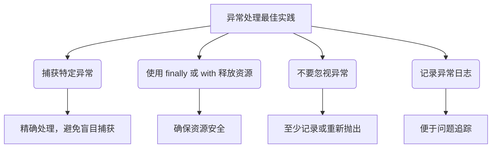

# 异常与文件处理

上一章：[面向对象基础](./06-oop-basics.zh.md) | 下一章：[ROS 2 Python 桥接](./08-ros2-python-bridge.zh.md)

---

任何程序都难免遇到错误，比如用户输入无效、文件不存在、网络中断等。Python 使用 **异常（Exception）** 机制来处理运行时错误，让程序能够优雅地恢复或报告问题，而不是直接崩溃。同时，文件操作是程序与外部存储交互的基本方式。本章将全面讲解异常处理与文件 I/O，帮助你编写健壮、可靠的代码。

> [!NOTE]
> 本章示例均可在 Python 3 环境中运行。建议在交互式环境中尝试异常捕获，同时创建临时文件练习文件操作。

---

## 1. 异常与错误

### 1.1 语法错误与运行时异常

- **语法错误（SyntaxError）**：代码不符合 Python 语法规则，解释器无法解析，程序无法运行。
- **运行时异常（Exception）**：语法正确，但在执行期间触发错误，如除以零、列表索引越界等。

```python
# 语法错误（取消注释会报错）
# print "Hello"   # SyntaxError: Missing parentheses

# 运行时异常
print(1 / 0)      # ZeroDivisionError
print([1, 2][5])  # IndexError
```

### 1.2 常见内置异常

| 异常类型 | 描述 |
|----------|------|
| `ZeroDivisionError` | 除以零 |
| `TypeError` | 类型不匹配 |
| `ValueError` | 值不正确（如 int("abc")） |
| `IndexError` | 序列索引越界 |
| `KeyError` | 字典键不存在 |
| `FileNotFoundError` | 文件不存在 |
| `AttributeError` | 对象没有该属性 |
| `ImportError` | 导入模块失败 |
| `KeyboardInterrupt` | 用户按 Ctrl+C 中断 |

---

## 2. 异常处理基础

### 2.1 `try` / `except` 捕获异常

```python
try:
    num = int(input("请输入一个整数: "))
    result = 10 / num
    print(f"结果是 {result}")
except ZeroDivisionError:
    print("不能除以零！")
except ValueError:
    print("请输入有效的整数！")
```

多个 `except` 可以分别处理不同异常。也可以捕获多个异常类型：

```python
except (ZeroDivisionError, ValueError) as e:
    print(f"发生错误：{e}")
```

### 2.2 捕获所有异常（不推荐）

```python
try:
    risky_code()
except Exception as e:   # 捕获所有非系统退出的异常
    print(f"出错了：{e}")
```

> [!CAUTION]
> 捕获过于宽泛的异常会隐藏未预期的错误，使调试困难。最好只捕获明确预期的异常。

### 2.3 `else` 子句

`else` 在 `try` 块没有抛出任何异常时执行，用于放置那些必须没有异常才能运行的代码。

```python
try:
    f = open("data.txt", "r")
except FileNotFoundError:
    print("文件不存在，创建空文件")
    f = open("data.txt", "w")
else:
    content = f.read()   # 只有文件成功打开时才读取
    print(content)
finally:
    f.close()
```

### 2.4 `finally` 子句

`finally` 无论是否发生异常都会执行，通常用于释放资源（如关闭文件、释放锁）。

```python
try:
    file = open("test.txt", "w")
    file.write("Hello")
except Exception as e:
    print(e)
finally:
    file.close()   # 确保文件一定被关闭
```

---

## 3. 抛出异常：`raise`

使用 `raise` 主动触发异常，可携带自定义错误信息。

```python
def set_age(age):
    if age < 0 or age > 150:
        raise ValueError("年龄必须在 0~150 之间")
    return age

try:
    set_age(-5)
except ValueError as e:
    print(e)   # 年龄必须在 0~150 之间
```

### 3.1 异常链与 `from`

可以在捕获异常后抛出新异常，并使用 `from` 保留原始异常上下文。

```python
try:
    int("abc")
except ValueError as e:
    raise RuntimeError("转换失败") from e
```

---

## 4. 自定义异常

继承 `Exception` 类或其子类，创建自己的异常类型。

```python
class InsufficientFundsError(Exception):
    """账户余额不足时抛出"""
    pass

class BankAccount:
    def __init__(self, balance=0):
        self.balance = balance

    def withdraw(self, amount):
        if amount > self.balance:
            raise InsufficientFundsError(f"余额不足，当前余额 {self.balance}")
        self.balance -= amount

try:
    acc = BankAccount(100)
    acc.withdraw(150)
except InsufficientFundsError as e:
    print(e)   # 余额不足，当前余额 100
```

---

## 5. 文件操作基础

Python 使用内置 `open()` 函数打开文件，返回文件对象。基本格式：

```python
f = open(file_path, mode, encoding=None)
```

常用模式：

| 模式 | 描述 |
|------|------|
| `'r'` | 只读（默认），文件必须存在 |
| `'w'` | 写入，覆盖原有内容，文件不存在则创建 |
| `'a'` | 追加，在文件末尾写入 |
| `'x'` | 独占创建，若文件已存在则抛出 `FileExistsError` |
| `'b'` | 二进制模式（如 `'rb'`, `'wb'`） |
| `'t'` | 文本模式（默认），如 `'rt'` |
| `'+'` | 读写模式（如 `'r+'`, `'w+'`） |

```python
# 写入文本
with open("hello.txt", "w", encoding="utf-8") as f:
    f.write("Hello, 世界！\n")
    f.write("第二行内容")

# 读取文本
with open("hello.txt", "r", encoding="utf-8") as f:
    content = f.read()
    print(content)
```

---

## 6. 使用 `with` 上下文管理器

`with` 语句自动管理资源，在退出代码块时自动调用 `close()`，即使发生异常也会安全关闭。

```python
with open("data.txt", "r", encoding="utf-8") as f:
    data = f.read()
# 文件已自动关闭
```

比传统 `try/finally` 更简洁安全：

```python
# 等价于：
f = open("data.txt", "r")
try:
    data = f.read()
finally:
    f.close()
```

---

## 7. 读取文件的常用方法

### 7.1 `read(size)`：读取指定字节数/字符数

```python
with open("file.txt", "r") as f:
    chunk = f.read(10)   # 读取前 10 个字符
    rest = f.read()      # 读取剩余所有内容
```

### 7.2 `readline()`：读取一行

```python
with open("file.txt", "r") as f:
    line = f.readline()   # 第一行
    while line:
        print(line, end="")
        line = f.readline()
```

### 7.3 `readlines()`：读取所有行，返回列表

```python
with open("file.txt", "r") as f:
    lines = f.readlines()   # 包含换行符
    for line in lines:
        print(line.strip())
```

### 7.4 遍历文件对象（推荐大文件）

文件对象本身是可迭代的，逐行读取，内存友好。

```python
with open("large_file.log", "r") as f:
    for line in f:
        process(line)   # 一次只处理一行
```

---

## 8. 写入文件的常用方法

- `write(str)`：写入字符串。
- `writelines(list)`：写入多个字符串（不会自动换行，需自行添加 `\n`）。

```python
lines = ["第一行\n", "第二行\n", "第三行"]
with open("output.txt", "w", encoding="utf-8") as f:
    f.writelines(lines)
    f.write("追加一行\n")
```

---

## 9. 二进制文件操作

读写非文本文件（图片、音频、压缩包等）时，使用 `'rb'` / `'wb'` 模式。

```python
# 复制图片
with open("source.jpg", "rb") as src:
    data = src.read()
with open("copy.jpg", "wb") as dst:
    dst.write(data)
```

---

## 10. 文件与目录操作（`os` / `pathlib`）

### 10.1 使用 `os` 模块

```python
import os

os.getcwd()                    # 当前工作目录
os.listdir(".")                # 列出目录内容
os.mkdir("new_folder")         # 创建目录
os.remove("file.txt")          # 删除文件
os.rename("old.txt", "new.txt")# 重命名
os.path.exists("file.txt")     # 检查文件是否存在
os.path.isfile("file.txt")     # 是否为文件
os.path.isdir("folder")        # 是否为目录
os.path.join("dir", "file")    # 拼接路径
```

### 10.2 使用 `pathlib`（面向对象，推荐）

```python
from pathlib import Path

p = Path(".")                    # 当前目录
p = Path("/home/user/data.txt")  # 绝对路径
print(p.name)        # data.txt
print(p.stem)        # data
print(p.suffix)      # .txt
print(p.parent)      # /home/user

# 检查
if p.exists():
    if p.is_file():
        content = p.read_text(encoding="utf-8")
        p.write_text("new content", encoding="utf-8")

# 遍历目录
for child in Path(".").iterdir():
    print(child)

# 递归遍历所有 .py 文件
for py_file in Path(".").rglob("*.py"):
    print(py_file)
```

---

## 11. JSON 文件处理

JSON 是常见的数据交换格式，Python 通过 `json` 模块进行读写。

```python
import json

data = {
    "name": "Alice",
    "age": 30,
    "city": "Beijing",
    "hobbies": ["reading", "coding"]
}

# 写入 JSON
with open("data.json", "w", encoding="utf-8") as f:
    json.dump(data, f, ensure_ascii=False, indent=2)

# 读取 JSON
with open("data.json", "r", encoding="utf-8") as f:
    loaded = json.load(f)
    print(loaded["name"])
```

- `ensure_ascii=False` 使中文正常显示。
- `indent` 参数美化输出。

---

## 12. 实战案例：日志文件分析器

```python
import re
from collections import Counter
from pathlib import Path

def analyze_log(log_path):
    """统计日志文件中各 IP 的访问次数"""
    if not Path(log_path).exists():
        raise FileNotFoundError(f"日志文件 {log_path} 不存在")

    ip_pattern = r'\b(?:\d{1,3}\.){3}\d{1,3}\b'
    ip_counter = Counter()

    with open(log_path, 'r', encoding='utf-8') as f:
        for line in f:
            ips = re.findall(ip_pattern, line)
            ip_counter.update(ips)

    return ip_counter.most_common(10)   # 返回前 10 个 IP

# 示例使用（假设有 access.log）
try:
    top_ips = analyze_log("access.log")
    for ip, count in top_ips:
        print(f"{ip}: {count} 次")
except FileNotFoundError as e:
    print(e)
except Exception as e:
    print(f"分析过程中出错: {e}")
```

---

## 13. 异常与文件的良好实践



???+ tip "使用日志记录异常"
    ```python
    import logging
    logging.basicConfig(level=logging.ERROR)
    try:
        risky_operation()
    except Exception as e:
        logging.exception("发生异常")   # 自动记录堆栈
    ```

??? warning "常见陷阱"
    - **捕获异常但不处理**：`except:` 或 `except Exception:` 后什么都不做，会掩盖错误。
    - **文件路径硬编码**：使用 `os.path.join` 或 `pathlib` 构造路径，保证跨平台性。
    - **忘记指定编码**：读写文本文件时不指定 `encoding`，在不同系统上可能导致 `UnicodeDecodeError`。推荐始终使用 `encoding="utf-8"`。
    - **处理二进制文件时使用文本模式**：图片等文件必须用 `'rb'` / `'wb'`，否则损坏数据。

---

## 14. 小结

本章学习了：

- Python 异常体系，`try/except/else/finally` 结构
- 主动抛出异常（`raise`）与自定义异常
- 文件的基本操作（`open`、模式、读写方法）
- 上下文管理器（`with`）自动管理资源
- 二进制文件与文本文件的区别
- 使用 `os` 和 `pathlib` 操作文件系统
- JSON 数据的读写
- 异常与文件的综合应用

异常处理和文件操作是实用编程的必备技能。掌握它们，你的程序将更加稳健、专业。下一章将进入 ROS 2 与 Python 的桥接，将所学应用于机器人开发。

---

## 练习

1. 编写一个函数 `safe_divide(a, b)`，捕获除零异常，返回 `None` 并打印错误信息。
2. 使用 `pathlib` 遍历当前目录下的所有 `.txt` 文件，统计总字符数（不包括换行）。
3. 实现一个简单的配置管理器，从 `config.json` 读取设置，若文件不存在则创建默认配置并写入。
4. 编写一个程序，读取一个包含数字的文本文件（每行一个数字），计算总和，若某行不是数字则跳过并记录错误日志。

---

> [!WARNING]
> 永远不要在 `except` 块中直接使用裸露的 `:` 而不做任何处理，这会使调试极其困难。

> [!CAUTION]
> 对于敏感数据（如密码），不要在日志中打印异常详细信息，避免信息泄露。


---
## 👥 贡献者
本项目离不开每一位提交 PR、提 Issue、优化文档的开发者，由衷致谢！
<div style="display: flex; flex-wrap: wrap; gap: 30px; margin-top: 20px; margin-bottom: 20px;">
    <div style="text-align: center;">
        <a href="https://github.com/yxzhc">
            
        </a>
        <div style="margin-top: 8px; font-weight: 600;">
            <a href="https://github.com/yxzhc" style="text-decoration: none;">YXZHC</a>
        </div>
    </div>
    <div style="text-align: center;">
        <a href="https://github.com/hbrobot">
            
        </a>
        <div style="margin-top: 8px; font-weight: 600;">
            <a href="https://github.com/hbrobot" style="text-decoration: none;">HBRobot</a>
        </div>
    </div>
</div>
---
🤝 **欢迎参与共建：**

[:fontawesome-brands-github: 提交 Issue](https://github.com/hbrobot/hbrobot.github.io/issues/new/choose){: .md-button }
[:octicons-git-pull-request-24: 提交 PR](https://github.com/hbrobot/hbrobot.github.io/compare){: .md-button .md-button--primary }