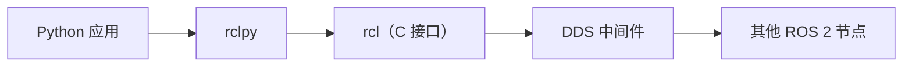
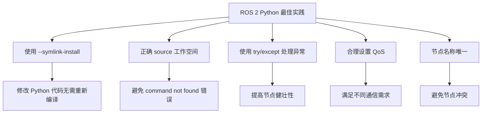

# ROS 2 Python 桥接

上一章：[异常与文件处理](./07-exception-file.zh.md)

---

欢迎来到本系列教程的最后一章！至此，你已经掌握了 Python 的核心语法、数据结构、函数、面向对象编程、模块与包，以及异常处理和文件操作。本章将把这些知识应用到机器人开发领域——**ROS 2（Robot Operating System 2）**。

ROS 2 是一个用于构建机器人应用的分布式通信中间件。它并不是一个传统意义上的“操作系统”，而是一套通信框架和工具集，让机器人的各个组件（传感器、控制器、规划器、视觉系统等）能够相互发现、交换数据并协同工作。

> [!NOTE]
> 本章假设你已安装 ROS 2（推荐 Humble 或 Jazzy 版本）并具备基本的终端操作能力。所有示例基于 `rclpy`（ROS 2 Python 客户端库）。

---

## 1. ROS 2 与 Python 的关系

### 1.1 为什么用 Python 开发 ROS 2？

ROS 2 官方支持两种主要客户端语言：**C++** 和 **Python**。Python 的优势在于：

- **开发效率高**：语法简洁，无需编译，修改后立即可见（配合 `--symlink-install`）。
- **生态丰富**：可无缝集成 NumPy、PyTorch、OpenCV 等科学计算与 AI 库。
- **入门友好**：适合快速原型验证和教学场景。

### 1.2 `rclpy`：ROS 2 Python 客户端库

`rclpy` 是 ROS 2 的 Python 客户端库，封装了对底层 `rcl`（ROS Client Library）C 接口的调用。它提供了：

- 节点（Node）的创建与管理
- 话题（Topic）的发布与订阅
- 服务（Service）的客户端与服务器
- 动作（Action）的客户端与服务器
- 参数（Parameter）的读写
- 定时器（Timer）与回调（Callback）机制




开发者无需接触复杂的 DDS（Data Distribution Service）实现细节（如 Fast DDS、Cyclone DDS），即可完成节点生命周期管理和通信。

---

## 2. 核心概念速览

在开始编码之前，先了解 ROS 2 的几个核心概念：

| 概念 | 描述 | 通信模式 |
|------|------|----------|
| **节点（Node）** | ROS 2 的基本执行单元，代表一个独立的功能模块 | — |
| **话题（Topic）** | 发布/订阅模式，数据单向、异步、多对多 | 异步 |
| **服务（Service）** | 请求/响应模式，一问一答的同步交互 | 同步 |
| **动作（Action）** | 可中断的长时间运行任务，带进度反馈 | 异步 + 反馈 |
| **参数（Parameter）** | 节点的可配置键值存储 | — |

---

## 3. 准备工作：工作空间与功能包

### 3.1 创建工作空间

ROS 2 的项目组织在 **工作空间（Workspace）** 中，源代码放在 `src/` 目录下。

```bash
# 创建工作空间目录
mkdir -p ~/ros2_ws/src
cd ~/ros2_ws
```

### 3.2 创建 Python 功能包

功能包（Package）是 ROS 2 代码的基本组织单元。使用 `ros2 pkg create` 创建 Python 类型的包：

```bash
cd ~/ros2_ws/src
ros2 pkg create my_py_pkg --build-type ament_python --dependencies rclpy
```

参数说明：
- `--build-type ament_python`：指定为 Python 功能包（C++ 用 `ament_cmake`）
- `--dependencies rclpy`：声明依赖 ROS 2 Python 客户端库

创建后的目录结构：

```
my_py_pkg/
├── my_py_pkg/          # Python 源码目录
│   └── __init__.py
├── resource/           # 资源目录
├── test/               # 测试目录
├── package.xml         # 功能包清单（依赖声明）
├── setup.cfg           # 安装配置
└── setup.py            # Python 构建配置（入口注册）
```

### 3.3 编译工作空间

使用 `colcon` 构建工具编译：

```bash
cd ~/ros2_ws
colcon build --symlink-install   # 符号链接模式，修改 Python 代码无需重新编译
```

编译后，**必须 source 工作空间**才能使用其中的节点：

```bash
source ~/ros2_ws/install/setup.bash
```

---

## 4. 编写第一个 Python 节点

### 4.1 节点代码框架

在 `my_py_pkg/my_py_pkg/` 目录下创建 `simple_node.py`：

```python
#!/usr/bin/env python3
import rclpy
from rclpy.node import Node

class SimpleNode(Node):
    def __init__(self):
        # 调用父类构造函数，指定节点名称（必须唯一）
        super().__init__('simple_node')
        # 日志输出
        self.get_logger().info("简单节点已启动！")

def main(args=None):
    # 初始化 ROS 2 系统
    rclpy.init(args=args)
    # 创建节点实例
    node = SimpleNode()
    # 进入事件循环，等待回调
    rclpy.spin(node)
    # 退出时清理资源
    node.destroy_node()
    rclpy.shutdown()

if __name__ == '__main__':
    main()
```

### 4.2 注册节点入口

修改 `setup.py`，在 `entry_points` 中注册可执行命令：

```python
entry_points={
    'console_scripts': [
        'simple_node = my_py_pkg.simple_node:main',
    ],
},
```

### 4.3 声明依赖

在 `package.xml` 中添加依赖：

```xml
<depend>rclpy</depend>
```

### 4.4 编译与运行

```bash
cd ~/ros2_ws
colcon build --packages-select my_py_pkg
source install/setup.bash
ros2 run my_py_pkg simple_node
```

你应该看到输出：`[INFO] [xxx] [simple_node]: 简单节点已启动！`

---

## 5. 话题（Topic）：发布者与订阅者

话题是 ROS 2 中最基础的通信方式，采用 **发布/订阅（Publish/Subscribe）** 模式。发布者和订阅者通过一个具有唯一名称和严格消息类型的话题进行解耦交互。

### 5.1 发布者节点

创建 `publisher_node.py`：

```python
#!/usr/bin/env python3
import rclpy
from rclpy.node import Node
from std_msgs.msg import String   # 标准字符串消息类型

class Talker(Node):
    def __init__(self):
        super().__init__('talker')
        # 创建发布者：话题名 '/chatter'，消息类型 String，队列长度 10
        self.publisher = self.create_publisher(String, '/chatter', 10)
        # 创建定时器：每 0.5 秒调用一次 timer_callback
        self.timer = self.create_timer(0.5, self.timer_callback)
        self.counter = 0

    def timer_callback(self):
        msg = String()
        msg.data = f'Hello ROS 2! {self.counter}'
        self.publisher.publish(msg)   # 发布消息
        self.get_logger().info(f'发布: {msg.data}')
        self.counter += 1

def main(args=None):
    rclpy.init(args=args)
    node = Talker()
    rclpy.spin(node)
    node.destroy_node()
    rclpy.shutdown()

if __name__ == '__main__':
    main()
```

### 5.2 订阅者节点

创建 `subscriber_node.py`：

```python
#!/usr/bin/env python3
import rclpy
from rclpy.node import Node
from std_msgs.msg import String

class Listener(Node):
    def __init__(self):
        super().__init__('listener')
        # 创建订阅者：订阅 '/chatter' 话题，收到消息时调用 callback
        self.subscription = self.create_subscription(
            String, '/chatter', self.callback, 10)

    def callback(self, msg):
        self.get_logger().info(f'收到: {msg.data}')

def main(args=None):
    rclpy.init(args=args)
    node = Listener()
    rclpy.spin(node)
    node.destroy_node()
    rclpy.shutdown()

if __name__ == '__main__':
    main()
```

### 5.3 QoS（服务质量）配置

ROS 2 引入了 QoS（Quality of Service）策略，用于控制消息传输的可靠性、持久性等：

```python
from rclpy.qos import QoSProfile, ReliabilityPolicy, DurabilityPolicy

qos = QoSProfile(
    reliability=ReliabilityPolicy.RELIABLE,        # 可靠传输，不丢包
    durability=DurabilityPolicy.TRANSIENT_LOCAL,   # 历史消息可重传
    depth=10
)

self.publisher = self.create_publisher(String, '/chatter', qos)
```

### 5.4 注册与运行

在 `setup.py` 的 `entry_points` 中添加：

```python
'console_scripts': [
    'talker = my_py_pkg.publisher_node:main',
    'listener = my_py_pkg.subscriber_node:main',
],
```

编译后分别运行：

```bash
ros2 run my_py_pkg talker
ros2 run my_py_pkg listener
```

---

## 6. 服务（Service）：请求与响应

服务采用 **请求/响应（Request/Response）** 模式，适合一问一答的同步交互。

### 6.1 服务定义

使用 `example_interfaces/AddTwoInts` 服务类型（定义两个整数，返回它们的和）。

### 6.2 服务端节点

创建 `service_server.py`：

```python
#!/usr/bin/env python3
import rclpy
from rclpy.node import Node
from example_interfaces.srv import AddTwoInts

class AddTwoIntsServer(Node):
    def __init__(self):
        super().__init__('add_two_ints_server')
        self.srv = self.create_service(AddTwoInts, '/add_two_ints', self.callback)

    def callback(self, request, response):
        response.sum = request.a + request.b
        self.get_logger().info(f'{request.a} + {request.b} = {response.sum}')
        return response

def main(args=None):
    rclpy.init(args=args)
    node = AddTwoIntsServer()
    rclpy.spin(node)
    node.destroy_node()
    rclpy.shutdown()

if __name__ == '__main__':
    main()
```

### 6.3 客户端节点

创建 `service_client.py`：

```python
#!/usr/bin/env python3
import sys
import rclpy
from rclpy.node import Node
from example_interfaces.srv import AddTwoInts

class AddTwoIntsClient(Node):
    def __init__(self):
        super().__init__('add_two_ints_client')
        self.cli = self.create_client(AddTwoInts, '/add_two_ints')
        while not self.cli.wait_for_service(timeout_sec=1.0):
            self.get_logger().info('等待服务...')

    def send_request(self, a, b):
        req = AddTwoInts.Request()
        req.a = a
        req.b = b
        future = self.cli.call_async(req)   # 异步调用
        rclpy.spin_until_future_complete(self, future)
        return future.result()

def main(args=None):
    rclpy.init(args=args)
    node = AddTwoIntsClient()
    if len(sys.argv) != 3:
        print('用法: ros2 run my_py_pkg client 3 5')
        return
    result = node.send_request(int(sys.argv[1]), int(sys.argv[2]))
    print(f'结果: {result.sum}')
    node.destroy_node()
    rclpy.shutdown()

if __name__ == '__main__':
    main()
```

### 6.4 运行

```bash
# 终端1：启动服务端
ros2 run my_py_pkg add_two_ints_server

# 终端2：调用客户端
ros2 run my_py_pkg add_two_ints_client 3 5
# 输出: 结果: 8
```

---

## 7. 动作（Action）：长时间运行的任务

动作适用于需要 **长时间执行、可中断、带进度反馈** 的任务（如导航到目标点）。

### 7.1 动作定义

首先需要创建自定义动作接口（`.action` 文件），包含三部分：
- **Goal**：目标（请求）
- **Result**：最终结果
- **Feedback**：进度反馈

### 7.2 动作服务端

```python
from rclpy.action import ActionServer
from my_robot_interfaces.action import CountUntil

class CountUntilServer(Node):
    def __init__(self):
        super().__init__('count_until_server')
        self.action_server = ActionServer(
            self, CountUntil, '/count_until', self.execute_callback)

    def execute_callback(self, goal_handle):
        # 执行目标
        for i in range(goal_handle.request.target_number):
            # 发布反馈
            feedback = CountUntil.Feedback()
            feedback.current_number = i
            goal_handle.publish_feedback(feedback)
            # 检查是否被取消
            if goal_handle.is_cancel_requested:
                goal_handle.canceled()
                return CountUntil.Result()
        goal_handle.succeed()
        result = CountUntil.Result()
        result.reached_number = goal_handle.request.target_number
        return result
```

---

## 8. 参数（Parameter）：节点配置

参数是节点的可配置键值存储，可在运行时动态修改。

### 8.1 声明与读取参数

```python
class ParamNode(Node):
    def __init__(self):
        super().__init__('param_node')
        # 声明参数（带默认值）
        self.declare_parameter('my_param', 'default_value')
        # 读取参数
        param_value = self.get_parameter('my_param').value
        self.get_logger().info(f'参数值: {param_value}')
```

### 8.2 从命令行设置参数

```bash
ros2 run my_py_pkg param_node --ros-args -p my_param:=hello
```

### 8.3 从 YAML 文件加载参数

```bash
ros2 run my_py_pkg param_node --ros-args --params-file config/params.yaml
```

---

## 9. Launch 文件：多节点启动

Launch 文件用于一次性启动多个节点，并配置参数、命名空间等。

创建 `launch/demo.launch.py`：

```python
from launch import LaunchDescription
from launch_ros.actions import Node

def generate_launch_description():
    return LaunchDescription([
        Node(
            package='my_py_pkg',
            executable='talker',
            name='talker_node',
            output='screen',
        ),
        Node(
            package='my_py_pkg',
            executable='listener',
            name='listener_node',
            output='screen',
        ),
    ])
```

运行：

```bash
ros2 launch my_py_pkg demo.launch.py
```

---

## 10. 调试与常用命令

### 10.1 节点相关

```bash
ros2 node list              # 查看所有活跃节点
ros2 node info /node_name   # 查看节点详情
```

### 10.2 话题相关

```bash
ros2 topic list             # 列出所有话题
ros2 topic echo /chatter    # 查看话题消息
ros2 topic pub /chatter std_msgs/msg/String "{data: 'hello'}"  # 手动发布
```

### 10.3 服务相关

```bash
ros2 service list           # 列出所有服务
ros2 service call /add_two_ints example_interfaces/srv/AddTwoInts "{a: 3, b: 5}"
```

### 10.4 参数相关

```bash
ros2 param list             # 列出节点参数
ros2 param get /node_name param_name   # 获取参数
ros2 param set /node_name param_name value   # 设置参数
```

---

## 11. 最佳实践与常见陷阱




???+ tip "开发效率技巧"
    - 使用 `colcon build --symlink-install`，修改 Python 脚本后无需重新编译。
    - 每次打开新终端，记得 `source ~/ros2_ws/install/setup.bash`。
    - 使用 `rclpy.logging` 记录日志，便于调试。

??? warning "常见问题"
    - **找不到节点**：未正确 source 工作空间。
    - **模块未找到**：确认 `setup.py` 中已注册 `entry_points`。
    - **话题收不到消息**：检查 QoS 设置是否匹配。
    - **节点名称冲突**：确保每个节点的名称在 ROS 网络中唯一。

---

## 12. 实战案例：简单机器人控制器

综合运用本章知识，实现一个简单控制器：

- 发布者节点：发布速度指令（`geometry_msgs/Twist`）
- 订阅者节点：订阅里程计（`nav_msgs/Odometry`）
- 参数：控制周期、最大速度等

```python
# controller_node.py 核心片段
from geometry_msgs.msg import Twist
from nav_msgs.msg import Odometry

class Controller(Node):
    def __init__(self):
        super().__init__('controller')
        self.declare_parameter('max_speed', 0.5)
        self.declare_parameter('control_rate', 10.0)
        
        max_speed = self.get_parameter('max_speed').value
        rate = self.get_parameter('control_rate').value
        
        self.cmd_pub = self.create_publisher(Twist, '/cmd_vel', 10)
        self.odom_sub = self.create_subscription(Odometry, '/odom', self.odom_callback, 10)
        self.timer = self.create_timer(1.0/rate, self.control_loop)
    
    def control_loop(self):
        # 控制逻辑
        cmd = Twist()
        cmd.linear.x = 0.2
        self.cmd_pub.publish(cmd)
```

---

## 13. 小结

本章学习了：

- ROS 2 的核心概念：节点、话题、服务、动作、参数
- 使用 `rclpy` 创建 Python 节点
- 发布者与订阅者的实现
- 服务端与客户端的实现
- 动作的基本概念
- 参数的声明与使用
- Launch 文件启动多节点
- 调试工具与常用命令

至此，Python 系列教程全部结束。你已掌握了从 Python 基础到机器人应用开发的完整知识体系。ROS 2 生态非常庞大，建议继续探索以下方向：

- **TF2**：坐标变换系统
- **RViz2**：3D 可视化工具
- **Gazebo**：机器人仿真
- **Nav2**：导航栈
- **MoveIt2**：运动规划

---

## 练习

1. 创建一个发布者节点，周期性发布 `std_msgs/Int32` 类型的随机数。
2. 创建一个订阅者节点，接收上述随机数并计算移动平均值。
3. 实现一个服务，接收两个字符串，返回拼接后的结果。
4. 编写一个 launch 文件，同时启动上述发布者和订阅者节点。

---

> [!WARNING]
> 务必在运行节点前 `source` 工作空间，否则 `ros2 run` 无法找到节点。

> [!CAUTION]
> 注意 Python 版本兼容性：ROS 2 Humble 推荐 Python 3.10，Jazzy 支持 Python 3.10/3.11。

---
## 👥 贡献者
本项目离不开每一位提交 PR、提 Issue、优化文档的开发者，由衷致谢！
<div style="display: flex; flex-wrap: wrap; gap: 30px; margin-top: 20px; margin-bottom: 20px;">
    <div style="text-align: center;">
        <a href="https://github.com/yxzhc">
            
        </a>
        <div style="margin-top: 8px; font-weight: 600;">
            <a href="https://github.com/yxzhc" style="text-decoration: none;">YXZHC</a>
        </div>
    </div>
    <div style="text-align: center;">
        <a href="https://github.com/hbrobot">
            
        </a>
        <div style="margin-top: 8px; font-weight: 600;">
            <a href="https://github.com/hbrobot" style="text-decoration: none;">HBRobot</a>
        </div>
    </div>
</div>
---
🤝 **欢迎参与共建：**

[:fontawesome-brands-github: 提交 Issue](https://github.com/hbrobot/hbrobot.github.io/issues/new/choose){: .md-button }
[:octicons-git-pull-request-24: 提交 PR](https://github.com/hbrobot/hbrobot.github.io/compare){: .md-button .md-button--primary }