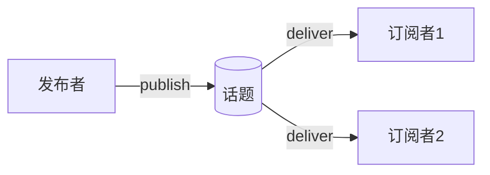

# ROS 2 话题（Topic）完全指南

> 本教程为系列第 01 篇，深入讲解 ROS 2 中最核心的通信机制——话题（Topic）。  
> 掌握后，您将能熟练使用发布/订阅模式进行异步数据交互。

---

## 1. 什么是话题？

**话题（Topic）** 是 ROS 2 中节点之间进行**异步数据通信**的命名通道。它采用 **发布/订阅（Publish/Subscribe）** 模式，是 ROS 2 三种主要通信接口之一。

!!! tip "形象比喻"
    话题就像**广播频道**——发布者（Publisher）在频道上发送数据，所有订阅者（Subscriber）都能接收到。双方互不知晓对方存在，实现高度解耦。

### 1.1 核心特征

| 特征 | 说明 |
|------|------|
| **异步通信** | 发布后无需等待，立即继续执行 |
| **多对多** | 一个话题可有多个发布者和多个订阅者 |
| **匿名性** | 订阅者通常不关心消息来源 |
| **强类型** | 每个话题绑定固定的消息类型 |
| **连续流** | 适用于传感器数据、状态更新等持续数据 |

### 1.2 适用场景

- 激光雷达、摄像头、IMU 等高频传感器数据  
- 机器人里程计、关节状态、电池电量  
- 系统日志、诊断信息  
- 任何“发布后即忘”的异步数据交换

---

## 2. 工作原理

### 2.1 发布/订阅模型

1. **发布者** 向指定话题发送消息  
2. **订阅者** 订阅同一话题，通过**回调函数**异步处理收到的消息  
3. 所有订阅者都会收到每条消息（除非 QoS 过滤）  
4. 发布者决定发送时机，订阅者被动接收

### 2.2 自动发现机制（去中心化）

ROS 2 摒弃了 ROS 1 的中央 Master，采用**分布式自动发现**：

- 节点启动时，通过 **DDS** 在同一 ROS 域（`ROS_DOMAIN_ID`）内广播自身信息  
- 其他节点响应，若 QoS 兼容则建立连接  
- 节点上线/下线均会通知，保证动态性

!!! note "与 ROS 1 的区别"
    ROS 1 依赖 Master 进行话题注册，存在单点故障；ROS 2 的去中心化设计更健壮、灵活。

### 2.3 消息传递流程



## 3. 消息（Message）与接口定义

### 3.1 消息类型

ROS 2 是**强类型**系统，每个话题绑定一种消息类型，字段类型固定（如 `uint32`、`string`、`float32[]`）。类型不匹配时无法通信。

### 3.2 自定义消息（`.msg` 文件）

定义示例 `Person.msg`：

```
string name
uint32 age
float32 height
```

支持基本类型、复合类型（嵌套消息）、数组（`[]` 或 `[N]`）。

### 3.3 常用内置消息

| 消息类型 | 用途 |
|----------|------|
| `std_msgs/String` | 字符串 |
| `std_msgs/Int64` | 整数 |
| `sensor_msgs/Image` | 图像 |
| `sensor_msgs/LaserScan` | 激光雷达数据 |
| `geometry_msgs/Twist` | 速度指令 |
| `nav_msgs/Odometry` | 里程计 |

---

## 4. Quality of Service（QoS）配置

QoS 是 ROS 2 相比 ROS 1 的重大增强，允许精细控制通信行为。

### 4.1 核心策略

| 策略 | 可选值 | 说明 |
|------|--------|------|
| **History** | `Keep last` / `Keep all` | 保留最近 N 条或全部消息 |
| **Depth** | 整数（如 10） | `Keep last` 时的队列大小 |
| **Reliability** | `Best effort` / `Reliable` | 尽力而为或可靠传输 |
| **Durability** | `Volatile` / `Transient local` | 是否为新订阅者保留历史 |
| **Deadline** | 时长 | 期望的最大消息间隔 |
| **Lifespan** | 时长 | 消息有效期限，超时丢弃 |

!!! warning "兼容性规则"
    发布者和订阅者的 **Reliability** 与 **Durability** 必须兼容才能建立连接。  
    - `Reliable` 与 `Best effort` **不兼容**  
    - `Transient local` 与 `Volatile` **不兼容**

### 4.2 默认 QoS

ROS 2 默认配置为：`Keep last` + `Depth=10` + `Reliable` + `Volatile`。

### 4.3 预定义配置文件

| 配置文件 | 适用场景 |
|----------|----------|
| `qos_profile_sensor_data` | 传感器数据（Best effort + Keep last） |
| `qos_profile_parameters` | 参数更新（Reliable） |
| `qos_profile_system_default` | 系统默认 |

---

## 5. 命令行工具

### 5.1 常用命令

| 命令 | 作用 |
|------|------|
| `ros2 topic list` | 列出所有活跃话题 |
| `ros2 topic echo <topic>` | 打印话题消息 |
| `ros2 topic pub <topic> <type> <data>` | 发布消息 |
| `ros2 topic info <topic>` | 查看发布者/订阅者信息 |
| `ros2 topic hz <topic>` | 显示发布频率 |
| `ros2 topic bw <topic>` | 显示带宽 |

### 5.2 示例：发布与订阅

**终端1（发布）**：
```bash
ros2 topic pub /chatter std_msgs/msg/String "data: Hello ROS 2"
```

**终端2（订阅）**：
```bash
ros2 topic echo /chatter
```

**查看频率**：
```bash
ros2 topic hz /chatter
```

### 5.3 可视化：`rqt_graph`

```bash
rqt_graph
```

显示节点与话题的拓扑关系，是调试的利器。

---

## 6. 编程实践

### 6.1 C++ 发布者

```cpp
#include <chrono>
#include <memory>
#include <string>
#include "rclcpp/rclcpp.hpp"
#include "std_msgs/msg/string.hpp"

using namespace std::chrono_literals;

class Talker : public rclcpp::Node {
public:
  Talker() : Node("talker"), count_(0) {
    publisher_ = this->create_publisher<std_msgs::msg::String>("chatter", 10);
    timer_ = this->create_wall_timer(1s, std::bind(&Talker::timer_callback, this));
  }

private:
  void timer_callback() {
    auto msg = std_msgs::msg::String();
    msg.data = "Hello, world! " + std::to_string(count_++);
    RCLCPP_INFO(this->get_logger(), "Publishing: '%s'", msg.data.c_str());
    publisher_->publish(msg);
  }
  rclcpp::Publisher<std_msgs::msg::String>::SharedPtr publisher_;
  rclcpp::TimerBase::SharedPtr timer_;
  size_t count_;
};

int main(int argc, char * argv[]) {
  rclcpp::init(argc, argv);
  rclcpp::spin(std::make_shared<Talker>());
  rclcpp::shutdown();
  return 0;
}
```

### 6.2 C++ 订阅者

```cpp
#include <memory>
#include "rclcpp/rclcpp.hpp"
#include "std_msgs/msg/string.hpp"

class Listener : public rclcpp::Node {
public:
  Listener() : Node("listener") {
    subscription_ = this->create_subscription<std_msgs::msg::String>(
      "chatter", 10, std::bind(&Listener::topic_callback, this, std::placeholders::_1));
  }

private:
  void topic_callback(const std_msgs::msg::String::SharedPtr msg) const {
    RCLCPP_INFO(this->get_logger(), "I heard: '%s'", msg->data.c_str());
  }
  rclcpp::Subscription<std_msgs::msg::String>::SharedPtr subscription_;
};

int main(int argc, char * argv[]) {
  rclcpp::init(argc, argv);
  rclcpp::spin(std::make_shared<Listener>());
  rclcpp::shutdown();
  return 0;
}
```

### 6.3 Python 发布者

```python
import rclpy
from rclpy.node import Node
from std_msgs.msg import String

class Talker(Node):
    def __init__(self):
        super().__init__('talker')
        self.publisher_ = self.create_publisher(String, 'chatter', 10)
        self.timer = self.create_timer(1.0, self.timer_callback)
        self.count = 0

    def timer_callback(self):
        msg = String()
        msg.data = f'Hello, world! {self.count}'
        self.get_logger().info(f'Publishing: "{msg.data}"')
        self.publisher_.publish(msg)
        self.count += 1

def main(args=None):
    rclpy.init(args=args)
    node = Talker()
    rclpy.spin(node)
    node.destroy_node()
    rclpy.shutdown()

if __name__ == '__main__':
    main()
```

### 6.4 Python 订阅者

```python
import rclpy
from rclpy.node import Node
from std_msgs.msg import String

class Listener(Node):
    def __init__(self):
        super().__init__('listener')
        self.subscription = self.create_subscription(
            String, 'chatter', self.listener_callback, 10)

    def listener_callback(self, msg):
        self.get_logger().info(f'I heard: "{msg.data}"')

def main(args=None):
    rclpy.init(args=args)
    node = Listener()
    rclpy.spin(node)
    node.destroy_node()
    rclpy.shutdown()

if __name__ == '__main__':
    main()
```

### 6.5 自定义 QoS 示例（C++）

```cpp
#include "rclcpp/qos.hpp"

auto qos = rclcpp::QoS(
    rclcpp::QoSInitialization(
        rmw_qos_profile_sensor_data.history,
        rmw_qos_profile_sensor_data.depth
    )
);
qos.reliability(RMW_QOS_POLICY_RELIABILITY_BEST_EFFORT);
qos.durability(RMW_QOS_POLICY_DURABILITY_VOLATILE);

auto pub = node->create_publisher<Image>("camera/image", qos);
```

---

## 7. 对比：话题 vs 服务 vs 动作

| 维度 | 话题（Topic） | 服务（Service） | 动作（Action） |
|------|--------------|----------------|----------------|
| 模式 | 发布/订阅（异步） | 请求/响应（同步） | 目标/反馈/结果（异步） |
| 适用场景 | 连续数据流 | 短时 RPC | 长周期任务 |
| 流向 | 单向（多对多） | 双向（一对一） | 双向（可取消） |
| 阻塞 | 不阻塞 | 阻塞等待 | 不阻塞 |
| 典型用例 | 传感器数据 | 获取参数、触发指令 | 导航、机械臂运动 |

---

## 8. 最佳实践与常见问题

### 8.1 最佳实践

- **命名规范**：使用有层级的名词，如 `/robot/odom`、`/camera/image_raw`  
- **合理设置深度**：根据数据频率和消费速度调整队列大小  
- **选择合适 QoS**：传感器用 `Best effort`，控制指令用 `Reliable`  
- **善用工具**：`rqt_graph` 可视化调试，`ros2 topic echo` 实时查看

### 8.2 常见问题

!!! question "发布者与订阅者无法通信？"
    检查：话题名称是否一致（大小写敏感）、消息类型是否匹配、QoS 兼容性、是否在同一 `ROS_DOMAIN_ID`。

!!! question "消息丢失？"
    检查：是否使用 `Reliable`、队列深度是否足够、`Durability` 是否为 `Transient local`（若需要晚加入者接收历史消息）。

!!! question "如何调试？"
    ```bash
    ros2 topic list
    ros2 topic echo /topic
    ros2 topic info /topic
    rqt_graph
    ```

---

## 9. 参考资源

- [ROS 2 Topics 官方文档](https://docs.ros.org/en/humble/Concepts/Basic/About-Topics.html)  
- [Writing a simple publisher and subscriber (C++)](https://docs.ros.org/en/humble/Tutorials/Beginner-Client-Libraries/Writing-A-Simple-Cpp-Publisher-And-Subscriber.html)
- [Writing a simple publisher and subscriber (Python)](https://docs.ros.org/en/humble/Tutorials/Beginner-Client-Libraries/Writing-A-Simple-Py-Publisher-And-Subscriber.html)


---
## 👥 贡献者
本项目离不开每一位提交 PR、提 Issue、优化文档的开发者，由衷致谢！
<div style="display: flex; flex-wrap: wrap; gap: 30px; margin-top: 20px; margin-bottom: 20px;">
    <div style="text-align: center;">
        <a href="https://github.com/yxzhc">
            
        </a>
        <div style="margin-top: 8px; font-weight: 600;">
            <a href="https://github.com/yxzhc" style="text-decoration: none;">YXZHC</a>
        </div>
    </div>
    <div style="text-align: center;">
        <a href="https://github.com/hbrobot">
            
        </a>
        <div style="margin-top: 8px; font-weight: 600;">
            <a href="https://github.com/hbrobot" style="text-decoration: none;">HBRobot</a>
        </div>
    </div>
</div>
---
🤝 **欢迎参与共建：**

[:fontawesome-brands-github: 提交 Issue](https://github.com/hbrobot/hbrobot.github.io/issues/new/choose){: .md-button }
[:octicons-git-pull-request-24: 提交 PR](https://github.com/hbrobot/hbrobot.github.io/compare){: .md-button .md-button--primary }

---