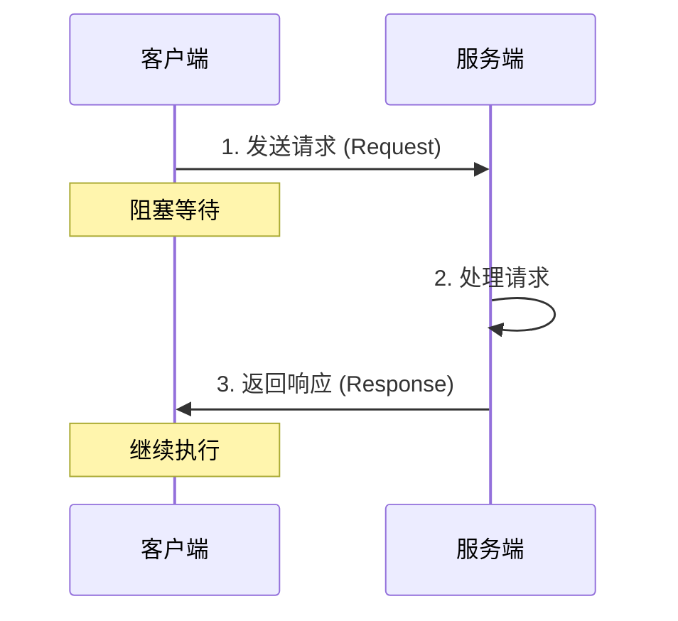
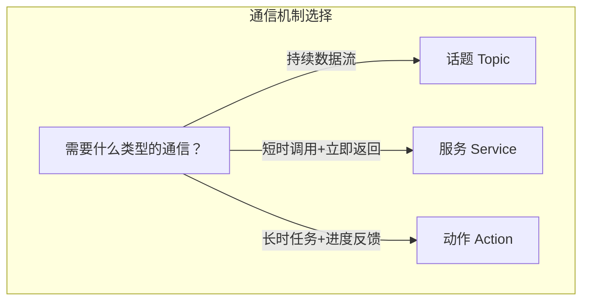

# ROS 2 服务（Service）指南

> 本教程为系列第 02 篇，深入讲解 ROS 2 中**同步请求/响应**通信机制——服务（Service）。  
> 掌握后，您将能够实现节点间的远程过程调用（RPC），完成配置查询、指令触发等交互任务。


## 1. 什么是服务？

**服务（Service）** 是 ROS 2 中节点之间进行**同步请求/响应**通信的机制。它采用**客户端-服务器（Client-Server）** 模型，是 ROS 2 三种主要通信接口之一。

与话题（Topic）的“广播”模式不同，服务更像**打电话**——客户端拨号（发送请求），服务器接听并回复（返回响应），通话期间客户端需要等待。


### 1.1 核心特征

| 特征 | 说明 |
|------|------|
| **同步通信** | 客户端发送请求后**阻塞等待**，直到收到响应 |
| **一对一** | 一个服务名称对应**一个服务端**，但可以有**多个客户端** |
| **短时操作** | 服务适用于**快速完成**的任务，不应用于长时间运行的操作 |
| **强类型** | 每个服务都有固定的请求（Request）和响应（Response）消息类型 |
| **有返回值** | 每次调用都有明确的返回结果 |

### 1.2 适用场景

服务最适合以下场景：

- **配置查询**：获取机器人当前参数、状态信息
- **指令触发**：启动/停止某个功能模块
- **一次性计算**：路径规划、坐标变换等需要返回结果的计算
- **参数设置**：动态修改节点配置

???+ tip "何时使用服务？"
    如果您需要**立即得到回复**，且操作能在**短时间内完成**，服务是最佳选择。  
    如果需要**持续数据流**，使用**话题（Topic）**；如果需要**长时间任务**并需要**进度反馈**，使用**动作（Action）**。


## 2. 服务通信的工作原理

### 2.1 客户端-服务器模型

服务通信涉及两个角色：

1. **服务端（Service Server）** ：接收请求、执行计算、返回响应的节点。**每个服务名称只能有一个服务端**。
2. **客户端（Service Client）** ：发送请求并等待响应的节点。**可以有任意数量的客户端**使用同一个服务。

???+ info "节点可以同时扮演两种角色"
    一个 ROS 2 节点可以同时作为某些服务的**客户端**和另一些服务的**服务端**。例如，一个导航节点可能是地图服务的客户端，同时又是位置服务的服务端。

### 2.2 通信流程



### 2.3 自动发现机制

与话题一样，服务也采用**分布式自动发现**机制：

1. 服务端启动时，在 ROS 域内**广播**自己提供的服务
2. 客户端调用服务时，自动**发现**可用的服务端并建立连接
3. 无需中央 Master 节点，系统更加健壮

> [!WARNING]
> 如果同一个服务名称有**多个服务端**同时运行，客户端请求将由**哪个服务端处理是未定义的**，应避免这种情况。


## 3. 服务接口（.srv 文件）

### 3.1 服务类型定义

服务类型由 **.srv 文件**定义，包含两部分：

- **请求（Request）** ：客户端发送的数据（`---` 上方）
- **响应（Response）** ：服务端返回的数据（`---` 下方）

以 `example_interfaces/srv/AddTwoInts` 为例：

```
int64 a
int64 b
---
int64 sum
```

???+ example "更多服务示例"

    **空服务（Empty）** —— 无数据交换，仅作为信号触发：
    ```
    ---
    ```

    **带状态码的服务**：
    ```
    string command
    ---
    int32 success   # 0=成功, 非0=错误码
    string message  # 错误描述信息
    ```

### 3.2 支持的数据类型

| 类型 | 说明 | 示例 |
|------|------|------|
| **基本类型** | `bool`、`int8`、`uint32`、`float64` 等 | `int64 a` |
| **字符串** | `string` | `string name` |
| **数组** | 变长数组 `[]`、定长数组 `[N]` | `float32[] data` |
| **嵌套消息** | 其他 `.msg` 类型 | `geometry_msgs/Pose pose` |

### 3.3 创建自定义服务接口

#### 步骤 1：创建接口包

```bash
# 创建专门存放接口的包
ros2 pkg create --build-type ament_cmake tutorial_interfaces
```

#### 步骤 2：添加 .srv 文件

在 `tutorial_interfaces/srv/` 目录下创建 `MyService.srv`：

```
string name
int32 value
---
bool success
string message
```

#### 步骤 3：修改 CMakeLists.txt

```cmake
find_package(rosidl_default_generators REQUIRED)

rosidl_generate_interfaces(${PROJECT_NAME}
  "srv/MyService.srv"
)
```

#### 步骤 4：修改 package.xml

```xml
<build_depend>rosidl_default_generators</build_depend>
<exec_depend>rosidl_default_runtime</exec_depend>
<member_of_group>rosidl_interface_packages</member_of_group>
```

#### 步骤 5：编译

```bash
colcon build --packages-select tutorial_interfaces
```


## 4. 命令行工具

ROS 2 提供了强大的命令行工具来内省和操作服务。

### 4.1 基本命令

| 命令 | 说明 |
|------|------|
| `ros2 service list` | 列出所有活跃服务 |
| `ros2 service type <service>` | 查看服务的类型 |
| `ros2 service find <type>` | 查找指定类型的所有服务 |
| `ros2 service call <service> <type> <request>` | 调用服务 |
| `ros2 interface show <type>` | 查看服务接口定义 |

### 4.2 实战示例：turtlesim 服务

启动 turtlesim：

```bash
# 终端 1
ros2 run turtlesim turtlesim_node

# 终端 2
ros2 run turtlesim turtle_teleop_key
```

**列出所有服务**：

```bash
ros2 service list
```

输出：
```
/clear
/kill
/reset
/spawn
/turtle1/set_pen
/turtle1/teleport_absolute
/turtle1/teleport_relative
```

**查看服务类型**：

```bash
ros2 service type /spawn
```

输出：
```
turtlesim/srv/Spawn
```

**查看接口定义**：

```bash
ros2 interface show turtlesim/srv/Spawn
```

输出：
```
float32 x
float32 y
float32 theta
string name
---
string name
```

**调用服务**——在 (2, 2) 位置生成一只新乌龟：

```bash
ros2 service call /spawn turtlesim/srv/Spawn "{x: 2, y: 2, theta: 0.2, name: ''}"
```

> [!CAUTION]
> 命令行调用服务时，**请求参数必须使用 YAML 语法**，注意引号和花括号的正确使用。

**调用空服务**——清空 turtlesim 的轨迹：

```bash
ros2 service call /clear std_srvs/srv/Empty
```

### 4.3 查看服务通信详情

```bash
# 查看服务类型
ros2 service type /turtle1/set_pen

# 查找特定类型的服务
ros2 service find turtlesim/srv/Spawn
```


## 5. 编程实践

### 5.1 C++ 示例（rclcpp）

#### 创建包

```bash
ros2 pkg create --build-type ament_cmake cpp_srvcli --dependencies rclcpp example_interfaces
```

`example_interfaces` 包含了 `AddTwoInts.srv` 接口。

#### 服务端（Server）

```cpp
#include "rclcpp/rclcpp.hpp"
#include "example_interfaces/srv/add_two_ints.hpp"

class MinimalServer : public rclcpp::Node
{
public:
    MinimalServer() : Node("minimal_server")
    {
        // 创建服务：服务名 "add_ints"，类型 AddTwoInts
        server_ = this->create_service<example_interfaces::srv::AddTwoInts>(
            "add_ints",
            std::bind(
                &MinimalServer::server_callback,
                this,
                std::placeholders::_1,
                std::placeholders::_2
            )
        );
        RCLCPP_INFO(this->get_logger(), "Service 'add_ints' is ready.");
    }

private:
    void server_callback(
        const example_interfaces::srv::AddTwoInts::Request::SharedPtr req,
        const example_interfaces::srv::AddTwoInts::Response::SharedPtr resp)
    {
        // 处理请求：计算两数之和
        resp->sum = req->a + req->b;
        RCLCPP_INFO(
            this->get_logger(),
            "Received: a=%ld, b=%ld, returning: %ld",
            req->a, req->b, resp->sum
        );
    }

    rclcpp::Service<example_interfaces::srv::AddTwoInts>::SharedPtr server_;
};

int main(int argc, char* argv[])
{
    rclcpp::init(argc, argv);
    auto node = std::make_shared<MinimalServer>();
    rclcpp::spin(node);
    rclcpp::shutdown();
    return 0;
}
```

#### 客户端（Client）

```cpp
#include "rclcpp/rclcpp.hpp"
#include "example_interfaces/srv/add_two_ints.hpp"

class MinimalClient : public rclcpp::Node
{
public:
    MinimalClient() : Node("minimal_client")
    {
        // 创建客户端
        client_ = this->create_client<example_interfaces::srv::AddTwoInts>("add_ints");
    }

    void send_request(int64_t a, int64_t b)
    {
        // 等待服务端就绪
        while (!client_->wait_for_service(std::chrono::seconds(1))) {
            RCLCPP_WARN(this->get_logger(), "Waiting for service 'add_ints'...");
        }

        // 构造请求
        auto request = std::make_shared<example_interfaces::srv::AddTwoInts::Request>();
        request->a = a;
        request->b = b;

        // 异步发送请求（带回调）
        auto future = client_->async_send_request(
            request,
            std::bind(&MinimalClient::response_callback, this, std::placeholders::_1)
        );
    }

private:
    void response_callback(
        rclcpp::Client<example_interfaces::srv::AddTwoInts>::SharedFuture future)
    {
        auto response = future.get();
        RCLCPP_INFO(this->get_logger(), "Result: %ld", response->sum);
    }

    rclcpp::Client<example_interfaces::srv::AddTwoInts>::SharedPtr client_;
};

int main(int argc, char* argv[])
{
    rclcpp::init(argc, argv);
    auto node = std::make_shared<MinimalClient>();

    // 从命令行读取参数
    if (argc != 3) {
        RCLCPP_ERROR(node->get_logger(), "Usage: ./client a b");
        return 1;
    }

    int64_t a = std::stoll(argv[1]);
    int64_t b = std::stoll(argv[2]);
    node->send_request(a, b);

    rclcpp::spin(node);
    rclcpp::shutdown();
    return 0;
}
```

#### 修改 CMakeLists.txt

```cmake
add_executable(server src/server.cpp)
ament_target_dependencies(server rclcpp example_interfaces)

add_executable(client src/client.cpp)
ament_target_dependencies(client rclcpp example_interfaces)

install(TARGETS server client DESTINATION lib/${PROJECT_NAME})
```

### 5.2 Python 示例（rclpy）

#### 创建包

```bash
ros2 pkg create --build-type ament_python py_srvcli --dependencies rclpy example_interfaces
```

#### 服务端（Server）

```python
import rclpy
from rclpy.node import Node
from example_interfaces.srv import AddTwoInts

class MinimalServer(Node):
    def __init__(self):
        super().__init__('minimal_server')
        # 创建服务
        self.srv = self.create_service(
            AddTwoInts,
            'add_ints',
            self.server_callback
        )
        self.get_logger().info("Service 'add_ints' is ready.")

    def server_callback(self, request, response):
        # 处理请求：计算两数之和
        response.sum = request.a + request.b
        self.get_logger().info(
            f'Received: a={request.a}, b={request.b}, returning: {response.sum}'
        )
        return response

def main(args=None):
    rclpy.init(args=args)
    node = MinimalServer()
    rclpy.spin(node)
    node.destroy_node()
    rclpy.shutdown()

if __name__ == '__main__':
    main()
```

#### 客户端（Client）

```python
import sys
import rclpy
from rclpy.node import Node
from example_interfaces.srv import AddTwoInts

class MinimalClient(Node):
    def __init__(self):
        super().__init__('minimal_client')
        # 创建客户端
        self.client = self.create_client(AddTwoInts, 'add_ints')
        while not self.client.wait_for_service(timeout_sec=1.0):
            self.get_logger().warn('Waiting for service "add_ints"...')

    def send_request(self, a, b):
        # 构造请求
        request = AddTwoInts.Request()
        request.a = a
        request.b = b

        # 异步发送请求（带回调）
        self.future = self.client.call_async(request)
        self.future.add_done_callback(self.response_callback)

    def response_callback(self, future):
        try:
            response = future.result()
            self.get_logger().info(f'Result: {response.sum}')
        except Exception as e:
            self.get_logger().error(f'Service call failed: {e}')
        # 收到响应后关闭节点
        rclpy.shutdown()

def main(args=None):
    rclpy.init(args=args)
    node = MinimalClient()

    if len(sys.argv) != 3:
        node.get_logger().error('Usage: python client.py a b')
        return 1

    a = int(sys.argv[1])
    b = int(sys.argv[2])
    node.send_request(a, b)

    rclpy.spin(node)

if __name__ == '__main__':
    main()
```

#### 修改 setup.py

```python
entry_points={
    'console_scripts': [
        'server = py_srvcli.server:main',
        'client = py_srvcli.client:main',
    ],
},
```

### 5.3 同步 vs 异步调用

ROS 2 服务调用支持两种模式：

| 模式 | 说明 | 适用场景 |
|------|------|----------|
| **同步调用** | 阻塞等待响应 | 简单脚本、快速任务 |
| **异步调用** | 不阻塞，通过回调处理响应 | 复杂节点、需要并发处理 |

???+ warning "避免长时间阻塞"
    在回调函数中调用**同步服务**可能导致死锁。推荐在 ROS 2 中使用**异步调用**方式。


## 6. 话题 vs 服务 vs 动作

| 维度 | 话题（Topic） | 服务（Service） | 动作（Action） |
|------|--------------|----------------|----------------|
| **通信模式** | 发布/订阅（异步） | 请求/响应（同步） | 目标/反馈/结果（异步） |
| **数据流向** | 单向（多对多） | 双向（一对多） | 双向（可取消） |
| **阻塞** | 不阻塞 | **阻塞等待** | 不阻塞 |
| **适用场景** | 连续数据流 | 短时 RPC | 长周期任务 |
| **典型用例** | 传感器数据、状态更新 | 获取参数、触发指令 | 导航、机械臂运动 |
| **可中断** | N/A | 否 | **是** |



> [!TIP]
> **服务 = 功能调用**，**话题 = 数据流**，**动作 = 任务管理**。


## 7. 最佳实践与常见问题

### 7.1 最佳实践

1. **服务应快速返回**：服务端应在**短时间内**完成处理，客户端通常阻塞等待结果

2. **长时间任务使用动作**：如果操作可能需要**数秒或更长时间**，或需要**进度反馈**，应使用动作（Action）

3. **服务命名规范**：使用有意义的名称，如 `/robot/arm/enable`、`/camera/calibrate`

4. **唯一服务端**：确保每个服务名称**只有一个服务端**在运行

5. **异步调用优先**：在复杂节点中优先使用异步调用，避免阻塞主线程

6. **超时处理**：客户端应设置合理的超时时间，防止无限等待

### 7.2 常见问题

??? question "客户端无法找到服务？"
    检查：
    
    - 服务端是否正常运行
    - 服务名称是否一致（大小写敏感）
    - 是否在同一个 ROS 域（`ROS_DOMAIN_ID`）
    - 使用 `ros2 service list` 确认服务已注册

??? question "服务调用超时？"
    可能原因：

    - 服务端处理时间过长
    - 网络延迟或丢包
    - 服务端崩溃未恢复
    - 考虑是否应该使用**动作（Action）** 替代

??? question "多个服务端冲突？"
    同一服务名称有多个服务端时，**无法确定哪个会响应**。确保每个服务名称只有一个服务端。

??? question "如何在回调中调用服务？"
    在回调函数中调用**同步服务**可能导致死锁。推荐使用**异步调用**或使用 `MultiThreadedExecutor`。


## 8. 小结

本文全面介绍了 ROS 2 的服务（Service）通信机制：

- ✅ 服务采用**同步请求/响应**模式，适用于**短时 RPC 调用**
- ✅ 服务接口由 **.srv 文件**定义，包含请求和响应两部分
- ✅ 提供**丰富的命令行工具**进行调试和内省
- ✅ 支持 **C++ 和 Python** 两种主流开发语言
- ✅ 服务适用于**配置查询、指令触发、一次性计算**等场景
- ✅ 长时间任务应使用**动作（Action）** 替代

在下一篇教程中，我们将深入讲解 ROS 2 的动作（Action）通信机制，学习如何处理需要**进度反馈**和**任务取消**的长周期任务。


## 9. 参考资源

- [ROS 2 官方文档 - Services](http://docs.ros.org/en/ros2_documentation/kilted/Concepts/Basic/About-Services.html)
- [ROS 2 官方文档 - Understanding services](http://docs.ros.org/en/ros2_documentation/rolling/Tutorials/Beginner-CLI-Tools/Understanding-ROS2-Services/Understanding-ROS2-Services.html)
- [Writing a simple service and client (C++)](https://docs.ros.org/en/ros2_documentation/dashing/Tutorials/Writing-A-Simple-Cpp-Service-And-Client.html)
- [Writing a simple service and client (Python)](https://docs.ros.org/en/eloquent/Tutorials/Writing-A-Simple-Py-Service-And-Client.html)
- [ROS 2 Interfaces - Topics, Services, Actions](https://docs.ros.org/en/jazzy/Concepts/Basic/Interfaces-Topics-Services-Actions.html)


---
## 👥 贡献者
本项目离不开每一位提交 PR、提 Issue、优化文档的开发者，由衷致谢！
<div style="display: flex; flex-wrap: wrap; gap: 30px; margin-top: 20px; margin-bottom: 20px;">
    <div style="text-align: center;">
        <a href="https://github.com/yxzhc">
            
        </a>
        <div style="margin-top: 8px; font-weight: 600;">
            <a href="https://github.com/yxzhc" style="text-decoration: none;">YXZHC</a>
        </div>
    </div>
    <div style="text-align: center;">
        <a href="https://github.com/hbrobot">
            
        </a>
        <div style="margin-top: 8px; font-weight: 600;">
            <a href="https://github.com/hbrobot" style="text-decoration: none;">HBRobot</a>
        </div>
    </div>
</div>
---
🤝 **欢迎参与共建：**

[:fontawesome-brands-github: 提交 Issue](https://github.com/hbrobot/hbrobot.github.io/issues/new/choose){: .md-button }
[:octicons-git-pull-request-24: 提交 PR](https://github.com/hbrobot/hbrobot.github.io/compare){: .md-button .md-button--primary }

---