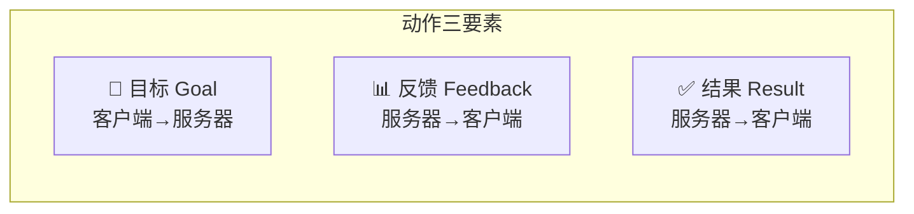
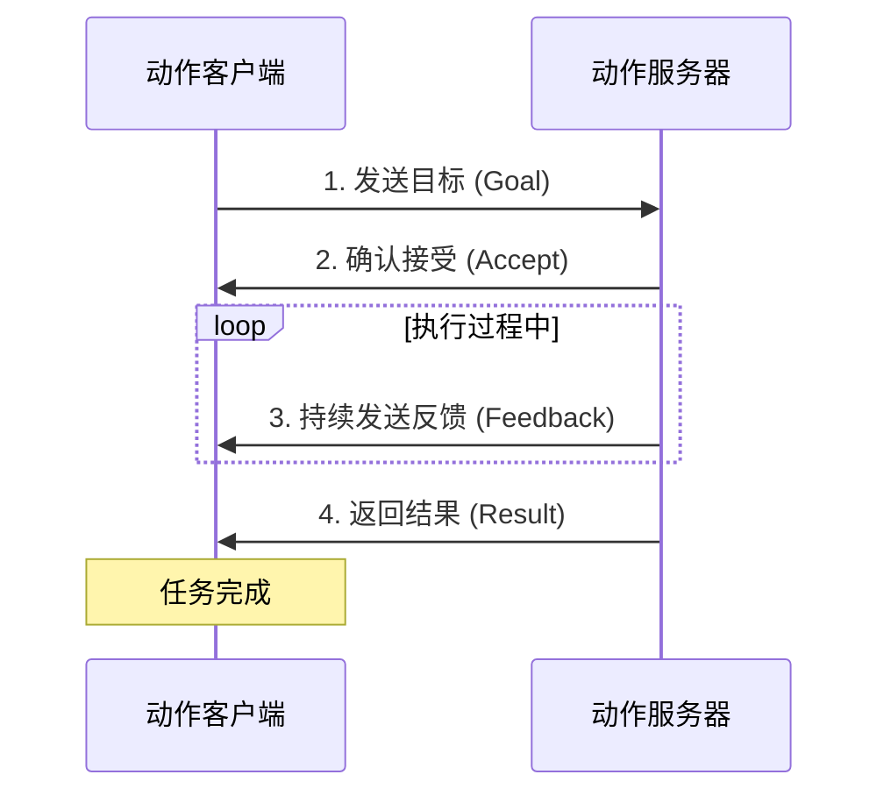
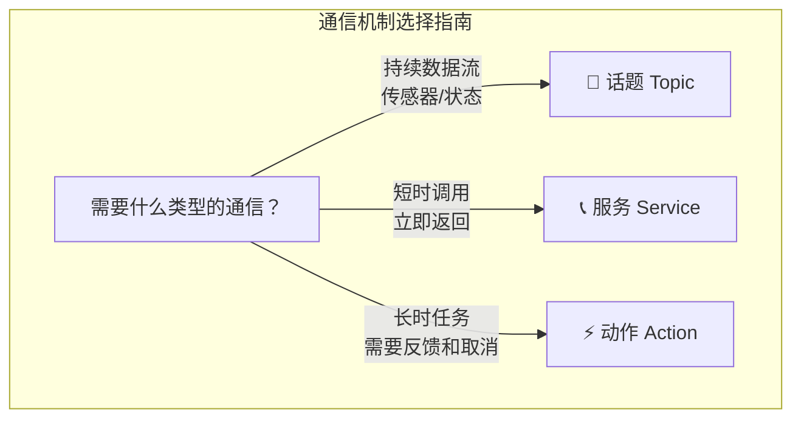

# ROS 2 动作（Action）完全指南

> 本教程为系列第 03 篇，深入讲解 ROS 2 中最强大的通信机制——**动作（Action）** 。
> 掌握后，您将能够处理需要**长时间运行、进度反馈和任务取消**的复杂机器人任务。


## 1. 什么是动作？

**动作（Action）** 是 ROS 2 中专门用于**长时间运行任务**的通信机制。它采用**客户端-服务器模型**，将**目标（Goal）、反馈（Feedback）和结果（Result）** 三个核心概念封装成统一的编程模型。

??? tip "形象比喻"
    如果说**话题（Topic）** 是**广播电台**（持续播放，谁都可以听），**服务（Service）** 是**打电话**（一问一答，立即挂断），那么**动作（Action）** 就是**点外卖**：

    - 您下订单（**发送目标**）
    - 商家接单并告知预计时间（**接受目标**）
    - 配送过程中不断更新位置（**反馈**）
    - 最终送达（**返回结果**）
    - 您可以随时取消订单（**取消任务**）

### 1.1 核心特征

| 特征 | 说明 |
|------|------|
| **异步通信** | 客户端发送目标后**不阻塞**，可继续执行其他任务 |
| **长时间运行** | 适用于持续数秒、数分钟甚至更长的任务 |
| **进度反馈** | 服务器在执行过程中**持续发送**反馈信息 |
| **可取消** | 客户端可以随时**取消**正在执行的目标 |
| **目标/反馈/结果** | 三部分构成完整的任务生命周期 |
| **基于话题和服务** | 动作在底层由**多个话题和服务**组合实现 |

### 1.2 适用场景

动作最适合以下场景：

- **导航任务**：机器人从 A 点移动到 B 点，需要持续反馈位置和状态
- **机械臂运动**：执行复杂的轨迹规划，需要进度提示
- **文件传输/数据处理**：长时间的后台处理任务
- **充电/ docking**：机器人自动回充，需要状态反馈
- **任何需要**“开始→进行中→完成”**三段式管理的任务**




## 2. 动作通信的工作原理

### 2.1 客户端-服务器模型

动作通信涉及两个角色：

1. **动作服务器（Action Server）** ：接收目标请求、执行任务、发送反馈和结果的节点。**每个动作名称只能有一个服务器**。
2. **动作客户端（Action Client）** ：发送目标请求、接收反馈和结果的节点。**可以有任意数量的客户端**使用同一个动作。

> [!WARNING]
> 如果同一个动作名称有**多个服务器**同时运行，客户端请求将由**哪个服务器处理是未定义的**，应严格避免这种情况。

### 2.2 通信流程



### 2.3 动作的底层实现

动作在底层实际上是**由多个话题和服务组合而成**：

| 底层通信 | 用途 |
|----------|------|
| **目标服务** | 客户端发送目标请求 |
| **结果服务** | 服务器返回最终结果 |
| **反馈话题** | 服务器持续发布进度信息 |
| **状态话题** | 发布目标状态变化 |
| **取消服务** | 客户端请求取消目标 |

???+ info "对开发者透明"
    这些底层细节对开发者是**完全透明**的。您只需要使用 `rclcpp_action` 或 `rclpy.action` 提供的高级 API，即可完成所有操作。


## 3. 动作接口（.action 文件）

### 3.1 动作类型定义

动作类型由 **.action 文件**定义，包含三部分，由 `---` 分隔：

```
# 第一部分：目标（Goal）—— 客户端发送给服务器
# 定义任务需要什么参数

---
# 第二部分：结果（Result）—— 服务器返回给客户端
# 定义任务完成后返回什么

---
# 第三部分：反馈（Feedback）—— 服务器持续发送给客户端
# 定义任务执行过程中报告什么状态
```

以 `action_tutorials_interfaces/action/Fibonacci` 为例：

```
# 计算斐波那契数列到第 n 项
int32 order
---
# 最终计算出的完整序列
int32[] sequence
---
# 当前已计算的部分序列（进度反馈）
int32[] partial_sequence
```

??? example "更多动作示例"

    **导航动作**（`nav2_msgs/action/NavigateToPose`）：
    ```
    # 目标：目标位姿
    geometry_msgs/PoseStamped goal
    ---
    # 结果：是否成功到达
    bool success
    ---
    # 反馈：当前距离、速度等
    geometry_msgs/PoseStamped current_pose
    float32 distance_remaining
    ```

    **机械臂动作**（`control_msgs/action/FollowJointTrajectory`）：
    ```
    # 目标：关节轨迹
    trajectory_msgs/JointTrajectory trajectory
    ---
    # 结果：错误码
    int32 error_code
    string error_message
    ---
    # 反馈：当前关节位置/速度
    float64[] actual_positions
    float64[] actual_velocities
    ```

### 3.2 支持的数据类型

与 `.msg` 和 `.srv` 一样，`.action` 文件支持：

| 类型 | 示例 |
|------|------|
| **基本类型** | `int32`、`float64`、`bool`、`string` |
| **数组** | `int32[]`（变长）、`int32[10]`（定长） |
| **嵌套消息** | `geometry_msgs/PoseStamped` |
| **嵌套动作** | 动作可以包含其他消息类型 |

### 3.3 创建自定义动作接口

#### 步骤 1：创建接口包

```bash
# 创建专门存放接口的包
ros2 pkg create --build-type ament_cmake action_tutorials_interfaces
```

#### 步骤 2：创建 action 目录并添加 .action 文件

```bash
cd action_tutorials_interfaces
mkdir action
```

在 `action/` 目录下创建 `Fibonacci.action`：

```
int32 order
---
int32[] sequence
---
int32[] partial_sequence
```

#### 步骤 3：修改 CMakeLists.txt

```cmake
find_package(rosidl_default_generators REQUIRED)

rosidl_generate_interfaces(${PROJECT_NAME}
  "action/Fibonacci.action"
)
```

#### 步骤 4：修改 package.xml

```xml
<build_depend>rosidl_default_generators</build_depend>
<exec_depend>rosidl_default_runtime</exec_depend>
<member_of_group>rosidl_interface_packages</member_of_group>
```

#### 步骤 5：编译

```bash
colcon build --packages-select action_tutorials_interfaces
```


## 4. 命令行工具

ROS 2 提供了强大的命令行工具来内省和操作动作。

### 4.1 基本命令

| 命令 | 说明 |
|------|------|
| `ros2 action list` | 列出所有活跃动作 |
| `ros2 action info <action>` | 查看动作的服务器/客户端信息 |
| `ros2 action send_goal <action> <type> <goal>` | 发送动作目标 |
| `ros2 action show <action>` | 查看动作类型定义 |

### 4.2 实战示例：turtlesim 旋转动作

启动 turtlesim：

```bash
# 终端 1
ros2 run turtlesim turtlesim_node

# 终端 2
ros2 run turtlesim turtle_teleop_key
```

**列出所有动作**：

```bash
ros2 action list
```

输出：
```
/turtle1/rotate_absolute
```

**查看动作信息**：

```bash
ros2 action info /turtle1/rotate_absolute
```

输出：
```
Action: /turtle1/rotate_absolute
Action clients: 1
    /teleop_turtle
Action servers: 1
    /turtlesim
```

**查看动作类型定义**：

```bash
ros2 action show /turtle1/rotate_absolute
```

输出：
```
turtlesim/action/RotateAbsolute
```

**查看完整接口**：

```bash
ros2 interface show turtlesim/action/RotateAbsolute
```

输出：
```
# 目标：目标角度（弧度）
float32 theta
---
# 结果：已旋转的角度
float32 delta
---
# 反馈：剩余角度
float32 remaining
```

**发送动作目标**——让乌龟旋转到 1.57 弧度（90 度）：

```bash
ros2 action send_goal /turtle1/rotate_absolute turtlesim/action/RotateAbsolute "{theta: 1.57}"
```

输出：
```
Waiting for an action server to become available...
Sending goal:
    theta: 1.57

Goal accepted with ID: f8db8f6c0a1f4f8e9b9c8d7e6f5a4b3c

Result:
    delta: 1.569999933242798

Goal finished with status: SUCCEEDED
```

**发送目标并观察反馈**（添加 `--feedback` 选项）：

```bash
ros2 action send_goal /turtle1/rotate_absolute turtlesim/action/RotateAbsolute "{theta: -1.57}" --feedback
```

输出会实时显示反馈信息：
```
Feedback:
    remaining: 1.2

Feedback:
    remaining: 0.8

Feedback:
    remaining: 0.3

Feedback:
    remaining: 0.0
```

> [!CAUTION]
> 命令行调用动作时，**目标参数必须使用 YAML 语法**，注意引号和花括号的正确使用。


## 5. 编程实践

### 5.1 C++ 示例（rclcpp）

#### 创建包

```bash
cd ~/ros2_ws/src
ros2 pkg create --dependencies action_tutorials_interfaces rclcpp rclcpp_action -- cpp_action_server
```

#### 动作服务器（Server）

```cpp
#include <chrono>
#include <memory>
#include <thread>

#include "rclcpp/rclcpp.hpp"
#include "rclcpp_action/rclcpp_action.hpp"
#include "action_tutorials_interfaces/action/fibonacci.hpp"

using namespace std::chrono_literals;

class FibonacciActionServer : public rclcpp::Node
{
public:
    using Fibonacci = action_tutorials_interfaces::action::Fibonacci;
    using GoalHandleFibonacci = rclcpp_action::ServerGoalHandle<Fibonacci>;

    FibonacciActionServer() : Node("fibonacci_action_server")
    {
        // 创建动作服务器
        action_server_ = rclcpp_action::create_server<Fibonacci>(
            this,
            "fibonacci",                                    // 动作名称
            std::bind(&FibonacciActionServer::handle_goal, this, std::placeholders::_1, std::placeholders::_2),
            std::bind(&FibonacciActionServer::handle_cancel, this, std::placeholders::_1),
            std::bind(&FibonacciActionServer::handle_accepted, this, std::placeholders::_1)
        );
        RCLCPP_INFO(this->get_logger(), "Action server 'fibonacci' is ready.");
    }

private:
    // 1. 目标接受回调：决定是否接受目标
    rclcpp_action::GoalResponse handle_goal(
        const rclcpp_action::GoalUUID &uuid,
        std::shared_ptr<const Fibonacci::Goal> goal)
    {
        RCLCPP_INFO(this->get_logger(), "Received goal request with order %d", goal->order);
        // 只接受 order <= 46 的目标（防止计算量过大）
        if (goal->order > 46) {
            RCLCPP_WARN(this->get_logger(), "Goal order %d is too large, rejecting", goal->order);
            return rclcpp_action::GoalResponse::REJECT;
        }
        return rclcpp_action::GoalResponse::ACCEPT_AND_EXECUTE;
    }

    // 2. 取消回调：处理取消请求
    rclcpp_action::CancelResponse handle_cancel(
        const std::shared_ptr<GoalHandleFibonacci> goal_handle)
    {
        RCLCPP_INFO(this->get_logger(), "Received cancel request");
        return rclcpp_action::CancelResponse::ACCEPT;
    }

    // 3. 目标执行回调：实际执行任务
    void handle_accepted(const std::shared_ptr<GoalHandleFibonacci> goal_handle)
    {
        // 在新线程中执行，避免阻塞主线程
        std::thread{std::bind(&FibonacciActionServer::execute, this, std::placeholders::_1), goal_handle}.detach();
    }

    void execute(const std::shared_ptr<GoalHandleFibonacci> goal_handle)
    {
        RCLCPP_INFO(this->get_logger(), "Executing goal...");

        // 获取目标参数
        const auto goal = goal_handle->get_goal();
        auto feedback = std::make_shared<Fibonacci::Feedback>();
        auto result = std::make_shared<Fibonacci::Result>();

        // 计算斐波那契数列
        std::vector<int32_t> sequence;
        sequence.push_back(0);
        sequence.push_back(1);

        for (int i = 1; i < goal->order; i++) {
            // 检查是否被取消
            if (goal_handle->is_canceling()) {
                result->sequence = sequence;
                goal_handle->canceled(result);
                RCLCPP_INFO(this->get_logger(), "Goal canceled");
                return;
            }

            // 计算下一项
            sequence.push_back(sequence[i] + sequence[i-1]);

            // 发送反馈
            feedback->partial_sequence = sequence;
            goal_handle->publish_feedback(feedback);

            // 模拟耗时操作
            std::this_thread::sleep_for(500ms);
        }

        // 任务完成，返回结果
        result->sequence = sequence;
        goal_handle->succeed(result);
        RCLCPP_INFO(this->get_logger(), "Goal succeeded");
    }

    rclcpp_action::Server<Fibonacci>::SharedPtr action_server_;
};

int main(int argc, char* argv[])
{
    rclcpp::init(argc, argv);
    auto node = std::make_shared<FibonacciActionServer>();
    rclcpp::spin(node);
    rclcpp::shutdown();
    return 0;
}
```

#### 动作客户端（Client）

```cpp
#include <memory>
#include <string>

#include "rclcpp/rclcpp.hpp"
#include "rclcpp_action/rclcpp_action.hpp"
#include "action_tutorials_interfaces/action/fibonacci.hpp"

class FibonacciActionClient : public rclcpp::Node
{
public:
    using Fibonacci = action_tutorials_interfaces::action::Fibonacci;
    using GoalHandleFibonacci = rclcpp_action::ClientGoalHandle<Fibonacci>;

    FibonacciActionClient() : Node("fibonacci_action_client")
    {
        // 创建动作客户端
        client_ = rclcpp_action::create_client<Fibonacci>(
            this,
            "fibonacci"
        );
    }

    void send_goal(int order)
    {
        // 等待动作服务器就绪
        if (!client_->wait_for_action_server(std::chrono::seconds(10))) {
            RCLCPP_ERROR(this->get_logger(), "Action server not available");
            return;
        }

        // 构造目标
        auto goal = Fibonacci::Goal();
        goal.order = order;

        // 设置发送选项
        auto send_goal_options = rclcpp_action::Client<Fibonacci>::SendGoalOptions();
        send_goal_options.goal_response_callback =
            std::bind(&FibonacciActionClient::goal_response_callback, this, std::placeholders::_1);
        send_goal_options.feedback_callback =
            std::bind(&FibonacciActionClient::feedback_callback, this, std::placeholders::_1, std::placeholders::_2);
        send_goal_options.result_callback =
            std::bind(&FibonacciActionClient::result_callback, this, std::placeholders::_1);

        // 异步发送目标
        auto goal_handle_future = client_->async_send_goal(goal, send_goal_options);
    }

private:
    // 目标响应回调
    void goal_response_callback(const GoalHandleFibonacci::SharedPtr &goal_handle)
    {
        if (!goal_handle) {
            RCLCPP_ERROR(this->get_logger(), "Goal was rejected by server");
            return;
        }
        RCLCPP_INFO(this->get_logger(), "Goal accepted by server, waiting for result...");
    }

    // 反馈回调
    void feedback_callback(
        GoalHandleFibonacci::SharedPtr,
        const std::shared_ptr<const Fibonacci::Feedback> feedback)
    {
        std::stringstream ss;
        ss << "Current sequence: [";
        for (auto n : feedback->partial_sequence) {
            ss << n << " ";
        }
        ss << "]";
        RCLCPP_INFO(this->get_logger(), "%s", ss.str().c_str());
    }

    // 结果回调
    void result_callback(const GoalHandleFibonacci::WrappedResult &result)
    {
        switch (result.code) {
            case rclcpp_action::ResultCode::SUCCEEDED:
                RCLCPP_INFO(this->get_logger(), "Goal succeeded!");
                break;
            case rclcpp_action::ResultCode::ABORTED:
                RCLCPP_ERROR(this->get_logger(), "Goal was aborted");
                return;
            case rclcpp_action::ResultCode::CANCELED:
                RCLCPP_ERROR(this->get_logger(), "Goal was canceled");
                return;
            default:
                RCLCPP_ERROR(this->get_logger(), "Unknown result code");
                return;
        }

        std::stringstream ss;
        ss << "Final sequence: [";
        for (auto n : result.result->sequence) {
            ss << n << " ";
        }
        ss << "]";
        RCLCPP_INFO(this->get_logger(), "%s", ss.str().c_str());
    }

    rclcpp_action::Client<Fibonacci>::SharedPtr client_;
};

int main(int argc, char* argv[])
{
    rclcpp::init(argc, argv);
    auto node = std::make_shared<FibonacciActionClient>();

    if (argc != 2) {
        RCLCPP_ERROR(node->get_logger(), "Usage: ./client order");
        return 1;
    }

    int order = std::stoi(argv[1]);
    node->send_goal(order);

    rclcpp::spin(node);
    rclcpp::shutdown();
    return 0;
}
```

#### 修改 CMakeLists.txt

```cmake
add_executable(action_server src/action_server.cpp)
ament_target_dependencies(action_server
  rclcpp
  rclcpp_action
  action_tutorials_interfaces
)

add_executable(action_client src/action_client.cpp)
ament_target_dependencies(action_client
  rclcpp
  rclcpp_action
  action_tutorials_interfaces
)

install(TARGETS action_server action_client DESTINATION lib/${PROJECT_NAME})
```

### 5.2 Python 示例（rclpy）

#### 创建包

```bash
ros2 pkg create --build-type ament_python py_action_server --dependencies rclpy action_tutorials_interfaces
```

#### 动作服务器（Server）

```python
import rclpy
import time
from rclpy.node import Node
from rclpy.action import ActionServer
from rclpy.callback_groups import ReentrantCallbackGroup
from action_tutorials_interfaces.action import Fibonacci


class FibonacciActionServer(Node):
    def __init__(self):
        super().__init__('fibonacci_action_server')
        self._action_server = ActionServer(
            self,
            Fibonacci,
            'fibonacci',
            execute_callback=self.execute_callback,
            goal_callback=self.goal_callback,
            cancel_callback=self.cancel_callback,
            callback_group=ReentrantCallbackGroup()
        )
        self.get_logger().info("Action server 'fibonacci' is ready.")

    def goal_callback(self, goal_request):
        """目标接受回调：决定是否接受目标"""
        self.get_logger().info(f'Received goal request with order {goal_request.order}')
        # 只接受 order <= 46 的目标
        if goal_request.order > 46:
            self.get_logger().warn(f'Goal order {goal_request.order} is too large, rejecting')
            return ActionServer.GoalResponse.REJECT
        return ActionServer.GoalResponse.ACCEPT_AND_EXECUTE

    def cancel_callback(self, goal_handle):
        """取消回调：处理取消请求"""
        self.get_logger().info('Received cancel request')
        return ActionServer.CancelResponse.ACCEPT

    async def execute_callback(self, goal_handle):
        """目标执行回调：实际执行任务"""
        self.get_logger().info('Executing goal...')

        # 获取目标参数
        order = goal_handle.request.order
        feedback = Fibonacci.Feedback()
        result = Fibonacci.Result()

        # 计算斐波那契数列
        sequence = [0, 1]

        for i in range(1, order):
            # 检查是否被取消
            if goal_handle.is_cancel_requested:
                result.sequence = sequence
                goal_handle.canceled()
                self.get_logger().info('Goal canceled')
                return result

            # 计算下一项
            sequence.append(sequence[i] + sequence[i-1])

            # 发送反馈
            feedback.partial_sequence = sequence
            goal_handle.publish_feedback(feedback)

            # 模拟耗时操作
            time.sleep(0.5)

        # 任务完成，返回结果
        result.sequence = sequence
        goal_handle.succeed()
        self.get_logger().info('Goal succeeded')
        return result


def main(args=None):
    rclpy.init(args=args)
    node = FibonacciActionServer()
    rclpy.spin(node)
    node.destroy_node()
    rclpy.shutdown()


if __name__ == '__main__':
    main()
```

#### 动作客户端（Client）

```python
import sys
import rclpy
from rclpy.node import Node
from rclpy.action import ActionClient
from rclpy.callback_groups import ReentrantCallbackGroup
from action_tutorials_interfaces.action import Fibonacci


class FibonacciActionClient(Node):
    def __init__(self):
        super().__init__('fibonacci_action_client')
        self._action_client = ActionClient(
            self,
            Fibonacci,
            'fibonacci',
            callback_group=ReentrantCallbackGroup()
        )

    def send_goal(self, order):
        # 等待动作服务器就绪
        if not self._action_client.wait_for_server(timeout_sec=10.0):
            self.get_logger().error('Action server not available')
            return

        # 构造目标
        goal = Fibonacci.Goal()
        goal.order = order

        # 异步发送目标
        self._action_client.send_goal_async(
            goal,
            feedback_callback=self.feedback_callback
        ).add_done_callback(self.goal_response_callback)

    def goal_response_callback(self, future):
        goal_handle = future.result()
        if not goal_handle.accepted:
            self.get_logger().error('Goal was rejected')
            return

        self.get_logger().info('Goal accepted, waiting for result...')
        goal_handle.get_result_async().add_done_callback(self.result_callback)

    def feedback_callback(self, feedback_msg):
        feedback = feedback_msg.feedback
        self.get_logger().info(f'Current sequence: {feedback.partial_sequence}')

    def result_callback(self, future):
        result = future.result().result
        self.get_logger().info(f'Final sequence: {result.sequence}')
        rclpy.shutdown()


def main(args=None):
    rclpy.init(args=args)
    node = FibonacciActionClient()

    if len(sys.argv) != 2:
        node.get_logger().error('Usage: python client.py order')
        return 1

    order = int(sys.argv[1])
    node.send_goal(order)

    rclpy.spin(node)


if __name__ == '__main__':
    main()
```

#### 修改 setup.py

```python
entry_points={
    'console_scripts': [
        'action_server = py_action_server.action_server:main',
        'action_client = py_action_server.action_client:main',
    ],
},
```

### 5.3 取消目标

#### C++ 取消目标

```cpp
// 在客户端中取消目标
auto cancel_future = client_->async_cancel_goal(goal_handle);
// 等待取消完成
cancel_future.wait();
```

#### Python 取消目标

```python
# 在客户端中取消目标
goal_handle.cancel_goal_async()
```

### 5.4 同步 vs 异步

| 模式 | 说明 | 适用场景 |
|------|------|----------|
| **异步调用**（推荐） | 不阻塞，通过回调处理响应 | 复杂节点、需要并发处理 |
| **同步调用** | 阻塞等待完成 | 简单脚本、测试场景 |

???+ warning "避免在回调中阻塞"
    在回调函数中执行**耗时操作**会阻塞执行器。推荐使用**异步方式**或将耗时操作放在**独立线程**中执行。


## 6. 话题 vs 服务 vs 动作

| 维度 | 话题（Topic） | 服务（Service） | 动作（Action） |
|------|--------------|----------------|----------------|
| **通信模式** | 发布/订阅（异步） | 请求/响应（同步） | 目标/反馈/结果（异步） |
| **数据流向** | 单向（多对多） | 双向（一对多） | 双向（一对多） |
| **阻塞** | 不阻塞 | **阻塞等待** | **不阻塞** |
| **适用场景** | 连续数据流 | 短时 RPC | 长周期任务 |
| **典型用例** | 传感器数据、状态更新 | 获取参数、触发指令 | 导航、机械臂运动 |
| **可取消** | N/A | 否 | **是** |
| **进度反馈** | N/A | 否 | **是** |



> [!TIP]
> **动作 = 任务管理**，**服务 = 功能调用**，**话题 = 数据流**。三者分别对应：**Task Execution**、**Function Call**、**Data Flow**。


## 7. 最佳实践与常见问题

### 7.1 最佳实践

1. **长时间任务使用动作**：如果操作可能需要**数秒或更长时间**，或需要**进度反馈**和**取消能力**，应使用动作
2. **短时操作使用服务**：如果任务能在**毫秒级完成**，使用服务更轻量
3. **唯一服务器**：确保每个动作名称**只有一个服务器**在运行
4. **合理设置检查点**：在执行循环中**定期检查** `is_canceling()` / `is_cancel_requested`，及时响应取消请求
5. **异步调用优先**：在复杂节点中优先使用异步调用，避免阻塞主线程
6. **反馈频率适中**：反馈发送过于频繁会增加网络开销，建议根据实际需求设置合理的反馈间隔
7. **使用 `ReentrantCallbackGroup`**：在需要并发处理多个目标时，使用可重入回调组

### 7.2 常见问题

??? question "客户端无法找到动作服务器？"
    检查：

    - 服务器是否正常运行
    - 动作名称是否一致（大小写敏感）
    - 是否在同一个 ROS 域（`ROS_DOMAIN_ID`）
    - 使用 `ros2 action list` 确认动作已注册

??? question "动作被拒绝（Rejected）？"
    检查服务器端的 `goal_callback` 逻辑：

    - 是否对某些参数值进行了拒绝
    - 服务器是否处于繁忙状态（如果实现了并发限制）
    - 查看服务器日志了解拒绝原因

??? question "取消请求无效？"
    可能原因：

    - 服务器端的 `cancel_callback` 返回了 `REJECT`
    - 服务器在执行循环中**没有定期检查** `is_canceling()` / `is_cancel_requested`
    - 动作已经完成或已经失败

??? question "多个动作服务器冲突？"
    同一动作名称有多个服务器时，**无法确定哪个会响应**。确保每个动作名称只有一个服务器。

??? question "反馈收不到？"
    检查：
    
    - 服务器是否调用了 `publish_feedback()` / `publish_feedback()`
    - 客户端是否注册了 `feedback_callback`
    - 网络是否正常


## 8. 小结

本文全面介绍了 ROS 2 的动作（Action）通信机制：

- ✅ 动作采用**目标/反馈/结果**三段式模型，适用于**长时间运行的任务**
- ✅ 动作**可取消**，并支持**持续进度反馈**
- ✅ 动作接口由 **.action 文件**定义，包含目标、结果和反馈三部分
- ✅ 提供**丰富的命令行工具**进行调试和内省
- ✅ 支持 **C++ 和 Python** 两种主流开发语言
- ✅ 动作适用于**导航、机械臂运动、数据处理**等需要任务管理的场景
- ✅ 短时操作应使用**服务（Service）** 替代

掌握动作是 ROS 2 高级开发的关键技能，它让您能够优雅地管理复杂的机器人任务。


## 9. 参考资源

- [ROS 2 Actions 官方概念文档](http://docs.ros.org/en/jazzy/Concepts/Basic/About-Actions.html)
- [Understanding ROS 2 Actions 教程](https://docs.ros.org/en/jazzy/Tutorials/Beginner-CLI-Tools/Understanding-ROS2-Actions/Understanding-ROS2-Actions.html)
- [Creating an Action 教程](https://docs.ros.org/en/galactic/Tutorials/Intermediate/Creating-an-Action.html)
- [Writing an Action Server and Client (C++)](https://docs.ros.org/en/iron/Tutorials/Intermediate/Writing-an-Action-Server-Client/Cpp.html)
- [Writing an Action Server and Client (Python)](https://docs.ros.org/en/ros2_documentation/crystal/Tutorials/Actions/Writing-a-Py-Action-Server-Client.html)
- [ROS 2 Interfaces - Topics, Services, Actions](https://docs.ros.org/en/jazzy/Concepts/Basic/Interfaces-Topics-Services-Actions.html)


---
## 👥 贡献者
本项目离不开每一位提交 PR、提 Issue、优化文档的开发者，由衷致谢！
<div style="display: flex; flex-wrap: wrap; gap: 30px; margin-top: 20px; margin-bottom: 20px;">
    <div style="text-align: center;">
        <a href="https://github.com/yxzhc">
            
        </a>
        <div style="margin-top: 8px; font-weight: 600;">
            <a href="https://github.com/yxzhc" style="text-decoration: none;">YXZHC</a>
        </div>
    </div>
    <div style="text-align: center;">
        <a href="https://github.com/hbrobot">
            
        </a>
        <div style="margin-top: 8px; font-weight: 600;">
            <a href="https://github.com/hbrobot" style="text-decoration: none;">HBRobot</a>
        </div>
    </div>
</div>
---
🤝 **欢迎参与共建：**

[:fontawesome-brands-github: 提交 Issue](https://github.com/hbrobot/hbrobot.github.io/issues/new/choose){: .md-button }
[:octicons-git-pull-request-24: 提交 PR](https://github.com/hbrobot/hbrobot.github.io/compare){: .md-button .md-button--primary }

---