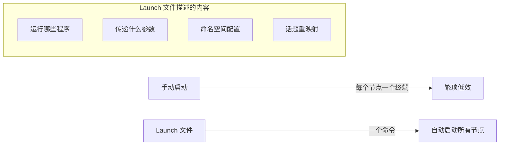

# ROS 2 Launch 系统完全指南

> 本教程为系列第 04 篇，深入讲解 ROS 2 的 Launch 系统——从单节点手动启动到多节点自动化部署的**核心工具**。
>
> 掌握后，您将能够用一个命令启动整个机器人系统，并灵活配置节点参数、命名空间、话题重映射等。


## 1. 什么是 Launch 系统？

一个真实的 ROS 2 系统通常由**许多节点**组成，它们运行在不同的进程中，甚至分布在不同机器上。虽然可以手动逐个启动这些节点，但随着系统复杂度增加，打开多个终端、反复输入命令会变得非常繁琐。

**Launch 系统**就是为了解决这个问题而设计的——它帮助用户**描述系统的配置**，然后**按照描述自动执行**，用一个命令启动整个系统。



### 1.1 核心特征

| 特征 | 说明 |
|------|------|
| **一键启动** | 一个 `ros2 launch` 命令启动整个系统 |
| **多格式支持** | 支持 Python、XML、YAML 三种格式 |
| **进程监控** | 监控启动的进程状态，并报告或响应状态变化 |
| **参数配置** | 在启动时为节点设置参数 |
| **命名空间隔离** | 轻松为不同节点组设置命名空间 |
| **话题重映射** | 在启动时重映射话题名称 |
| **条件执行** | 根据条件决定是否启动某些节点 |

### 1.2 适用场景

- **系统集成**：将多个节点打包成一个完整的机器人系统
- **多机器人**：同时启动多个机器人实例，各自拥有独立的命名空间
- **参数化启动**：根据不同的启动参数（如仿真模式 vs 真实模式）启动不同配置
- **测试与调试**：快速启动测试环境，重复运行相同配置


## 2. Launch 文件格式：Python vs XML vs YAML

ROS 2 的 launch 文件可以用 **Python、XML 和 YAML** 三种格式编写。它们**功能上等价**，你可以根据喜好和场景选择。

| 格式 | 优点 | 适用场景 |
|------|------|----------|
| **Python** | 最灵活，支持编程逻辑（循环、条件、函数） | 复杂动态配置、需要编程逻辑的场景 |
| **XML** | 结构清晰，ROS 1 用户熟悉 | 简单静态配置、从 ROS 1 迁移 |
| **YAML** | 简洁易读，适合配置密集型场景 | 参数较多的配置文件 |

> [!TIP]
> 对于**典型用例**，XML 和 YAML 应优先于 Python。但如果 launch 文件需要 XML 或 YAML 无法实现的**灵活性**，则使用 Python。

下面我们用三种格式实现**同一个任务**：启动两个 turtlesim 节点。


## 3. Python 格式 Launch 文件

### 3.1 基本结构

Python launch 文件的核心是一个名为 `generate_launch_description()` 的函数，它返回一个 `LaunchDescription` 对象：

```python
from launch import LaunchDescription
from launch_ros.actions import Node

def generate_launch_description():
    return LaunchDescription([
        # 在这里添加节点、动作等
    ])
```

### 3.2 启动多个节点

```python title="turtlesim_mimic_launch.py"
from launch import LaunchDescription
from launch_ros.actions import Node

def generate_launch_description():
    return LaunchDescription([
        Node(
            package='turtlesim',
            executable='turtlesim_node',
            name='sim',
            namespace='turtlesim1',
            output='screen'
        ),
        Node(
            package='turtlesim',
            executable='turtlesim_node',
            name='sim',
            namespace='turtlesim2',
            output='screen'
        ),
    ])
```

> 这个 launch 文件会**同时启动两个 turtlesim 节点**，分别运行在 `turtlesim1` 和 `turtlesim2` 命名空间下。

### 3.3 添加 Launch 参数（Arguments）

使用 `DeclareLaunchArgument` 声明可从命令行传入的参数：

```python
from launch import LaunchDescription
from launch.actions import DeclareLaunchArgument
from launch.substitutions import LaunchConfiguration, TextSubstitution
from launch_ros.actions import Node

def generate_launch_description():
    return LaunchDescription([
        # 声明命令行参数
        DeclareLaunchArgument(
            'background_r',
            default_value=TextSubstitution(text='0')
        ),
        DeclareLaunchArgument(
            'background_g',
            default_value=TextSubstitution(text='255')
        ),
        DeclareLaunchArgument(
            'background_b',
            default_value=TextSubstitution(text='0')
        ),
        
        # 使用参数
        Node(
            package='turtlesim',
            executable='turtlesim_node',
            name='sim',
            namespace='turtlesim1',
            parameters=[{
                'background_r': LaunchConfiguration('background_r'),
                'background_g': LaunchConfiguration('background_g'),
                'background_b': LaunchConfiguration('background_b'),
            }]
        ),
    ])
```

### 3.4 话题重映射（Remapping）

```python
Node(
    package='turtlesim',
    executable='mimic',
    name='mimic',
    remappings=[
        ('/input/pose', '/turtlesim1/turtle1/pose'),
        ('/output/cmd_vel', '/turtlesim2/turtle1/cmd_vel'),
    ]
)
```

### 3.5 包含其他 Launch 文件（Include）

使用 `IncludeLaunchDescription` 可以在一个 launch 文件中包含另一个 launch 文件：

```python
import os
from ament_index_python import get_package_share_directory
from launch import LaunchDescription
from launch.actions import IncludeLaunchDescription
from launch.launch_description_sources import PythonLaunchDescriptionSource

def generate_launch_description():
    return LaunchDescription([
        IncludeLaunchDescription(
            PythonLaunchDescriptionSource(
                os.path.join(
                    get_package_share_directory('demo_nodes_cpp'),
                    'launch/topics/talker_listener_launch.py'
                )
            )
        ),
    ])
```

### 3.6 带命名空间的包含（GroupAction）

使用 `GroupAction` 和 `PushRosNamespace` 可以为被包含的 launch 文件中的所有节点设置命名空间：

```python
from launch.actions import GroupAction
from launch_ros.actions import PushRosNamespace

def generate_launch_description():
    return LaunchDescription([
        GroupAction(
            actions=[
                PushRosNamespace('chatter_py_ns'),
                IncludeLaunchDescription(
                    PythonLaunchDescriptionSource(
                        os.path.join(
                            get_package_share_directory('demo_nodes_cpp'),
                            'launch/topics/talker_listener_launch.py'
                        )
                    )
                ),
            ]
        ),
    ])
```


## 4. XML 格式 Launch 文件

### 4.1 基本结构

XML launch 文件的根元素是 `<launch>`：

```xml title="turtlesim_mimic_launch.xml"
<?xml version="1.0" encoding="UTF-8"?>
<launch>
    <!-- 节点定义 -->
</launch>
```

### 4.2 启动多个节点

```xml
<?xml version="1.0" encoding="UTF-8"?>
<launch>
    <node pkg="turtlesim" exec="turtlesim_node" name="sim" namespace="turtlesim1" output="screen"/>
    <node pkg="turtlesim" exec="turtlesim_node" name="sim" namespace="turtlesim2" output="screen"/>
</launch>
```

### 4.3 声明参数（Arguments）

```xml
<launch>
    <!-- 声明命令行参数 -->
    <arg name="background_r" default="0"/>
    <arg name="background_g" default="255"/>
    <arg name="background_b" default="0"/>
    
    <!-- 使用参数 -->
    <node pkg="turtlesim" exec="turtlesim_node" name="sim" namespace="turtlesim1">
        <param name="background_r" value="$(var background_r)"/>
        <param name="background_g" value="$(var background_g)"/>
        <param name="background_b" value="$(var background_b)"/>
    </node>
</launch>
```

### 4.4 话题重映射

```xml
<node pkg="turtlesim" exec="mimic" name="mimic">
    <remap from="/input/pose" to="/turtlesim1/turtle1/pose"/>
    <remap from="/output/cmd_vel" to="/turtlesim2/turtle1/cmd_vel"/>
</node>
```

### 4.5 包含其他 Launch 文件

使用 `<include>` 标签包含另一个 launch 文件：

```xml
<launch>
    <!-- 包含另一个 launch 文件 -->
    <include file="$(find-pkg-share demo_nodes_cpp)/launch/topics/talker_listener.launch.py"/>
    
    <!-- 在命名空间中包含 -->
    <group>
        <push_ros_namespace namespace="my/chatter/ns"/>
        <include file="$(find-pkg-share demo_nodes_cpp)/launch/topics/talker_listener.launch.py"/>
    </group>
</launch>
```

> [!WARNING]
> 在 ROS 2 中，`<include>` 标签的参数**不会隐式传递**给被包含的 launch 文件。如果需要传递参数，需要显式声明。


## 5. YAML 格式 Launch 文件

### 5.1 基本结构

YAML launch 文件的根键是 `launch`：

```yaml title="turtlesim_mimic_launch.yaml"
%YAML 1.2
launch:
    # 节点定义
```

### 5.2 启动多个节点

```yaml
%YAML 1.2
launch:
    - node:
        pkg: "turtlesim"
        exec: "turtlesim_node"
        name: "sim"
        namespace: "turtlesim1"
        output: "screen"
    - node:
        pkg: "turtlesim"
        exec: "turtlesim_node"
        name: "sim"
        namespace: "turtlesim2"
        output: "screen"
```

### 5.3 声明参数

```yaml
%YAML 1.2
launch:
    - arg:
        name: "background_r"
        default: "0"
    - arg:
        name: "background_g"
        default: "255"
    - arg:
        name: "background_b"
        default: "0"
    - node:
        pkg: "turtlesim"
        exec: "turtlesim_node"
        name: "sim"
        namespace: "turtlesim1"
        param:
            - name: "background_r"
              value: "$(var background_r)"
            - name: "background_g"
              value: "$(var background_g)"
            - name: "background_b"
              value: "$(var background_b)"
```

### 5.4 包含其他 Launch 文件

```yaml
%YAML 1.2
launch:
    - include:
        file: "$(find-pkg-share demo_nodes_cpp)/launch/topics/talker_listener.launch.py"
    - group:
        - push_ros_namespace:
            namespace: "my/chatter/ns"
        - include:
            file: "$(find-pkg-share demo_nodes_cpp)/launch/topics/talker_listener.launch.py"
```


## 6. 命令行工具

### 6.1 基本命令

| 命令 | 说明 |
|------|------|
| `ros2 launch <package> <launch_file>` | 运行 launch 文件 |
| `ros2 launch <package> <launch_file> arg:=value` | 带参数运行 |

### 6.2 运行 Launch 文件

```bash
# 运行 Python launch 文件
ros2 launch turtlesim multisim.launch.py

# 运行 XML launch 文件
ros2 launch my_package my_launch.xml

# 运行 YAML launch 文件
ros2 launch my_package my_launch.yaml
```

### 6.3 传递参数

```bash
# 传递命令行参数
ros2 launch my_package my_launch.py background_r:=128 background_g:=128 background_b:=128

# 查看可用参数
ros2 launch my_package my_launch.py --show-args
```

### 6.4 常用选项

```bash
# 不运行节点，只打印会执行的操作（调试用）
ros2 launch my_package my_launch.py --dry-run

# 指定日志级别
ros2 launch my_package my_launch.py --log-level debug
```


## 7. 高级功能

### 7.1 条件执行（Conditional Execution）

在 Python launch 文件中，可以使用条件逻辑决定是否启动某些节点：

```python
from launch.conditions import IfCondition, UnlessCondition
from launch.substitutions import LaunchConfiguration

def generate_launch_description():
    return LaunchDescription([
        DeclareLaunchArgument(
            'enable_rviz',
            default_value='true',
            description='Enable RViz visualization'
        ),
        
        Node(
            package='rviz2',
            executable='rviz2',
            name='rviz2',
            condition=IfCondition(LaunchConfiguration('enable_rviz'))
        ),
        
        Node(
            package='my_package',
            executable='fallback_node',
            name='fallback',
            condition=UnlessCondition(LaunchConfiguration('enable_rviz'))
        ),
    ])
```

### 7.2 事件处理（Event Handlers）

Launch 系统支持事件处理，可以监控进程状态并动态响应：

```python
from launch.actions import RegisterEventHandler
from launch.event_handlers import OnProcessStart, OnProcessExit

def generate_launch_description():
    return LaunchDescription([
        Node(
            package='my_package',
            executable='main_node',
            name='main_node'
        ),
        
        RegisterEventHandler(
            OnProcessStart(
                target_action='main_node',
                on_start=[
                    # main_node 启动后执行的操作
                    Node(
                        package='my_package',
                        executable='monitor_node',
                        name='monitor'
                    )
                ]
            )
        ),
        
        RegisterEventHandler(
            OnProcessExit(
                target_action='main_node',
                on_exit=[
                    # main_node 退出时执行的操作
                    # 例如：关闭其他节点
                ]
            )
        ),
    ])
```

### 7.3 替换（Substitutions）

ROS 2 launch 提供了强大的替换机制，用于在运行时动态获取值：

| 替换类型 | 说明 | 示例 |
|----------|------|------|
| `LaunchConfiguration` | 获取 launch 参数值 | `LaunchConfiguration('background_r')` |
| `TextSubstitution` | 文本字符串 | `TextSubstitution(text='0')` |
| `PythonExpression` | Python 表达式 | `PythonExpression(['2 + 2'])` |
| `EnvironmentVariable` | 环境变量 | `EnvironmentVariable('USER')` |
| `FindExecutable` | 查找可执行文件路径 | `FindExecutable('rviz2')` |


## 8. 最佳实践

### 8.1 文件组织

1. **创建 `launch` 目录**：在功能包根目录下创建 `launch` 目录存放 launch 文件
2. **命名规范**：使用描述性名称，如 `bringup.launch.py`、`navigation.launch.xml`
3. **格式选择**：
   - 简单静态配置 → XML 或 YAML
   - 复杂动态配置 → Python
   - 从 ROS 1 迁移 → XML

### 8.2 参数设计

1. **为关键参数提供默认值**：方便快速启动
2. **使用有意义的参数名**：如 `use_sim_time`、`enable_rviz`
3. **添加参数描述**：帮助用户理解参数用途

### 8.3 可维护性

1. **模块化**：将大型 launch 文件拆分为多个小文件，用 `<include>` 组合
2. **复用**：将通用配置提取为独立的 launch 文件
3. **注释**：在 launch 文件中添加注释说明

### 8.4 调试技巧

1. **使用 `--dry-run`**：查看会执行哪些操作而不实际运行
2. **检查日志**：使用 `--log-level debug` 查看详细日志
3. **使用 `rqt_graph`**：可视化检查节点连接关系


## 9. 常见问题

??? question "Launch 文件找不到？"
    确保：
    
    - launch 文件位于功能包的 `launch/` 目录下
    - 功能包已编译（`colcon build`）
    - 已 source 工作空间（`source install/setup.bash`）

??? question "参数传递不生效？"
    检查：

    - 参数名是否正确（大小写敏感）
    - 在 XML 中使用 `$(var arg_name)` 引用参数
    - 在 Python 中使用 `LaunchConfiguration('arg_name')` 引用参数
    - 不同格式的 launch 文件之间参数传递可能需要显式声明

??? question "节点启动顺序问题？"
    使用事件处理器（`OnProcessStart`）可以控制节点启动顺序。

??? question "如何调试 Launch 文件？"
    ```bash
    # 查看会执行什么
    ros2 launch my_package my_launch.py --dry-run
    
    # 启用详细日志
    ros2 launch my_package my_launch.py --log-level debug
    ```


## 10. 小结

本文全面介绍了 ROS 2 的 Launch 系统：

- ✅ Launch 系统用于**用一个命令启动整个 ROS 2 系统**
- ✅ 支持 **Python、XML、YAML** 三种格式
- ✅ Python 格式**最灵活**，适合复杂动态配置
- ✅ XML 格式**结构清晰**，适合从 ROS 1 迁移
- ✅ YAML 格式**简洁易读**，适合配置密集型场景
- ✅ 支持**参数传递、命名空间、话题重映射、条件执行**等高级功能
- ✅ 提供 **`--dry-run`** 和详细日志等调试工具

Launch 系统是将多个 ROS 2 节点**集成**为完整机器人系统的关键工具。掌握它，您就能高效地管理和部署复杂的机器人应用。


## 11. 参考资源

- [ROS 2 Launch 官方概念文档](https://docs.ros.org/en/ros2_documentation/rolling/Concepts/Basic/About-Launch.html)
- [Launching Multiple Nodes 教程](https://docs.ros.org/en/ros2_documentation/rolling/Tutorials/Beginner-CLI-Tools/Launching-Multiple-Nodes/Launching-Multiple-Nodes.html)
- [Creating a Launch File 教程](https://docs.ros.org/en/ros2_documentation/eloquent/Tutorials/Launch-Files/Creating-Launch-Files.html)
- [Using Python, XML, and YAML for ROS 2 Launch Files](https://docs.ros.org/en/jazzy/How-To-Guides/Launch-file-different-formats.html)
- [Migrating Launch Files from ROS 1 to ROS 2](https://docs.ros.org/en/ros2_documentation/rolling/How-To-Guides/Migrating-launch-files.html)


---
## 👥 贡献者
本项目离不开每一位提交 PR、提 Issue、优化文档的开发者，由衷致谢！
<div style="display: flex; flex-wrap: wrap; gap: 30px; margin-top: 20px; margin-bottom: 20px;">
    <div style="text-align: center;">
        <a href="https://github.com/yxzhc">
            
        </a>
        <div style="margin-top: 8px; font-weight: 600;">
            <a href="https://github.com/yxzhc" style="text-decoration: none;">YXZHC</a>
        </div>
    </div>
    <div style="text-align: center;">
        <a href="https://github.com/hbrobot">
            
        </a>
        <div style="margin-top: 8px; font-weight: 600;">
            <a href="https://github.com/hbrobot" style="text-decoration: none;">HBRobot</a>
        </div>
    </div>
</div>
---
🤝 **欢迎参与共建：**

[:fontawesome-brands-github: 提交 Issue](https://github.com/hbrobot/hbrobot.github.io/issues/new/choose){: .md-button }
[:octicons-git-pull-request-24: 提交 PR](https://github.com/hbrobot/hbrobot.github.io/compare){: .md-button .md-button--primary }

---