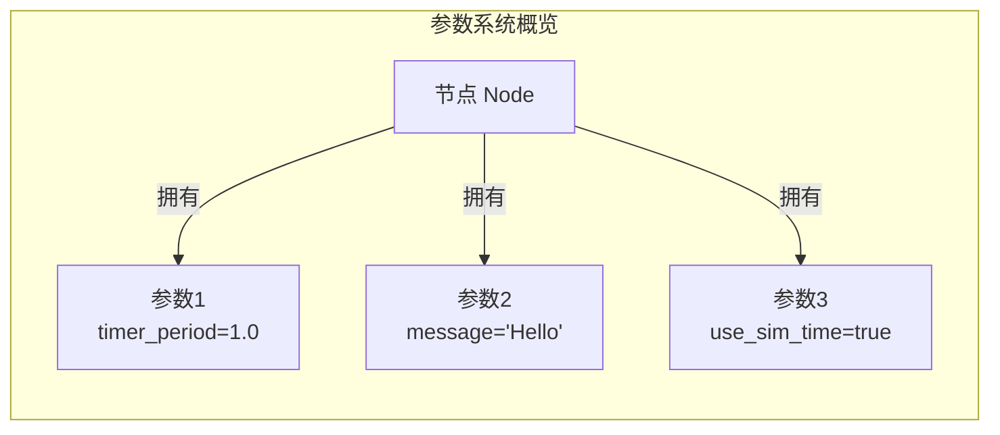
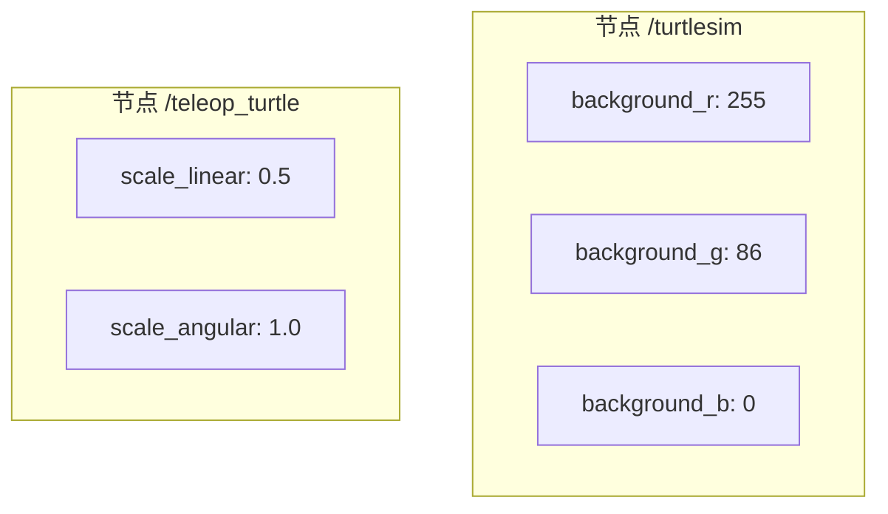
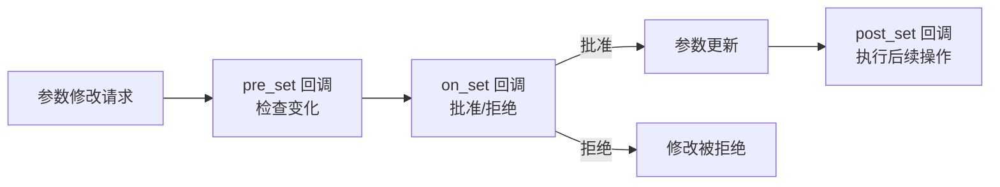

# ROS 2 参数系统完全指南

> 本教程为系列第 05 篇，深入讲解 ROS 2 的参数（Parameter）系统——从节点配置到运行时动态调整的**核心配置管理机制**。
>
> 掌握后，您将能够在不修改代码的情况下灵活配置节点行为，实现真正的**可复用、可调优**的机器人应用。


## 1. 什么是参数？

**参数（Parameter）** 是 ROS 2 中与**单个节点关联**的配置值，用于在**启动时（以及运行时）配置节点**，无需修改代码。

可以将参数理解为**节点的“设置项”** ——就像手机应用中的设置选项一样，您可以在不重写代码的情况下调整节点的行为。



### 1.1 核心特征

| 特征 | 说明 |
|------|------|
| **节点关联** | 每个参数属于**特定的节点**，参数的生命周期与节点绑定 |
| **动态配置** | 可在节点**启动时**和**运行时**读取和修改 |
| **无需重编译** | 修改参数**无需重新编译代码**，极大地提高了开发和调试效率 |
| **强类型** | 每个参数有固定的数据类型，类型不匹配时修改会失败 |
| **服务驱动** | 参数的读写通过 ROS 2 服务实现，`ros2 param` 命令行工具是这些服务的封装 |

### 1.2 适用场景

- **算法调优**：调整 PID 控制器的增益系数、滤波器截止频率等
- **行为配置**：设置机器人的最大速度、加速度限制
- **模式切换**：通过参数在“仿真模式”和“真实模式”之间切换
- **调试控制**：启用/禁用调试日志、可视化输出
- **多实例部署**：同一节点在不同命名空间下使用不同参数运行


## 2. 参数的工作原理

### 2.1 参数与节点的关系

在 ROS 2 中，**每个节点维护自己的参数集**。参数通过**节点名称、节点命名空间、参数名称和参数命名空间**来寻址。



> [!NOTE]
> 与 ROS 1 不同，ROS 2 的**参数与节点绑定**，而不是集中存储在参数服务器中。这使得系统更加健壮和去中心化。

### 2.2 参数声明（Declaration）

**默认情况下，节点需要在其生命周期内声明它将要接受的所有参数**。这样做的好处是：

- 在节点启动时明确定义参数的**类型和名称**
- 减少后期**配置错误**的可能性
- 使节点的接口更加**清晰和可预测**

```python
# 声明参数及其默认值
self.declare_parameter('message', 'Hello')
self.declare_parameter('timer_period', 1.0)
```

> [!TIP]
> 对于某些无法预先知道所有参数的节点，可以在实例化时设置 `allow_undeclared_parameters=true`，允许获取和设置**未声明**的参数。

### 2.3 参数生命周期

- 参数的**生命周期与节点绑定**——节点销毁时参数也随之销毁
- 节点可以实现持久化机制，在重启后重新加载参数值


## 3. 参数数据类型

ROS 2 参数支持以下数据类型：

| 类型 | 说明 | YAML 示例 |
|------|------|-----------|
| `bool` | 布尔值 | `true` / `false` |
| `int64` | 64 位整数 | `42` |
| `float64` | 64 位浮点数 | `3.14159` |
| `string` | 字符串 | `"Hello ROS 2"` |
| `byte[]` | 字节数组 | `[0x01, 0x02]` |
| `bool[]` | 布尔数组 | `[true, false, true]` |
| `int64[]` | 整数数组 | `[1, 2, 3, 4]` |
| `float64[]` | 浮点数数组 | `[0.1, 0.2, 0.3]` |
| `string[]` | 字符串数组 | `["lidar", "camera", "imu"]` |

> [!CAUTION]
> ROS 2 参数**不支持异构列表**（即列表中包含不同类型元素）。任何包含多种类型的 YAML 列表都将被解释为字符串。

### 3.1 参数描述符（Parameter Descriptor）

每个参数除了键和值之外，还可以包含**描述符（Descriptor）** ，用于提供：

- **参数描述**：说明参数的用途
- **取值范围**：定义参数的有效范围
- **类型信息**：额外的类型约束
- **动态类型**：允许参数在运行时改变类型

```cpp
// C++ 中使用参数描述符
rcl_interfaces::msg::ParameterDescriptor descriptor;
descriptor.description = "Background red channel value (0-255)";
descriptor.integer_range = {{
    .from_value = 0,
    .to_value = 255,
    .step = 1
}};
node->declare_parameter("background_r", 255, descriptor);
```


## 4. YAML 参数文件

YAML 是 ROS 2 中编写参数文件的标准格式。

### 4.1 ROS 1 vs ROS 2 参数文件

**ROS 1 参数文件**（全局参数，无节点区分）：
```yaml
lidar_name: foo
lidar_id: 10
ports: [11312, 11311, 21311]
debug: true
```

**ROS 2 参数文件**（参数与节点绑定）：
```yaml
/lidar_ns:
  lidar_node_name:
    ros__parameters:
      lidar_name: foo
      id: 10
imu:
  ros__parameters:
    ports: [2438, 2439, 2440]
/**:
  ros__parameters:
    debug: true
```

### 4.2 ROS 2 参数文件的关键语法

- 使用 **节点名称** 来寻址参数
- 使用 **`ros__parameters`** 键来标识参数部分的开始
- 支持 **通配符 `/**`** 表示匹配所有节点

### 4.3 完整参数文件示例

```yaml title="config/my_robot_params.yaml"
/turtlesim:
  ros__parameters:
    background_r: 255
    background_g: 86
    background_b: 0
    use_sim_time: false

/teleop_turtle:
  ros__parameters:
    scale_linear: 0.5
    scale_angular: 1.0
    use_sim_time: false

/**:
  ros__parameters:
    use_sim_time: false
    qos_overrides:
      /parameter_events:
        publisher:
          depth: 1000
          durability: volatile
          history: keep_last
          reliability: reliable
```

### 4.4 从命令行加载参数文件

```bash
# 启动节点时加载参数文件
ros2 run turtlesim turtlesim_node --ros-args --params-file config/turtlesim_params.yaml
```


## 5. 命令行工具

ROS 2 提供了 `ros2 param` 命令行工具来操作参数。

### 5.1 基本命令

| 命令 | 说明 |
|------|------|
| `ros2 param list` | 列出节点上的所有参数 |
| `ros2 param get <node> <param>` | 获取参数值 |
| `ros2 param set <node> <param> <value>` | 设置参数值 |
| `ros2 param delete <node> <param>` | 删除参数（仅限动态参数） |
| `ros2 param describe <node> <param>` | 查看参数描述 |
| `ros2 param dump <node>` | 导出节点所有参数到文件 |
| `ros2 param load <node> <file>` | 从文件加载参数 |

### 5.2 实战示例：turtlesim 参数

启动 turtlesim：

```bash
# 终端 1
ros2 run turtlesim turtlesim_node

# 终端 2
ros2 run turtlesim turtle_teleop_key
```

**列出所有参数**：

```bash
ros2 param list
```

输出：
```
/teleop_turtle:
  scale_angular
  scale_linear
  use_sim_time
/turtlesim:
  background_b
  background_g
  background_r
  use_sim_time
```

**获取参数值**：

```bash
ros2 param get /turtlesim background_r
```

输出：
```
Integer value is: 255
```

**设置参数值**——将背景色改为绿色：

```bash
ros2 param set /turtlesim background_r 0
ros2 param set /turnsim background_g 255
ros2 param set /turtlesim background_b 0
```

> [!WARNING]
> 设置参数时，**新值的类型必须与现有类型相同**。例如，不能将字符串 `"off"` 设置为布尔参数。

**YAML 类型陷阱**：

```bash
# 错误：YAML 将 "off" 解释为布尔值
ros2 param set /my_node my_string off

# 正确：显式指定为字符串
ros2 param set /my_node my_string '!!str off'
```

**导出参数到文件**：

```bash
ros2 param dump /turtlesim > turtlesim_params.yaml
```

**加载参数文件**：

```bash
ros2 param load /turtlesim turtlesim_params.yaml
```

### 5.3 一次性设置多个参数

```bash
# 启动时设置多个参数
ros2 run turtlesim turtlesim_node --ros-args -p background_r:=0 -p background_g:=255 -p background_b:=0
```


## 6. 编程实践

### 6.1 Python 示例（rclpy）

#### 创建包

```bash
ros2 pkg create --build-type ament_python python_parameters --dependencies rclpy
```

#### 声明和读取参数

```python title="python_parameters/python_parameters/publisher_with_params.py"
import rclpy
from rclpy.node import Node
from example_interfaces.msg import String

class PublisherWithParams(Node):
    def __init__(self):
        super().__init__('publisher_with_params')
        
        # 声明参数及其默认值
        self.declare_parameter('message', 'Hello')
        self.declare_parameter('timer_period', 1.0)
        
        # 读取参数值
        self._message = self.get_parameter('message').value
        self._timer_period = self.get_parameter('timer_period').value
        
        # 创建发布者
        self._publisher = self.create_publisher(String, 'my_topic', 10)
        self._timer = self.create_timer(self._timer_period, self._timer_callback)
        
    def _timer_callback(self):
        msg = String()
        msg.data = self._message
        self._publisher.publish(msg)
        self.get_logger().info(f'Publishing: {msg.data}')

def main(args=None):
    rclpy.init(args=args)
    node = PublisherWithParams()
    rclpy.spin(node)
    node.destroy_node()
    rclpy.shutdown()

if __name__ == '__main__':
    main()
```

#### 设置参数回调

```python
from rclpy.parameter import Parameter

class ParamCallbackNode(Node):
    def __init__(self):
        super().__init__('param_callback_node')
        
        self.declare_parameter('my_param', 1.0)
        
        # 注册参数设置回调
        self.add_on_set_parameters_callback(self.parameters_callback)
    
    def parameters_callback(self, params):
        for param in params:
            if param.name == 'my_param' and param.type_ == Parameter.Type.DOUBLE:
                if param.value < 0:
                    # 拒绝负值
                    return rclpy.parameter.SetParametersResult(successful=False, 
                        reason="my_param must be positive")
                # 更新节点行为
                self.get_logger().info(f'my_param updated to {param.value}')
        return rclpy.parameter.SetParametersResult(successful=True)
```

### 6.2 C++ 示例（rclcpp）

#### 创建包

```bash
ros2 pkg create --build-type ament_cmake cpp_parameters --dependencies rclcpp
```

#### 声明和读取参数

```cpp title="cpp_parameters/src/publisher_with_params.cpp"
#include <chrono>
#include <memory>
#include <string>

#include "rclcpp/rclcpp.hpp"
#include "std_msgs/msg/string.hpp"

using namespace std::chrono_literals;

class PublisherWithParams : public rclcpp::Node
{
public:
    PublisherWithParams() : Node("publisher_with_params")
    {
        // 声明参数及其默认值
        this->declare_parameter<std::string>("message", "Hello");
        this->declare_parameter<double>("timer_period", 1.0);
        
        // 读取参数值
        this->get_parameter("message", message_);
        this->get_parameter("timer_period", timer_period_);
        
        // 创建发布者
        publisher_ = this->create_publisher<std_msgs::msg::String>("my_topic", 10);
        timer_ = this->create_wall_timer(
            std::chrono::duration<double>(timer_period_),
            std::bind(&PublisherWithParams::timer_callback, this)
        );
    }

private:
    void timer_callback()
    {
        auto msg = std_msgs::msg::String();
        msg.data = message_;
        publisher_->publish(msg);
        RCLCPP_INFO(this->get_logger(), "Publishing: '%s'", msg.data.c_str());
    }
    
    std::string message_;
    double timer_period_;
    rclcpp::Publisher<std_msgs::msg::String>::SharedPtr publisher_;
    rclcpp::TimerBase::SharedPtr timer_;
};

int main(int argc, char* argv[])
{
    rclcpp::init(argc, argv);
    auto node = std::make_shared<PublisherWithParams>();
    rclcpp::spin(node);
    rclcpp::shutdown();
    return 0;
}
```

#### 设置参数回调

```cpp
#include "rclcpp/rclcpp.hpp"
#include "rcl_interfaces/msg/set_parameters_result.hpp"

class ParamCallbackNode : public rclcpp::Node
{
public:
    ParamCallbackNode() : Node("param_callback_node")
    {
        this->declare_parameter<double>("my_param", 1.0);
        
        // 注册参数设置回调
        callback_handle_ = this->add_on_set_parameters_callback(
            std::bind(&ParamCallbackNode::parameters_callback, this, std::placeholders::_1)
        );
    }

private:
    rcl_interfaces::msg::SetParametersResult parameters_callback(
        const std::vector<rclcpp::Parameter>& params)
    {
        rcl_interfaces::msg::SetParametersResult result;
        result.successful = true;
        
        for (const auto& param : params) {
            if (param.get_name() == "my_param") {
                if (param.get_type() == rclcpp::ParameterType::PARAMETER_DOUBLE) {
                    double value = param.as_double();
                    if (value < 0) {
                        result.successful = false;
                        result.reason = "my_param must be positive";
                        return result;
                    }
                    RCLCPP_INFO(this->get_logger(), "my_param updated to %f", value);
                }
            }
        }
        return result;
    }
    
    rclcpp::node_interfaces::OnSetParametersCallbackHandle::SharedPtr callback_handle_;
};
```

### 6.3 参数描述符（C++）

```cpp
#include "rcl_interfaces/msg/parameter_descriptor.hpp"

// 创建参数描述符
rcl_interfaces::msg::ParameterDescriptor descriptor;
descriptor.description = "Background red channel value (0-255)";
rcl_interfaces::msg::IntegerRange range;
range.from_value = 0;
range.to_value = 255;
range.step = 1;
descriptor.integer_range.push_back(range);

// 使用描述符声明参数
this->declare_parameter("background_r", 255, descriptor);
```

### 6.4 获取所有参数

**Python**：

```python
# 获取所有参数
all_params = node.get_parameters(node.list_parameters())
for param in all_params:
    print(f"{param.name}: {param.value}")
```

**C++**：

```cpp
// 获取所有参数
auto param_names = this->list_parameters({}, rclcpp::ParameterDepth::ALL);
auto all_params = this->get_parameters(param_names.names);
for (const auto& param : all_params) {
    RCLCPP_INFO(this->get_logger(), "%s: %s", 
                param.get_name().c_str(), param.value_to_string().c_str());
}
```


## 7. 在 Launch 文件中设置参数

### 7.1 Python Launch 文件

```python title="launch/my_launch.py"
from launch import LaunchDescription
from launch_ros.actions import Node

def generate_launch_description():
    return LaunchDescription([
        Node(
            package='turtlesim',
            executable='turtlesim_node',
            name='sim',
            namespace='turtlesim1',
            parameters=[{
                'background_r': 0,
                'background_g': 255,
                'background_b': 0,
            }]
        ),
        Node(
            package='my_package',
            executable='my_node',
            name='my_node',
            parameters=[
                {'message': 'Hello from launch'},
                {'timer_period': 0.5},
                {'use_sim_time': True}
            ]
        ),
    ])
```

### 7.2 从 YAML 文件加载参数

```python
import os
from ament_index_python import get_package_share_directory

def generate_launch_description():
    config_file = os.path.join(
        get_package_share_directory('my_package'),
        'config',
        'my_params.yaml'
    )
    
    return LaunchDescription([
        Node(
            package='my_package',
            executable='my_node',
            name='my_node',
            parameters=[config_file]
        ),
    ])
```

### 7.3 XML Launch 文件

```xml
<launch>
    <node pkg="turtlesim" exec="turtlesim_node" name="sim">
        <param name="background_r" value="0"/>
        <param name="background_g" value="255"/>
        <param name="background_b" value="0"/>
    </node>
    
    <node pkg="my_package" exec="my_node" name="my_node">
        <param from="$(find-pkg-share my_package)/config/my_params.yaml"/>
    </node>
</launch>
```


## 8. 参数回调的三种类型

ROS 2 节点可以注册**三种不同类型的回调**来响应参数变化：

| 回调类型 | 说明 |
|----------|------|
| **`on_set_parameters_callback`** | 在参数**即将被修改时**触发，可以**批准或拒绝**更改 |
| **`post_set_parameters_callback`** | 在参数**已被修改后**触发，用于执行后续操作 |
| **`pre_set_parameters_callback`** | 在参数修改**之前**触发，用于**检查**即将发生的变化 |



> [!TIP]
> `on_set_parameters_callback` 是**最常用**的回调类型。它允许您验证新参数值并在需要时拒绝更改。**不应该在回调中修改节点状态**，而应该只在 `post_set` 回调中执行状态更新。


## 9. 最佳实践

### 9.1 参数设计

1. **总是声明参数**：在节点初始化时声明所有参数及其默认值
2. **提供合理的默认值**：让节点在没有外部配置时也能正常工作
3. **使用有意义的参数名**：如 `max_speed`、`publish_rate`，避免使用 `param1`、`param2`
4. **添加参数描述**：使用 `ParameterDescriptor` 为参数添加说明和取值范围

### 9.2 参数使用

1. **参数与节点绑定**：每个节点维护自己的参数，不要跨节点共享参数
2. **使用参数文件管理复杂配置**：对于有大量参数的节点，使用 YAML 文件管理
3. **运行时参数更新**：通过 `ros2 param set` 或参数回调实现运行时动态调整
4. **参数验证**：在 `on_set_parameters_callback` 中验证参数值的有效性

### 9.3 调试技巧

1. **使用 `ros2 param list` 查看可用参数**
2. **使用 `ros2 param get` 验证参数值**
3. **使用 `ros2 param dump` 导出当前配置作为参考**
4. **在 launch 文件中使用 `--log-level debug` 查看参数加载日志**


## 10. 常见问题

??? question "参数修改后没有生效？"
    检查：

    - 节点是否在参数修改后**重新读取**了参数值（参数不会自动同步到业务逻辑）
    - 是否注册了 `on_set_parameters_callback` 来处理参数变化
    - 参数修改是否被回调**拒绝**了

??? question "参数类型不匹配错误？"
    ROS 2 参数**类型是固定的**，修改时必须保持类型一致。例如，不能用字符串 `"off"` 修改布尔参数。

??? question "如何在多个节点间共享参数？"
    ROS 2 参数是**节点级别**的，不提供全局参数服务器。如需共享配置，可以：

    - 使用**相同的参数文件**启动多个节点
    - 使用通配符 `/**` 在参数文件中为所有节点设置相同参数
    - 创建一个专门的**配置节点**，其他节点通过服务查询配置

??? question "参数声明 vs 未声明参数？"

    - **声明参数**：节点显式声明参数及其类型，参数修改受类型保护
    - **未声明参数**：节点设置 `allow_undeclared_parameters=true`，允许任意参数
    - 建议**总是声明参数**，使节点接口更清晰

??? question "参数回调中修改参数导致死锁？"
    **不能在 `on_set_parameters_callback` 中调用 `set_parameter()`**，这会导致死锁。如需在参数变化时修改其他参数，应使用 `post_set_parameters_callback`。


## 11. 小结

本文全面介绍了 ROS 2 的参数系统：

- ✅ 参数是**与节点关联的配置值**，用于在启动时和运行时配置节点
- ✅ 支持 **bool、int64、float64、string 及数组**等数据类型
- ✅ 参数通过 **YAML 文件**管理，使用节点名称寻址
- ✅ 提供 **`ros2 param` 命令行工具**进行参数操作
- ✅ 支持 **C++ 和 Python** 两种主流开发语言
- ✅ 可通过 **`on_set_parameters_callback`** 验证和响应参数变化
- ✅ 可在 **Launch 文件**中通过 `parameters` 参数设置节点配置

参数系统是 ROS 2 中实现**灵活、可配置、可调优**的机器人应用的关键工具。掌握它，您就能高效地管理和调整节点行为。


## 12. 参考资源

- [ROS 2 参数概念文档](https://docs.ros.org/en/ros2_documentation/rolling/Concepts/Basic/About-Parameters.html)
- [Understanding parameters 教程](https://docs.ros.org/en/ros2_documentation/humble/Tutorials/Beginner-CLI-Tools/Understanding-ROS2-Parameters/Understanding-ROS2-Parameters.html)
- [Using the ros2 param command-line tool](https://docs.ros.org/en/rolling/How-To-Guides/Using-ros2-param.html)
- [Using parameters in a class (C++)](https://docs.ros.org/en/iron/Tutorials/Beginner-Client-Libraries/Using-Parameters-In-A-Class-CPP.html)
- [Using parameters in a class (Python)](https://docs.ros.org/en/iron/Tutorials/Beginner-Client-Libraries/Using-Parameters-In-A-Class-Python.html)
- [Migrating Parameters (ROS 1 → ROS 2)](https://docs.ros.org/en/ros2_documentation/rolling/How-To-Guides/Migrating-from-ROS1/Migrating-Parameters.html)


---
## 👥 贡献者
本项目离不开每一位提交 PR、提 Issue、优化文档的开发者，由衷致谢！
<div style="display: flex; flex-wrap: wrap; gap: 30px; margin-top: 20px; margin-bottom: 20px;">
    <div style="text-align: center;">
        <a href="https://github.com/yxzhc">
            
        </a>
        <div style="margin-top: 8px; font-weight: 600;">
            <a href="https://github.com/yxzhc" style="text-decoration: none;">YXZHC</a>
        </div>
    </div>
    <div style="text-align: center;">
        <a href="https://github.com/hbrobot">
            
        </a>
        <div style="margin-top: 8px; font-weight: 600;">
            <a href="https://github.com/hbrobot" style="text-decoration: none;">HBRobot</a>
        </div>
    </div>
</div>
---
🤝 **欢迎参与共建：**08-ros2-python-bridge.zh.md

[:fontawesome-brands-github: 提交 Issue](https://github.com/hbrobot/hbrobot.github.io/issues/new/choose){: .md-button }
[:octicons-git-pull-request-24: 提交 PR](https://github.com/hbrobot/hbrobot.github.io/compare){: .md-button .md-button--primary }

---