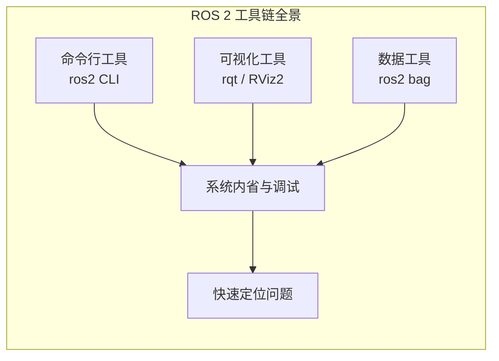
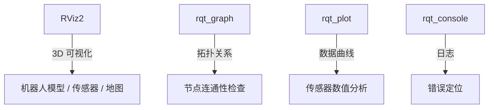

# ROS 2 工具链与调试完全指南

> 本教程为系列第 06 篇，系统讲解 ROS 2 的命令行工具、可视化工具和数据记录工具——**从终端调试到图形化分析的全套工具箱**。
>
> 掌握后，您将能够在**不修改任何代码**的情况下，完成系统内省、故障诊断、性能分析和数据回放等核心调试任务。


## 1. 为什么需要 ROS 2 工具链？

在 ROS 2 开发中，**工具链**是连接“代码编写”与“系统调试”的桥梁。一个真实的机器人系统可能包含数十个节点、数百个话题和复杂的通信拓扑。在没有工具链辅助的情况下，排查问题就像在黑暗中摸索。



ROS 2 工具链的核心价值在于：

| 价值 | 说明 |
|------|------|
| **零代码调试** | 无需编写或修改任何代码即可内省系统状态 |
| **快速验证** | 在编写代码之前测试通信模式和接口 |
| **问题复现** | 录制数据并在开发环境中回放，实现离线调试 |
| **可视化分析** | 将抽象的数据流和坐标变换直观呈现 |


## 2. 命令行工具（ros2 CLI）

`ros2` 是 ROS 2 命令行工具的**统一入口**，所有的子命令都通过它来调用。

### 2.1 基本用法

```bash
# 查看所有可用的子命令
ros2 --help

# 查看特定子命令的帮助
ros2 <command> --help
```

命令格式统一为：
```
ros2 <command> <verb> [options]
```

例如：`ros2 topic echo /chatter`

### 2.2 核心子命令速查

| 子命令 | 用途 | 常用动词 |
|--------|------|----------|
| `ros2 node` | 节点管理 | `list`、`info` |
| `ros2 topic` | 话题操作 | `list`、`echo`、`pub`、`info`、`hz`、`bw` |
| `ros2 service` | 服务操作 | `list`、`call`、`type`、`find` |
| `ros2 action` | 动作操作 | `list`、`info`、`send_goal` |
| `ros2 param` | 参数管理 | `list`、`get`、`set`、`dump`、`load` |
| `ros2 bag` | 数据录制与回放 | `record`、`play`、`info` |
| `ros2 doctor` | 系统健康检查 | （无动词，直接运行） |
| `ros2 run` | 运行节点 | `<package> <executable>` |
| `ros2 launch` | 运行 Launch 文件 | `<package> <launch_file>` |

> [!TIP]
> `ros2` 命令支持 **Tab 自动补全**，输入部分命令后按 Tab 键即可看到可用的子命令和参数。

### 2.3 节点内省（ros2 node）

```bash
# 列出所有运行中的节点
ros2 node list

# 查看节点的详细信息（发布/订阅的话题、提供的服务等）
ros2 node info /turtlesim
```

`ros2 node info` 会输出节点发布的 topics、订阅的 topics、提供的 services 以及参数列表。

### 2.4 话题内省（ros2 topic）

```bash
# 列出所有活跃话题
ros2 topic list

# 查看话题的实时消息流
ros2 topic echo /turtle1/pose

# 查看话题的消息类型
ros2 topic type /turtle1/cmd_vel

# 手动发布消息到话题
ros2 topic pub --once /turtle1/cmd_vel geometry_msgs/msg/Twist \
    "{linear: {x: 2.0}, angular: {z: 1.8}}"

# 查看话题发布频率
ros2 topic hz /turtle1/pose

# 查看话题带宽
ros2 topic bw /turtle1/pose

# 查看话题详细信息（发布者/订阅者数量）
ros2 topic info /chatter
```

`ros2 topic pub` 支持 `--once`（发布一次）和 `--rate`（按频率持续发布）两种模式。

### 2.5 服务内省（ros2 service）

```bash
# 列出所有服务
ros2 service list

# 查看服务类型
ros2 service type /spawn

# 查找特定类型的所有服务
ros2 service find turtlesim/srv/Spawn

# 调用服务
ros2 service call /spawn turtlesim/srv/Spawn \
    "{x: 2, y: 2, theta: 0.2, name: 't2'}"
```

> [!CAUTION]
> 命令行调用服务时，**请求参数必须使用 YAML 语法**，注意引号和花括号的正确使用。

### 2.6 动作内省（ros2 action）

```bash
# 列出所有动作
ros2 action list

# 查看动作详细信息
ros2 action info /turtle1/rotate_absolute

# 发送动作目标（带反馈）
ros2 action send_goal /turtle1/rotate_absolute \
    turtlesim/action/RotateAbsolute "{theta: 1.57}" --feedback
```

### 2.7 参数管理（ros2 param）

```bash
# 列出节点的所有参数
ros2 param list

# 获取参数值
ros2 param get /turtlesim background_r

# 设置参数值
ros2 param set /turtlesim background_b 200

# 导出节点所有参数到 YAML 文件
ros2 param dump /turtlesim > turtle_params.yaml

# 从 YAML 文件加载参数
ros2 param load /turtlesim turtle_params.yaml
```

参数修改**实时生效**，无需重启节点。

### 2.8 运行节点与 Launch（ros2 run & ros2 launch）

```bash
# 运行单个节点
ros2 run turtlesim turtlesim_node

# 运行 launch 文件
ros2 launch my_package my_launch.py

# 带参数运行
ros2 run turtlesim turtlesim_node --ros-args -p background_r:=0

# 查看 launch 文件的可用参数
ros2 launch my_package my_launch.py --show-args
```


## 3. 可视化工具（rqt）

**rqt** 是基于 Qt 开发的 GUI 框架工具集，支持加载多种插件，实现节点关系查看、服务调用、参数配置、TF 树可视化等**一站式调试功能**。

### 3.1 安装与启动

```bash
# 安装 rqt（如未安装）
sudo apt install ros-$ROS_DISTRO-rqt

# 启动 rqt 主界面
rqt
```

启动后，通过菜单栏 **Plugins** → 选择需要的插件来添加功能。

### 3.2 核心插件一览

| 插件 | 功能 | 启动方式 |
|------|------|----------|
| **rqt_graph** | 节点-话题拓扑关系图 | `rqt_graph` 或 Plugins → Introspection → Node Graph |
| **rqt_plot** | 实时数据曲线绘图 | `rqt_plot` |
| **rqt_console** | 日志查看与过滤 | `rqt_console` |
| **rqt_tf_tree** | TF 坐标树可视化 | `rqt_tf_tree` |
| **rqt_parameters** | 参数查看与修改 | `rqt_parameters` |
| **rqt_image_view** | 图像话题实时显示 | `rqt_image_view` |
| **rqt_service_caller** | 服务调用图形界面 | Plugins → Services → Service Caller |
| **rqt_bag** | 图形化录包与回放 | `rqt_bag` |

### 3.3 rqt_graph——节点拓扑图

`rqt_graph` 是**最常用**的调试插件，图形化展示节点与话题的发布/订阅关系。

```bash
# 独立启动
rqt_graph

# 或在 rqt 中：Plugins → Introspection → Node Graph
```

**使用场景**：

- 排查节点是否**正常连通**
- 检查话题名称是否**匹配**
- 验证发布者与订阅者是否**建立连接**

> [!TIP]
> 点击左上角的 **Refresh** 按钮刷新视图。勾选 **Nodes only** 可隐藏话题节点，使视图更清晰。

### 3.4 rqt_plot——实时数据曲线

`rqt_plot` 将数值类话题数据绘制成**实时曲线**，适用于分析传感器数据变化趋势。

```bash
rqt_plot
```

**典型用途**：

- IMU 角度变化
- 里程计速度曲线
- 关节角度轨迹
- PID 控制器输出

### 3.5 rqt_console——日志查看器

`rqt_console` 集中显示所有节点的日志输出，支持按**日志等级**过滤。

```bash
rqt_console
```

**日志等级**：`DEBUG` < `INFO` < `WARN` < `ERROR` < `FATAL`

**功能**：

- 按等级过滤日志
- 高亮关键信息
- 保存日志到文件

### 3.6 rqt_tf_tree——TF 坐标树

`rqt_tf_tree` 以树形结构显示所有坐标帧之间的变换关系。

```bash
rqt_tf_tree
```

**使用场景**：

- 检查 TF 树是否**完整**
- 定位缺失的坐标变换
- 验证坐标帧之间的父子关系

### 3.7 rqt_parameters——参数图形化管理

`rqt_parameters` 提供图形化界面查看和修改节点参数，**无需记忆命令**。

```bash
rqt_parameters
```

### 3.8 rqt_image_view——图像实时显示

`rqt_image_view` 专门用于查看相机图像话题，**比 RViz2 启动更快、更轻量**。

```bash
rqt_image_view
```

在界面下拉菜单中选择图像话题（如 `/camera/image_raw`）即可实时显示。

### 3.9 清理 rqt 配置

如果插件加载异常，可以删除配置文件重置：

```bash
rm -rf ~/.config/ros.org/rqt_gui.ini
```


## 4. 3D 可视化工具（RViz2）

**RViz2** 是 ROS 2 的标准 3D 可视化工具，用于显示机器人模型、传感器数据、地图、导航路径等。

### 4.1 安装与启动

```bash
# 启动 RViz2
rviz2

# 带配置文件启动
rviz2 -d /path/to/config.rviz
```

### 4.2 核心显示类型

| 显示类型 | 用途 |
|----------|------|
| **RobotModel** | 显示 URDF 机器人模型 |
| **TF** | 显示坐标变换框架 |
| **LaserScan** | 显示激光雷达点云 |
| **PointCloud2** | 显示 3D 点云数据 |
| **Image** | 显示相机图像 |
| **Map** | 显示 occupancy grid 地图 |
| **Path** | 显示导航规划路径 |
| **Odometry** | 显示里程计轨迹 |
| **Grid** | 显示参考网格 |

### 4.3 TF 调试

RViz2 是调试 TF 坐标变换的**最佳工具**：

1. 启动 RViz2
2. 点击 **Add** → 选择 **TF** 显示
3. 勾选 **Show Names** 和 **Show Axes** 查看坐标帧名称和方向

> [!WARNING]
> 如果某个坐标帧显示为**灰色**，表示该帧没有可用的变换数据。

### 4.4 典型调试组合




## 5. 数据录制与回放（ros2 bag）

`ros2 bag` 是 ROS 2 的**数据录制与回放工具**，可以记录话题和服务上的数据，用于**离线调试、实验复现和结果分享**。

### 5.1 录制数据（ros2 bag record）

```bash
# 录制所有话题
ros2 bag record -a

# 录制指定话题
ros2 bag record /turtle1/cmd_vel /turtle1/pose

# 指定输出文件名
ros2 bag record -o my_bag /turtle1/cmd_vel

# 录制并包含服务数据
ros2 bag record --include-services /turtle1/cmd_vel
```

### 5.2 查看录制信息（ros2 bag info）

```bash
# 查看 bag 文件信息
ros2 bag info my_bag
```

输出包含：录制时长、话题列表、消息数量、存储格式等。

### 5.3 回放数据（ros2 bag play）

```bash
# 回放 bag 文件
ros2 bag play my_bag

# 以不同速度回放（0.5 = 半速，2.0 = 两倍速）
ros2 bag play my_bag --rate 0.5

# 循环回放
ros2 bag play my_bag --loop

# 回放指定话题
ros2 bag play my_bag --topics /turtle1/cmd_vel
```

### 5.4 实战示例：录制 turtlesim 操作

```bash
# 终端 1：启动 turtlesim
ros2 run turtlesim turtlesim_node

# 终端 2：启动键盘控制
ros2 run turtlesim turtle_teleop_key

# 终端 3：创建目录并录制
mkdir bag_files
cd bag_files
ros2 bag record /turtle1/cmd_vel /turtle1/pose

# 操作乌龟移动一段时间后按 Ctrl+C 停止录制

# 终端 4：停止 teleop，回放录制数据
ros2 bag play bag_files/my_bag
```

> [!TIP]
> 录制前停止 teleop 节点，回放时才能清晰地看到乌龟按照录制的轨迹运动。

### 5.5 QoS 兼容性注意事项

由于 ROS 2 引入了 **QoS（服务质量）** 策略，录制和回放时需注意 QoS 兼容性。如果回放时遇到 QoS 不匹配的问题，可以使用 QoS 覆盖参数。


## 6. 系统健康检查（ros2doctor）

`ros2doctor` 是 ROS 2 的**系统诊断工具**，类似于 ROS 1 中的 `roswtf`。它会检查 ROS 2 的各个方面（平台、版本、网络、环境、运行系统等），并**警告可能存在的错误和问题**。

### 6.1 基本用法

```bash
# 检查 ROS 2 环境
ros2 doctor

# 生成详细报告
ros2 doctor --report

# 检查正在运行的系统
# 先启动 turtlesim，再运行
ros2 doctor
```

### 6.2 理解输出

- **All `<n>` checks passed**：所有检查通过，系统状态良好
- **UserWarning**：配置不理想但**不影响使用**，需要用户判断重要性
- **ERROR**：系统缺少关键设置或功能，**必须解决**

### 6.3 典型警告示例

```
UserWarning: Distribution <distro> is not fully supported or tested.
```

表示当前使用的 ROS 2 发行版不是完全稳定版本。


## 7. TF2 工具

### 7.1 view_frames——生成 TF 树 PDF

`view_frames` 生成整个 TF 树的 **PDF 快照**，便于离线分析。

```bash
ros2 run tf2_tools view_frames
# 生成 frames.pdf
```

### 7.2 tf2_echo——查询坐标变换

```bash
# 查询从 base_link 到 laser 的坐标变换
ros2 run tf2_ros tf2_echo base_link laser
```


## 8. 调试工作流速查

| 调试目标 | 推荐工具 |
|----------|----------|
| 查看 3D 传感器 / 导航数据 | `rviz2` |
| 检查节点通信拓扑 | `rqt_graph` |
| 查看传感器数据曲线 | `rqt_plot` |
| 检查 TF 坐标变换 | `rqt_tf_tree` |
| 查看报错日志 | `rqt_console` |
| 查看相机图像 | `rqt_image_view` |
| 录制/回放数据 | `ros2 bag` / `rqt_bag` |
| 系统环境诊断 | `ros2 doctor` |
| 查看节点/话题/服务状态 | `ros2 node list`、`ros2 topic list`、`ros2 service list` |
| 实时查看话题消息 | `ros2 topic echo` |
| 手动发布测试消息 | `ros2 topic pub` |
| 动态修改参数 | `ros2 param set` |

> [!TIP]
> 日常开发调试的**标准组合**：`rviz2` + `rqt_graph` + `rqt_console`。这三个工具覆盖了大多数调试场景。


## 9. 常见问题

??? question "ros2 命令找不到？"
    确保已正确 source ROS 2 环境：
    ```bash
    source /opt/ros/humble/setup.bash
    ```

??? question "rqt 插件找不到？"
    安装对应插件包：
    ```bash
    sudo apt install ros-$ROS_DISTRO-rqt-tf-tree
    ```
    如果插件仍未显示，删除配置文件重启 rqt：
    ```bash
    rm -rf ~/.config/ros.org/rqt_gui.ini
    ```

??? question "ros2 bag 录制失败？"
    检查：
    
    - 话题名称是否正确
    - QoS 设置是否兼容
    - 磁盘空间是否充足

??? question "rviz2 中 TF 显示为灰色？"
    表示该坐标帧**没有可用的变换数据**。检查：

    - `tf2` 相关节点是否运行
    - `robot_state_publisher` 是否正常发布变换
    - `fixed frame` 设置是否正确

??? question "ros2 doctor 报告警告怎么办？"
    警告**不一定需要修复**，请根据实际情况判断。如果是 ERROR 级别，则需要解决。


## 10. 小结

本文全面介绍了 ROS 2 的工具链：

- ✅ **命令行工具（ros2 CLI）** ：节点、话题、服务、动作、参数、bag 的完整内省与操作
- ✅ **可视化工具（rqt）** ：`rqt_graph`、`rqt_plot`、`rqt_console`、`rqt_tf_tree` 等核心插件
- ✅ **3D 可视化（RViz2）** ：机器人模型、传感器数据、TF 坐标、导航路径的可视化
- ✅ **数据录制（ros2 bag）** ：录制与回放话题数据，实现离线调试
- ✅ **系统诊断（ros2doctor）** ：检查 ROS 2 环境和运行系统的健康状态
- ✅ **TF2 工具**：`view_frames` 和 `tf2_echo` 用于坐标变换调试

掌握这些工具，您就能在**不修改任何代码**的情况下完成大多数调试任务，极大地提升开发效率。


## 11. 参考资源

- [ROS 2 命令行工具官方文档](https://docs.ros.org/en/rolling/Tutorials/Beginner-CLI-Tools.html)
- [Recording and playing back data (ros2 bag)](https://docs.ros.org/en/jazzy/Tutorials/Beginner-CLI-Tools/Recording-And-Playing-Back-Data/Recording-And-Playing-Back-Data.html)
- [Using ros2doctor to identify issues](https://docs.ros.org/en/ros2_documentation/lyrical/Tutorials/Beginner-Client-Libraries/Getting-Started-With-Ros2doctor.html)
- [RViz2 用户指南](https://docs.ros.org/en/rolling/Tutorials/RViz/RViz-User-Guide.html)
- [rqt 插件文档](https://wiki.ros.org/rqt)
- [ROS 2 CLI Cheat Sheet](https://github.com/ros2/ros2cli)

