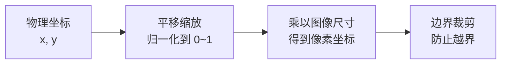
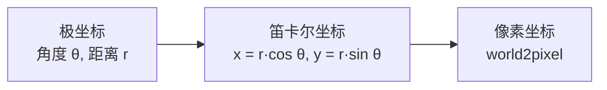
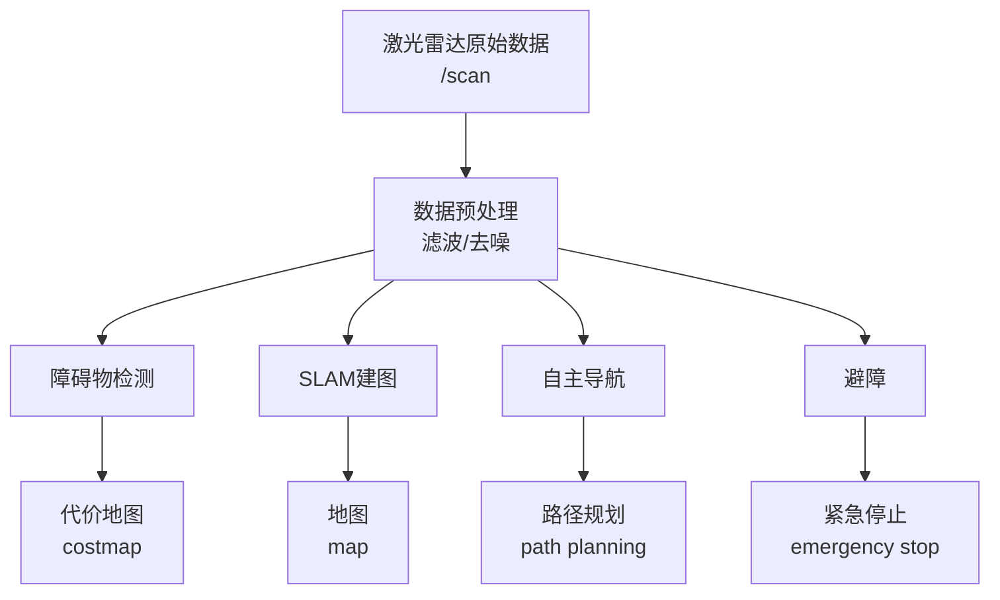

# 激光雷达数据处理与可视化

本教程将带你学习如何使用 ROS2 RCLPY 订阅激光雷达（LiDAR）发布的 `LaserScan` 数据，并通过 OpenCV 实现实时彩色可视化，直观展示周围环境的障碍物分布。

---

## 1. 课前准备

### 1.1 知识预备

在开始本教程之前，建议你先了解以下内容：

- ROS2 话题（Topic）通信的基本概念
- RCLPY 节点（Node）的创建与运行
- 激光雷达（LiDAR）的基本工作原理
- Python NumPy 数组操作基础

### 1.2 环境要求

| 项目 | 要求 |
|------|------|
| ROS2 发行版 | Humble 及以上 |
| Python 版本 | 3.10+ |
| 依赖包 | `opencv-python`, `numpy` |

### 1.3 启动激光雷达数据源

在运行本教程的代码之前，请确保你的机器人或仿真环境正在发布激光雷达数据话题：

```bash
# 检查激光雷达话题是否存在
ros2 topic list | grep scan
```

典型的话题名称为 `/scan`。你可以使用以下命令查看原始数据：

```bash
ros2 topic echo /scan --once
```

---

## 2. LaserScan 消息结构详解

在深入代码之前，先了解 `sensor_msgs/msg/LaserScan` 的消息结构至关重要。

```yaml
std_msgs/Header header           # 时间戳和坐标系
    uint32 seq                   # 序列号
    time stamp                   # 采集时间
    string frame_id              # 坐标系（如 laser_link）
float32 angle_min                # 扫描起始角度 [rad]
float32 angle_max                # 扫描终止角度 [rad]
float32 angle_increment          # 角度增量 [rad]
float32 time_increment           # 测量时间间隔 [秒]
float32 scan_time                # 扫描周期 [秒]
float32 range_min                # 最小有效距离 [m]
float32 range_max                # 最大有效距离 [m]
float32[] ranges                 # 距离数据 [m]
float32[] intensities            # 反射强度（可选）
```

### 2.1 关键字段说明

| 字段 | 说明 |
|------|------|
| `angle_min` / `angle_max` | 扫描的起始和终止角度，通常为 -π 到 π 或 0 到 2π |
| `angle_increment` | 相邻两个测量点之间的角度步长 |
| `range_min` / `range_max` | 传感器的有效测距范围，超出此范围的数据应丢弃 |
| `ranges` | 核心数据：浮点数数组，每个元素表示对应角度下的距离（米） |
| `intensities` | 可选数据：表示反射强度，若设备不支持则数组为空 |

??? tip "关于坐标系的约定"

    根据 ROS 标准，激光雷达的扫描角度是绕 Z 轴测量的（逆时针方向），零角度指向 X 轴正方向（即机器人前方）。坐标系 `frame_id` 通常为 `laser_link` 或 `base_scan`。

### 2.2 数据有效性规则

LaserScan 消息官方定义中明确规定：**`ranges` 数组中值小于 `range_min` 或大于 `range_max` 的应被丢弃**。此外：

- `NaN`（非数字）：表示无效测量
- `+Inf`（正无穷）：表示超出量程
- `-Inf`（负无穷）：表示距离太近无法测量

---

## 3. 代码详解

### 3.1 完整代码

以下是激光雷达数据订阅与 OpenCV 可视化节点的完整代码：

```python
import cv2
import numpy as np
import rclpy
from rclpy.node import Node
from sensor_msgs.msg import LaserScan


class LaserScanCVVisualizer(Node):
    def __init__(self):
        super().__init__('laserscan_cv_visualizer')
        
        # 初始化激光雷达订阅
        self.subscription = self.create_subscription(
            LaserScan,
            '/scan',
            self.scan_callback,
            10 
        )
        self.subscription
        self.get_logger().info('激光雷达OpenCV可视化已启动,等待/scan话题...')

        self.MAP_RANGE = 10.0   # 图像覆盖物理范围(±10米)
        self.IMG_SIZE = 1080    # 图像分辨率
        self.POINT_SIZE = 1     # 激光点大小(半径)
        self.WINDOW_NAME = 'LaserScan (Gradient Color)'  # 窗口名

        # 初始化OpenCV窗口
        cv2.namedWindow(self.WINDOW_NAME, cv2.WINDOW_NORMAL)
        cv2.resizeWindow(self.WINDOW_NAME, self.IMG_SIZE + 100, self.IMG_SIZE)

    def world2pixel(self, x, y):
        """物理坐标→像素坐标"""
        px = (x + self.MAP_RANGE) * (self.IMG_SIZE - 1) / (2 * self.MAP_RANGE)
        py = (self.MAP_RANGE - y) * (self.IMG_SIZE - 1) / (2 * self.MAP_RANGE)
        px = np.clip(px, 0, self.IMG_SIZE - 1).astype(np.int32)
        py = np.clip(py, 0, self.IMG_SIZE - 1).astype(np.int32)
        return px, py

    def distance2color(self, distances):
        """距离值→渐变颜色(HSV色域)"""
        norm_dist = np.clip(distances / self.MAP_RANGE, 0, 1)
        hue = (1 - norm_dist) * 120  # 近(红)→远(蓝)
        hsv = np.zeros((len(distances), 3), dtype=np.uint8)
        hsv[:, 0] = hue.astype(np.uint8)
        hsv[:, 1] = 255
        hsv[:, 2] = 255
        bgr_colors = cv2.cvtColor(hsv.reshape(-1, 1, 3), cv2.COLOR_HSV2BGR).reshape(-1, 3)
        return bgr_colors

    def draw_color_bar(self, img):
        """在图像右侧绘制颜色条"""
        bar_width = 8
        bar_height = self.IMG_SIZE
        color_bar = np.zeros((bar_height, bar_width, 3), dtype=np.uint8)
        
        for y in range(bar_height):
            norm_y = y / (bar_height - 1)
            hue = (1 - norm_y) * 120
            color_bar[y, :] = cv2.cvtColor(np.array([[[hue, 255, 255]]], dtype=np.uint8), cv2.COLOR_HSV2BGR)[0,0]
        
        img_with_bar = np.hstack((img, color_bar))
        
        for dist in [0, 2, 4, 6, 8, 10]:
            y = int((dist / self.MAP_RANGE) * (bar_height - 1))
            cv2.putText(
                img_with_bar,
                f"{dist}m",
                (self.IMG_SIZE + bar_width + 5, y + 5),
                cv2.FONT_HERSHEY_SIMPLEX,
                0.4,
                (255, 255, 255),
                1
            )
        return img_with_bar

    def scan_callback(self, msg: LaserScan):
        """激光数据回调"""
        try:
            img = np.zeros((self.IMG_SIZE, self.IMG_SIZE, 3), dtype=np.uint8)

            angle_min = msg.angle_min
            angle_increment = msg.angle_increment
            ranges = np.array(msg.ranges)
            
            # 过滤有效数据
            valid_mask = (
                np.isfinite(ranges) 
                & (ranges >= msg.range_min) 
                & (ranges <= msg.range_max)
                & (ranges <= self.MAP_RANGE)
            )
            valid_ranges = ranges[valid_mask]
            angles = angle_min + np.arange(len(ranges))[valid_mask] * angle_increment

            if len(valid_ranges) > 0:
                # 极坐标→笛卡尔坐标
                x = valid_ranges * np.cos(angles)
                y = valid_ranges * np.sin(angles)
                px, py = self.world2pixel(x, y)

                colors = self.distance2color(valid_ranges)

                for i in range(len(px)):
                    cv2.circle(img, (px[i], py[i]), self.POINT_SIZE, tuple(colors[i].tolist()), -1)
                
                # 标记雷达原点
                center = int(self.IMG_SIZE / 2)
                cv2.drawMarker(img, (center, center), (255, 255, 255), cv2.MARKER_CROSS, 10, 2)

            cv2.putText(
                img,
                f"Valid Points: {len(valid_ranges)} | Range: 0~{self.MAP_RANGE}m",
                (10, 30),
                cv2.FONT_HERSHEY_SIMPLEX,
                0.6,
                (255, 255, 255),
                2
            )

            img_with_bar = self.draw_color_bar(img)
            cv2.imshow(self.WINDOW_NAME, img_with_bar)

            if cv2.waitKey(1) & 0xFF == ord('q'):
                self.get_logger().info('用户按下q键,准备关闭节点')
                rclpy.shutdown()

            self.get_logger().debug(f'有效点：{len(valid_ranges)} | 显示帧率稳定')

        except Exception as e:
            self.get_logger().error(f'处理激光数据失败：{str(e)}')

def main(args=None):
    rclpy.init(args=args)
    visualizer = LaserScanCVVisualizer()
    
    try:
        rclpy.spin(visualizer)
    except KeyboardInterrupt:
        visualizer.get_logger().info('节点被用户手动关闭')
    finally:
        cv2.destroyAllWindows()
        visualizer.destroy_node()
        rclpy.shutdown()

if __name__ == '__main__':
    main()
```

### 3.2 逐段解析

#### 3.2.1 导入依赖

```python
import cv2
import numpy as np
import rclpy
from rclpy.node import Node
from sensor_msgs.msg import LaserScan
```

| 导入模块 | 用途 |
|----------|------|
| `cv2` | OpenCV 图像处理与可视化 |
| `numpy` | 高效的数组运算 |
| `rclpy` | ROS2 Python 客户端库 |
| `rclpy.node.Node` | 节点基类 |
| `sensor_msgs.msg.LaserScan` | 激光雷达数据消息类型 |

??? tip "为什么使用 NumPy？"

    激光雷达一帧数据可能包含数百到数千个点（如 360° 扫描通常有 360~720 个点）。使用 NumPy 数组进行批量运算比 Python 原生循环快数十倍，对于实时数据处理至关重要。

#### 3.2.2 创建订阅

```python
self.subscription = self.create_subscription(
    LaserScan,
    '/scan',
    self.scan_callback,
    10
)
```

`create_subscription` 方法参数说明：

| 参数 | 说明 |
|------|------|
| `LaserScan` | 消息类型 |
| `/scan` | 话题名称（标准激光雷达话题） |
| `self.scan_callback` | 回调函数 |
| `10` | 队列大小（QoS） |

!!! warning "话题名称可能不同"

    不同激光雷达驱动发布的话题名称可能不同：

    - `/scan`（最常见）
    - `/scan_raw`
    - `/lidar/scan`
    
    请使用 `ros2 topic list` 确认实际话题名称。

#### 3.2.3 坐标转换：物理坐标 → 像素坐标

```python
def world2pixel(self, x, y):
    px = (x + self.MAP_RANGE) * (self.IMG_SIZE - 1) / (2 * self.MAP_RANGE)
    py = (self.MAP_RANGE - y) * (self.IMG_SIZE - 1) / (2 * self.MAP_RANGE)
    px = np.clip(px, 0, self.IMG_SIZE - 1).astype(np.int32)
    py = np.clip(py, 0, self.IMG_SIZE - 1).astype(np.int32)
    return px, py
```

该函数将物理世界坐标（米）映射到图像像素坐标：



**转换原理**：

- `MAP_RANGE = 10.0` 表示图像覆盖 ±10 米的物理范围
- X 轴：向右为正，对应图像列索引（从左到右）
- Y 轴：向上为正，但图像 Y 轴向下为正，因此使用 `(MAP_RANGE - y)` 翻转

??? example "坐标转换示例"

    假设 `MAP_RANGE = 10.0`，`IMG_SIZE = 1080`：
    
    | 物理坐标 (x, y) | 像素坐标 (px, py) |
    |-----------------|-------------------|
    | (0, 0) | (540, 540) |
    | (10, 0) | (1080, 540) |
    | (0, 10) | (540, 0) |
    | (-10, -10) | (0, 1080) |

#### 3.2.4 距离颜色映射

```python
def distance2color(self, distances):
    norm_dist = np.clip(distances / self.MAP_RANGE, 0, 1)
    hue = (1 - norm_dist) * 120  # 近(红)→远(蓝)
    hsv = np.zeros((len(distances), 3), dtype=np.uint8)
    hsv[:, 0] = hue.astype(np.uint8)
    hsv[:, 1] = 255
    hsv[:, 2] = 255
    bgr_colors = cv2.cvtColor(hsv.reshape(-1, 1, 3), cv2.COLOR_HSV2BGR).reshape(-1, 3)
    return bgr_colors
```

该函数使用 **HSV 色域** 将距离映射为渐变色：

| 距离 | 色调 (Hue) | 颜色 |
|------|-----------|------|
| 0m（最近） | 0° | 🔴 红色 |
| 5m（中等） | 60° | 🟡 黄色 |
| 10m（最远） | 120° | 🔵 蓝色 |

??? tip "为什么用 HSV 而非 RGB？"

    HSV（色相/饱和度/明度）色彩空间更容易实现平滑的色调渐变——只需调整 H 通道即可产生从红到蓝的连续过渡，而 RGB 需要同时调整三个通道，难以保证渐变的自然流畅。

#### 3.2.5 数据过滤

```python
valid_mask = (
    np.isfinite(ranges) 
    & (ranges >= msg.range_min) 
    & (ranges <= msg.range_max)
    & (ranges <= self.MAP_RANGE)
)
valid_ranges = ranges[valid_mask]
angles = angle_min + np.arange(len(ranges))[valid_mask] * angle_increment
```

过滤条件说明：

| 条件 | 目的 |
|------|------|
| `np.isfinite(ranges)` | 排除 NaN 和 Inf 无效值 |
| `ranges >= range_min` | 排除距离过近的测量（传感器盲区） |
| `ranges <= range_max` | 排除超出量程的测量 |
| `ranges <= MAP_RANGE` | 仅保留在可视化范围内的点 |

!!! warning "数据过滤的重要性"

    原始激光雷达数据中通常包含大量无效值（如 `inf`、`nan` 或超出量程的值）。**不过滤这些值会导致程序崩溃或产生错误的可视化结果**。务必在数据处理前进行有效性检查。

#### 3.2.6 极坐标 → 笛卡尔坐标

激光雷达数据以**极坐标**形式提供（角度 + 距离），需要转换为**笛卡尔坐标**才能在图像上绘制：

```python
x = valid_ranges * np.cos(angles)
y = valid_ranges * np.sin(angles)
```

其中：

- `angles` = `angle_min + i * angle_increment`（第 i 个点的角度）
- `valid_ranges` = 对应角度的距离值



#### 3.2.7 OpenCV 可视化

```python
# 绘制彩色激光点
for i in range(len(px)):
    cv2.circle(img, (px[i], py[i]), self.POINT_SIZE, tuple(colors[i].tolist()), -1)

# 标记雷达原点（白色十字）
center = int(self.IMG_SIZE / 2)
cv2.drawMarker(img, (center, center), (255, 255, 255), cv2.MARKER_CROSS, 10, 2)
```

`cv2.circle` 参数说明：

| 参数 | 说明 |
|------|------|
| `img` | 目标图像 |
| `(px[i], py[i])` | 圆心坐标 |
| `self.POINT_SIZE` | 半径（1 像素） |
| `tuple(colors[i].tolist())` | 颜色（BGR） |
| `-1` | 填充整个圆 |

#### 3.2.8 颜色条与交互

`draw_color_bar` 函数在图像右侧绘制距离-颜色对应关系，方便观察者直观理解颜色所代表的距离。

键盘交互：
- 按 **`q`** 键退出节点

```python
if cv2.waitKey(1) & 0xFF == ord('q'):
    self.get_logger().info('用户按下q键,准备关闭节点')
    rclpy.shutdown()
```

---

## 4. 运行与测试

### 4.1 运行节点

```bash
python3 03-读取2D激光雷达数据.py
```

### 4.2 预期输出

你将看到一个 OpenCV 窗口，其中：

- **彩色点云**：红色点表示近距离障碍物，蓝色点表示远距离障碍物
- **白色十字**：激光雷达原点（机器人位置）
- **右侧颜色条**：距离与颜色的对应关系
- **左上角信息**：有效点数与量程范围

### 4.3 验证数据

使用命令行工具验证激光雷达数据：

```bash
# 查看话题数据
ros2 topic echo /scan --once

# 查看话题发布频率
ros2 topic hz /scan

# 查看话题信息
ros2 topic info /scan
```

---

## 5. 常见问题

??? warning "ImportError: No module named 'cv2'"

    OpenCV 未安装：
    
    ```bash
    sudo pip install opencv-python==4.5.5 
    ```

??? warning "无法接收到激光雷达数据"

    1. 确认话题名称是否正确：`ros2 topic list | grep scan`
    2. 确认激光雷达驱动节点是否正在运行
    3. 检查是否有数据发布：`ros2 topic echo /scan --once`

??? question "为什么看到的点很少或没有点？"

    可能原因：

    1. `MAP_RANGE` 设置过小，远距离点被过滤
    2. 激光雷达未正确启动或参数配置错误
    3. 传感器量程（`range_min`/`range_max`）与可视化范围不匹配

??? question "窗口卡顿或帧率低怎么办？"

    可以尝试：

    1. 降低 `IMG_SIZE`（如改为 720 或 540）
    2. 增大 `POINT_SIZE` 减少绘制开销（但会降低精度）
    3. 在回调中添加节流（如每 3 帧处理 1 帧）

??? tip "关于 `cv2.waitKey(1)` 的作用"

    `cv2.waitKey(1)` 有两个作用：

    1. **刷新图像窗口**：处理 OpenCV 的事件循环
    2. **检测键盘输入**：返回值用于判断是否按下 'q' 键
    
    参数 `1` 表示等待 1 毫秒，既保证了实时刷新，又不会阻塞主线程。

---

## 6. 激光雷达数据应用场景




## 7. 参考资料

- [sensor_msgs/LaserScan 消息定义](https://docs.ros2.org/galactic/api/sensor_msgs/msg/LaserScan.html)
- [OpenCV 颜色映射文档](https://docs.opencv.org)


---
## 👥 贡献者
本项目离不开每一位提交 PR、提 Issue、优化文档的开发者，由衷致谢！
<div style="display: flex; flex-wrap: wrap; gap: 30px; margin-top: 20px; margin-bottom: 20px;">
    <div style="text-align: center;">
        <a href="https://github.com/yxzhc">
            
        </a>
        <div style="margin-top: 8px; font-weight: 600;">
            <a href="https://github.com/yxzhc" style="text-decoration: none;">YXZHC</a>
        </div>
    </div>
    <div style="text-align: center;">
        <a href="https://github.com/hbrobot">
            
        </a>
        <div style="margin-top: 8px; font-weight: 600;">
            <a href="https://github.com/hbrobot" style="text-decoration: none;">HBRobot</a>
        </div>
    </div>
</div>
---
🤝 **欢迎参与共建：**

[:fontawesome-brands-github: 提交 Issue](https://github.com/hbrobot/hbrobot.github.io/issues/new/choose){: .md-button }
[:octicons-git-pull-request-24: 提交 PR](https://github.com/hbrobot/hbrobot.github.io/compare){: .md-button .md-button--primary }