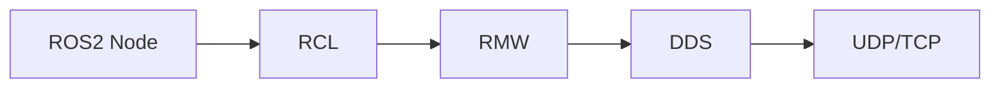

# ROS2 DDS 配置（00-ros2-dds-config.zh.md）

> ROS2 Humble 自主移动机器人系列教程

---

# ROS2 DDS 配置

ROS2（Robot Operating System 2）采用 **DDS（Data Distribution Service）** 作为底层通信中间件，不同的 DDS 实现具有不同的性能特点。ROS2 Humble 默认使用 **eProsima Fast DDS**，同时官方支持 **Cyclone DDS、RTI Connext DDS、GurumDDS** 等实现。

本文介绍如何安装、切换和验证不同 DDS，实现根据实际应用场景选择合适的通信中间件。

---

## DDS 简介

DDS（Data Distribution Service）是一种发布/订阅（Publish-Subscribe）通信中间件，负责 ROS2 节点之间的数据发现、传输和管理。

ROS2 的通信架构如下：



其中：

* **RCL（ROS Client Library）**：ROS2 客户端接口
* **RMW（ROS Middleware）**：ROS2 中间件抽象层
* **DDS**：真正负责网络通信

ROS2 可以通过更换 RMW 实现切换不同 DDS，而无需修改应用程序代码。

---

## 查看当前 DDS

查看当前安装的 RMW：

```bash
printenv | grep RMW
```

或者：

```bash
echo $RMW_IMPLEMENTATION
```

如果没有任何输出，则使用系统默认 DDS。

查看当前系统支持的 DDS：

```bash
ros2 doctor --report
```

---

## ROS2 Humble 默认 DDS

Ubuntu 安装的 ROS2 Humble 默认使用：

```text
rmw_fastrtps_cpp
```

对应：

* eProsima Fast DDS

---

## 安装 Cyclone DDS

官方推荐命令：

```bash
sudo apt update

sudo apt install ros-humble-rmw-cyclonedds-cpp
```

安装完成后，切换 DDS：

```bash
export RMW_IMPLEMENTATION=rmw_cyclonedds_cpp
```

永久生效：

```bash
echo "export RMW_IMPLEMENTATION=rmw_cyclonedds_cpp" >> ~/.bashrc

source ~/.bashrc
```

---

## 安装 Fast DDS

如果已经安装 ROS2 Humble，一般已经包含 Fast DDS。

如需重新安装：

```bash
sudo apt install ros-humble-rmw-fastrtps-cpp
```

切换：

```bash
export RMW_IMPLEMENTATION=rmw_fastrtps_cpp
```

---

## 安装 RTI Connext DDS

> [!WARNING]
> RTI Connext DDS 并非完全开源，需要单独申请或购买授权。

下载并安装 RTI Connext DDS 后，再安装 ROS2 对应 RMW：

```bash
sudo apt install ros-humble-rmw-connextdds
```

切换：

```bash
export RMW_IMPLEMENTATION=rmw_connextdds
```

---

## 安装 GurumDDS

> [!WARNING]
> GurumDDS 为商业产品，需要获得官方授权。

安装 ROS2 RMW：

```bash
sudo apt install ros-humble-rmw-gurumdds-cpp
```

切换：

```bash
export RMW_IMPLEMENTATION=rmw_gurumdds_cpp
```

---

## 查看已安装 DDS

查看系统中已安装的 RMW：

```bash
apt list --installed | grep rmw
```

例如：

```text
ros-humble-rmw-fastrtps-cpp
ros-humble-rmw-cyclonedds-cpp
ros-humble-rmw-connextdds
ros-humble-rmw-gurumdds-cpp
```

---

## 验证 DDS 是否切换成功

打开终端 A：

```bash
export RMW_IMPLEMENTATION=rmw_cyclonedds_cpp

ros2 run demo_nodes_cpp talker
```

打开终端 B：

```bash
export RMW_IMPLEMENTATION=rmw_cyclonedds_cpp

ros2 run demo_nodes_cpp listener
```

如果能够正常收到消息：

```text
I heard: Hello World
```

说明 DDS 已切换成功。

> [!CAUTION]
> Talker 和 Listener 必须使用相同的 DDS 实现，否则无法正常通信。

---

## 查看当前使用的 RMW

使用以下命令查看当前 RMW：

```bash
echo $RMW_IMPLEMENTATION
```

输出示例：

```text
rmw_cyclonedds_cpp
```

或者：

```text
rmw_fastrtps_cpp
```

---

## 常用 DDS 对比

| DDS             | 开源 | 默认支持 | 推荐场景      |
| --------------- | -- | ---- | --------- |
| Fast DDS        | ✅  | ⭐ 默认 | 通用机器人开发   |
| Cyclone DDS     | ✅  | 官方推荐 | 多机器人、无线网络 |
| RTI Connext DDS | ❌  | 支持   | 工业级应用     |
| GurumDDS        | ❌  | 支持   | 商业机器人     |

---

??? example "切换到 Cyclone DDS"

```bash
sudo apt install ros-humble-rmw-cyclonedds-cpp

export RMW_IMPLEMENTATION=rmw_cyclonedds_cpp

ros2 run demo_nodes_cpp talker
```

---

???+ tip "推荐选择"

对于大多数 ROS2 Humble 自主移动机器人项目，建议：

* **开发环境**：Fast DDS（默认即可）
* **多机器人通信**：Cyclone DDS
* **工业项目**：RTI Connext DDS
* **商业闭源产品**：GurumDDS

---

???+ warning "注意事项"

* 所有通信节点必须使用相同的 DDS 实现。
* 修改 `RMW_IMPLEMENTATION` 后需要重新打开终端或执行 `source ~/.bashrc`。
* Docker 容器中的 DDS 配置应与宿主机保持一致，避免通信失败。

---

## 参考资料

* ROS2 Humble DDS Implementations
* Working with Eclipse Cyclone DDS
* Working with eProsima Fast DDS
* Working with RTI Connext DDS
* Working with GurumDDS

