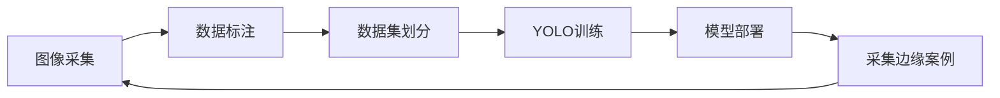
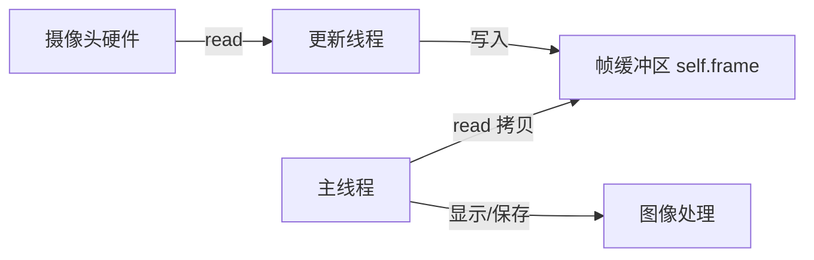
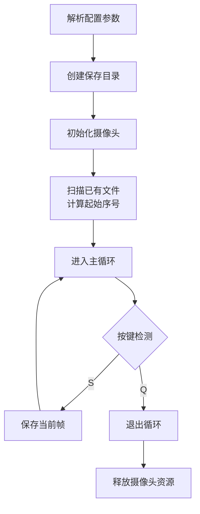
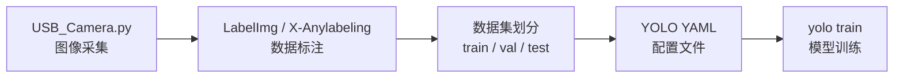

# 图像采集 —— 为 YOLO 训练准备自定义数据集

> 本文是 Ultralytics YOLO 系列教程的**图像采集**篇，介绍如何使用 Python + OpenCV 从 USB 摄像头采集图像，构建带序号的组织化数据集，为后续的 YOLO 模型训练打下基础。


## 概述

训练一个高质量的 YOLO 目标检测模型，**数据是决定性因素**。正如 Ultralytics 官方文档所强调的："训练与你实际部署场景相似的图像至关重要"。图像采集是整个数据准备流程的第一步，也是最基础的一步。

本教程将带你：

1. 理解图像采集在 YOLO 训练流程中的位置与重要性
2. 掌握基于 OpenCV 的 USB 摄像头图像采集程序的实现原理
3. 学会使用采集程序批量获取带序号的图像数据集
4. 了解从图像采集到 YOLO 数据集组织的完整链路



> 上图展示了 YOLO 自定义数据集训练的完整迭代流程。**图像采集**是起点，也是最需要投入精力的环节。


## 环境准备

### 1. 安装 Python 依赖

本程序依赖以下核心库：

```bash
pip install opencv-python
```

> 如果你的系统同时安装了多个 Python 版本，请确保使用正确的 pip 版本。

### 2. 硬件要求

| 硬件 | 要求 |
|------|------|
| 摄像头 | USB 摄像头（兼容 OpenCV） |
| 操作系统 | Windows / Linux / macOS |
| Python | 3.10+ |

### 3. 验证摄像头

在运行采集程序之前，建议先确认摄像头是否被系统正确识别。你可以使用以下命令快速测试：

```python
import cv2
cap = cv2.VideoCapture(0)  # 0 为默认摄像头
print(cap.isOpened())      # 输出 True 表示成功
cap.release()
```


## 程序代码详解

### 完整代码

以下是完整的 USB 摄像头图像采集程序 `USB_Camera.py`：

```python
import cv2
import threading
import time
import os
from pathlib import Path

class USBCamera:
    """USB 摄像头"""
    def __init__(self, camera_id=0, width=640, height=480, fps=30):
        self.camera_id = camera_id
        self.width = width
        self.height = height
        self.fps = fps
        self.frame = None
        self.running = False
        self.thread = None

    def start(self):
        """启动摄像头线程"""
        self.cap = cv2.VideoCapture(self.camera_id)
        self.cap.set(cv2.CAP_PROP_FRAME_WIDTH, self.width)
        self.cap.set(cv2.CAP_PROP_FRAME_HEIGHT, self.height)
        self.cap.set(cv2.CAP_PROP_FPS, self.fps)

        if not self.cap.isOpened():
            raise ValueError(f"无法打开摄像头 ID={self.camera_id}")

        self.running = True
        self.thread = threading.Thread(target=self.update, daemon=True)
        self.thread.start()
        time.sleep(0.2)  # 等待摄像头预热

    def update(self):
        """持续读取帧"""
        while self.running:
            ret, frame = self.cap.read()
            if ret:
                self.frame = frame
            time.sleep(1 / self.fps)

    def read(self):
        """返回最新帧"""
        if self.frame is not None:
            return self.frame.copy()
        return None

    def stop(self):
        """释放摄像头资源"""
        self.running = False
        if self.thread:
            self.thread.join(timeout=1)
        self.cap.release()

# ------------------ 图像采集主程序 ------------------
def main():
    # 配置参数
    CAMERA_ID = 2          # 摄像头索引
    WIDTH = 640
    HEIGHT = 480
    FPS = 30
    SAVE_DIR = "./dataset/images"   # 保存路径
    IMAGE_PREFIX = "img"            # 文件名前缀

    # 创建保存目录
    Path(SAVE_DIR).mkdir(parents=True, exist_ok=True)

    # 初始化摄像头
    camera = USBCamera(CAMERA_ID, WIDTH, HEIGHT, FPS)
    camera.start()

    # 从已有文件中获取当前最大序号（断点续传）
    existing_files = list(Path(SAVE_DIR).glob(f"{IMAGE_PREFIX}_*.jpg"))
    if existing_files:
        # 提取序号并取最大值
        nums = [int(f.stem.split('_')[-1]) for f in existing_files if f.stem.split('_')[-1].isdigit()]
        counter = max(nums) + 1 if nums else 1
    else:
        counter = 1

    print(f"📸 摄像头已启动，按 [S] 保存当前帧（从序号 {counter} 开始），按 [Q] 退出")

    try:
        while True:
            frame = camera.read()
            if frame is None:
                continue

            # 显示实时预览
            display = frame.copy()
            cv2.putText(display, f"Count: {counter}", (10, 30),
                        cv2.FONT_HERSHEY_SIMPLEX, 0.8, (0, 255, 0), 2)
            cv2.imshow("Image Collector (S: save, Q: quit)", display)

            key = cv2.waitKey(1) & 0xFF
            if key == ord('q') or key == ord('Q'):
                break
            elif key == ord('s') or key == ord('S'):
                # 保存图像
                filename = f"{IMAGE_PREFIX}_{counter:06d}.jpg"  # 六位序号，如 img_000001.jpg
                save_path = os.path.join(SAVE_DIR, filename)
                cv2.imwrite(save_path, frame)
                print(f"✅ 已保存: {save_path}")
                counter += 1

    finally:
        camera.stop()
        cv2.destroyAllWindows()
        print("🛑 采集结束，共保存 {} 张图像".format(counter - 1))

if __name__ == "__main__":
    main()
```

### 核心类：USBCamera

`USBCamera` 类封装了 USB 摄像头的操作，采用**生产者-消费者模式**设计：



??? tip "为什么使用独立线程读取摄像头？"
    使用独立线程持续读取摄像头帧，可以避免主线程在处理图像（如显示、保存）时阻塞摄像头读取，从而**保证画面流畅、不丢帧**。这是实时视频处理中的常用设计模式。

#### 关键方法说明

| 方法 | 功能 | 说明 |
|------|------|------|
| `__init__()` | 初始化摄像头参数 | 设置摄像头 ID、分辨率、帧率 |
| `start()` | 启动摄像头 | 打开设备、启动读取线程 |
| `update()` | 后台更新帧 | 在独立线程中持续读取 |
| `read()` | 获取最新帧 | 返回帧的**副本**，避免数据竞争 |
| `stop()` | 释放资源 | 停止线程、释放摄像头 |

??? warning "注意 `read()` 返回的是副本"
    直接返回 `self.frame` 可能导致主线程和后台线程同时访问同一内存区域，引发数据竞争。使用 `.copy()` 返回副本是线程安全的做法。

### 主程序逻辑

主程序 `main()` 的核心流程如下：




## 运行指南

### 1. 配置采集参数

在 `main()` 函数中调整以下参数以适应你的采集需求：

| 参数 | 示例值 | 说明 |
|------|--------|------|
| `CAMERA_ID` | `2` | 摄像头设备索引，通常 `0` 为默认摄像头 |
| `WIDTH` | `640` | 采集图像宽度 |
| `HEIGHT` | `480` | 采集图像高度 |
| `FPS` | `30` | 目标帧率 |
| `SAVE_DIR` | `"./dataset/images"` | 图像保存目录 |
| `IMAGE_PREFIX` | `"img"` | 文件名前缀 |

??? example "如何确定摄像头 ID？"
    如果你有多个摄像头，可以通过以下方式确定正确的 ID：
    
    ```python
    for i in range(5):
        cap = cv2.VideoCapture(i)
        if cap.isOpened():
            print(f"摄像头 {i} 可用")
            cap.release()
    ```
    
    通常内置摄像头为 `0`，外接 USB 摄像头为 `1`、`2` 等。

### 2. 启动采集程序

```bash
python3 USB_Camera.py
```

程序启动后，会显示实时预览窗口：

- 窗口标题：`Image Collector (S: save, Q: quit)`
- 画面左上角显示当前计数：`Count: N`

### 3. 交互操作

| 按键 | 功能 |
|------|------|
| `S` 或 `s` | 保存当前帧为 JPG 图像 |
| `Q` 或 `q` | 退出程序 |

### 4. 输出结果

采集的图像保存在 `./dataset/images/` 目录下，文件命名格式为：

```
img_000001.jpg
img_000002.jpg
img_000003.jpg
...
```

> 序号从 `1` 开始，自动补零至 **6 位**，确保排序正确。

### 5. 断点续传

程序启动时会自动扫描保存目录中已存在的图像文件，提取最大序号并**从下一个序号开始继续采集**。这意味着：

- 即使程序意外中断，重新运行后也不会覆盖已有图像
- 可以在不同时间分批采集，所有图像保持连续编号

??? tip "断点续传的实现原理"
    ```python
    existing_files = list(Path(SAVE_DIR).glob(f"{IMAGE_PREFIX}_*.jpg"))
    nums = [int(f.stem.split('_')[-1]) for f in existing_files if ...]
    counter = max(nums) + 1 if nums else 1
    ```
    程序通过正则匹配文件名中的数字后缀，计算出下一个可用序号。


## 采集技巧与最佳实践

### 1. 数据多样性

YOLO 模型通过"示例学习"，训练数据的多样性直接影响模型的泛化能力。采集时应注意：

??? tip "采集多样性 checklist"
    - [ ] **不同角度**：从多个角度拍摄目标对象
    - [ ] **不同光照**：在室内、室外、强光、弱光等条件下采集
    - [ ] **不同背景**：让目标出现在不同的背景环境中
    - [ ] **不同尺度**：目标在画面中的大小应有所变化
    - [ ] **不同遮挡程度**：部分遮挡的目标也应采集

### 2. 画面质量

- 保持摄像头稳定，避免运动模糊
- 确保目标物体清晰可见
- 合理设置分辨率和焦距

### 3. 采集数量建议

| 场景 | 建议采集数量 | 说明 |
|------|------------|------|
| 快速验证 | 100-300 张 | 用于测试训练流程是否通畅 |
| 正式训练（单类别） | 500-2000 张 | 每类目标至少 500 张以上 |
| 正式训练（多类别） | 每类 1000+ 张 | 类别越多，每类需要的样本越多 |

> [!WARNING]
> 采集的图像数量直接影响模型性能。**宁缺毋滥**——高质量、多样化的 500 张图像，远优于模糊、重复的 5000 张图像。

### 4. 从采集到训练的完整流程



??? example "下一步：数据标注"
    采集完成后，下一步是使用标注工具（如 [LabelImg](https://github.com/HumanSignal/labelImg.git) 或 [X-Anylabeling](https://github.com/CVHub520/X-AnyLabeling.git)）对图像中的目标进行标注。标注完成后，即可按照 YOLO 数据集格式组织训练数据。


## 故障排查

### 常见问题及解决方案

| 问题 | 可能原因 | 解决方案 |
|------|---------|---------|
| `无法打开摄像头 ID=0` | 摄像头不存在或被占用 | 检查摄像头连接，尝试更换 `CAMERA_ID` |
| 画面黑屏/无画面 | 摄像头未就绪 | 增加 `time.sleep()` 预热时间 |
| 保存图像失败 | 目录权限不足 | 检查 `SAVE_DIR` 是否有写入权限 |
| 画面卡顿 | 分辨率或帧率设置过高 | 降低 `WIDTH`/`HEIGHT` 或 `FPS` |
| 按键无响应 | 窗口未获得焦点 | 点击预览窗口使其获得焦点 |

### 调试建议

如果摄像头无法打开，可以尝试：

```python
# 测试所有可能的摄像头 ID
for i in range(10):
    cap = cv2.VideoCapture(i)
    if cap.isOpened():
        print(f"✅ 摄像头 {i} 可用")
        cap.release()
    else:
        print(f"❌ 摄像头 {i} 不可用")
```


## 进阶扩展

### 1. 批量采集脚本

如果需要自动化采集（如每隔 N 秒自动保存一帧），可以在主循环中添加定时逻辑：

```python
import time

last_save = time.time()
SAVE_INTERVAL = 2.0  # 每 2 秒保存一张

while True:
    frame = camera.read()
    # ...
    if time.time() - last_save >= SAVE_INTERVAL:
        cv2.imwrite(save_path, frame)
        last_save = time.time()
```

### 2. 视频采集替代方案

如果已有视频文件而非实时摄像头，可以使用 `cv2.VideoCapture` 读取视频文件逐帧保存：

```python
cap = cv2.VideoCapture("input_video.mp4")
frame_count = 0
while True:
    ret, frame = cap.read()
    if not ret:
        break
    if frame_count % 10 == 0:  # 每 10 帧保存一张
        cv2.imwrite(f"frame_{frame_count:06d}.jpg", frame)
    frame_count += 1
```

### 3. 数据集目录结构

采集完成后，建议按以下 YOLO 标准目录结构组织数据：

```
dataset/
├── images/
│   ├── img_000001.jpg
│   ├── img_000002.jpg
│   └── ...
├── labels/          # 标注文件（.txt），与图像一一对应
│   ├── img_000001.txt
│   └── ...
└── dataset.yaml     # 数据集配置文件
```

`dataset.yaml` 示例：

```yaml
path: ../dataset
train: images  # 训练集图像目录
val: images    # 验证集图像目录

nc: 1          # 类别数量
names: ['target']  # 类别名称
```

> [!CAUTION]
> 标注前请**不要重命名**图像文件！标注工具生成的标签文件与图像文件名一一对应，重命名会导致标注文件无法匹配。


## 参考资料

- [Ultralytics YOLOv5 自定义数据集训练指南](https://docs.ultralytics.com/yolov5/tutorials/train-custom-data)
- [Ultralytics 数据集格式说明](https://docs.ultralytics.com/datasets)
- [OpenCV 官方文档](https://docs.opencv.org/5.0/py_tutorials/py_tutorials.html)


## 下一步
完成图像采集后，下一步是使用标注工具对图像进行标注，生成 YOLO 格式的标签文件。请继续关注本系列教程的后续章节。

---